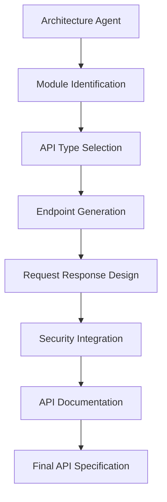

# API Agent Documentation

# AI Software Architect Agent


## 1. Introduction

The API Agent is a specialized AI agent responsible for designing secure, scalable, and well-structured APIs for software applications.

The API Agent analyzes the requirements, system architecture, and database design generated by other agents and converts them into complete API specifications.

It works like an experienced API architect by defining:

- API structure
- Endpoints
- HTTP methods
- Request and response formats
- Authentication mechanisms
- Error handling strategies
- API documentation


The API Agent ensures that different software components can communicate efficiently through well-designed interfaces.


Example:


User Requirement:

```
Create an online shopping application.
```


API Agent Output:


```
API Type:

REST API


Endpoints:

POST /api/auth/login

GET /api/products

POST /api/orders


Authentication:

JWT Token


Response Format:

JSON

```


---

# 2. Purpose of API Agent


The main purpose of the API Agent is to design communication interfaces between different system components.


It performs:


- API requirement analysis
- Endpoint generation
- HTTP method selection
- Request/response design
- API security implementation
- API documentation generation


---

# 3. Role of API Agent


The API Agent works as:


```
API Architect

+

Backend Communication Designer

+

Integration Specialist

+

API Security Expert

```


It answers questions like:


```
What APIs are required?


Which HTTP methods should be used?


How should services communicate?


How should APIs be secured?

```


---

# 4. Input and Output


# Input


The API Agent receives:


```
Software Requirements

System Architecture

Database Design

Business Logic

Security Requirements

```


Example:


```json
{
"system":

"E-Commerce Platform",

"modules":

[
"User",

"Product",

"Order",

"Payment"
]
}
```


---

# Output


The agent generates:


```
Complete API Documentation

```


Including:


- API architecture
- Endpoint list
- HTTP methods
- Request structure
- Response structure
- Authentication design
- Error handling


---

# 5. API Agent Workflow


The workflow follows multiple stages.


```
Architecture Input


        |

        v


Service Identification


        |

        v


API Requirement Analysis


        |

        v


Endpoint Generation


        |

        v


Request Response Design


        |

        v


Security Integration


        |

        v


API Documentation Generation

```


---

# 6. Internal Architecture


The API Agent consists of:


```
                     API Agent


                         |

       ------------------------------------


       |              |                   |


       v              v                   v


API Analyzer   Endpoint Generator   Validation Engine


       |              |                   |


       ------------------------------------


                         |

                         v


                API Knowledge Base

```


---

# 7. API Requirement Analysis Module


This module analyzes system requirements and identifies required APIs.


It identifies:


## System Modules


Example:


```
User Module

Product Module

Payment Module

Order Module

```


---

## Communication Requirements


Example:


```
Frontend communicates with Backend

Backend communicates with Database

Services communicate internally

```


---

# 8. API Type Selection


The API Agent selects suitable API architecture.


---

# 8.1 REST API


Recommended when:


```
Standard web applications

Mobile applications

CRUD operations

```


Example:


```
GET /users

POST /orders

```


Advantages:


- Simple
- Widely supported
- Easy integration


---

# 8.2 GraphQL API


Recommended when:


```
Complex data requirements

Flexible data queries

Multiple frontend clients

```


Example:


```
Query {

 user {

  name

 }

}

```


---

# 8.3 WebSocket API


Recommended when:


```
Real-time communication required

```


Examples:


- Chat applications
- Live notifications
- Gaming


---

# 9. Endpoint Generation Engine


The API Agent automatically generates endpoints.


Example:


Application:

```
Library Management System
```


Generated APIs:


## User APIs


```
POST /api/users/register

POST /api/users/login

GET /api/users/profile

```


---

## Book APIs


```
GET /api/books

POST /api/books

PUT /api/books/{id}

DELETE /api/books/{id}

```


---

## Transaction APIs


```
POST /api/issue-book

POST /api/return-book

```


---

# 10. HTTP Method Selection Logic


The agent selects HTTP methods based on operations.


## GET


Used for retrieving data.


Example:


```
GET /api/products

```


---

## POST


Used for creating resources.


Example:


```
POST /api/orders

```


---

## PUT


Used for updating resources.


Example:


```
PUT /api/users/10

```


---

## DELETE


Used for removing resources.


Example:


```
DELETE /api/products/5

```


---

# 11. Request and Response Design


The API Agent creates standard JSON formats.


Example Request:


```json
{
"productName":

"Laptop",

"price":

50000
}
```


Example Response:


```json
{
"status":

"success",

"message":

"Product created",

"id":

101
}
```


---

# 12. API Authentication Design


The API Agent integrates security mechanisms.


Recommended:


## JWT Authentication


Workflow:


```
User Login


     |

     v


Authentication Service


     |

     v


JWT Token Generation


     |

     v


Protected API Access

```


---

# 13. API Authorization Design


The agent supports role-based permissions.


Example:


```
Admin

- Create Product

- Delete Product


Customer

- View Product

- Place Order

```


---

# 14. API Validation Engine


Before finalizing APIs, validation is performed.


Checks:


## Completeness


Are all required APIs created?


Example:


```
Payment feature exists

but

Payment API missing

```


---

## Security Validation


Checks:


```
Authentication

Authorization

Input Validation

```


---

## Performance Validation


Checks:


```
API response time

Database dependency

Scalability

```


---

# 15. API Documentation Generation


The API Agent generates:


## API Specification


Example:


```
Endpoint:

POST /api/login


Description:

Authenticate user


Request:

Email and password


Response:

JWT token

```


---

## OpenAPI Documentation


The agent can generate:


```
Swagger/OpenAPI Specification

```


Example:


```
openapi.yaml

```


---

# 16. API Agent Prompt Design


System Prompt:


```
You are an API architect.

Design secure and scalable APIs.

Create REST endpoints, request-response structures,
authentication mechanisms, and API documentation.

Follow industry API design standards.
```


---

# 17. Communication With Other Agents


## Requirement Agent


Provides:


```
Functional Requirements

User Actions

Business Operations

```


---

## Architecture Agent


Provides:


```
System Components

Service Communication

Technology Stack

```


---

## Database Agent


Provides:


```
Entities

Tables

Relationships

Data Operations

```


---

## Security Agent


Provides:


```
Authentication Requirements

Security Rules

Access Control

```


---

# 18. API Agent Data Flow





---

# 19. Error Handling


## Invalid API Requirement


Example:


```
User requests payment system
but no payment information exists.
```


Solution:


```
Request additional details.
```


---

## API Conflict Detection


Example:


Two services use:


```
Same endpoint

Different operations

```


Solution:


```
Modify API naming structure.

```


---

# 20. Advantages of API Agent


- Automatically designs APIs
- Maintains API standards
- Improves backend communication
- Generates documentation
- Enhances security
- Reduces development effort


---

# 21. Future Enhancements


## Automatic API Testing


Generate test cases automatically.


## API Performance Prediction


Predict bottlenecks before deployment.


## API Version Management


Automatically manage:


```
/api/v1

/api/v2

```


## Third Party API Integration


Recommend external services.


---

# 22. Conclusion


The API Agent provides intelligent API architecture generation within the AI Software Architect Agent system.

By analyzing application requirements, designing endpoints, integrating security, and generating documentation, it enables efficient communication between software components.

This agent represents the role of an AI-powered API architect that helps developers create professional and scalable software interfaces.
