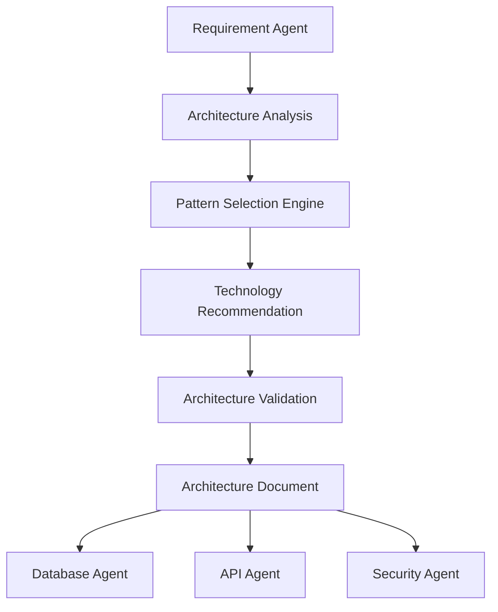

# Architecture Agent Documentation

# AI Software Architect Agent


## 1. Introduction

The Architecture Agent is the core design intelligence component of the AI Software Architect Agent system.

Its primary responsibility is to transform validated software requirements into a complete software architecture design.

The Architecture Agent behaves like a senior software architect by analyzing requirements, selecting suitable architecture patterns, recommending technologies, defining system components, and explaining architecture decisions.

The agent ensures that the generated architecture is:

- Scalable
- Secure
- Maintainable
- Reliable
- Cost-effective
- Suitable for future expansion


Example:

User Requirement:

```
Build an online banking application supporting millions of users.
```


Architecture Agent Output:


```
Architecture Style:

Microservices Architecture


Components:

- User Service
- Account Service
- Transaction Service
- Authentication Service
- Notification Service


Database:

PostgreSQL


Communication:

REST API + Message Queue


Security:

JWT Authentication + Encryption

```


---

# 2. Purpose of Architecture Agent


The main purpose of the Architecture Agent is to design the overall structure of a software system.


It performs:


- Architecture pattern selection
- Component identification
- Technology recommendation
- System communication design
- Deployment planning
- Architecture validation


---

# 3. Role of Architecture Agent


The Architecture Agent works as:


```
Senior Software Architect

+

System Designer

+

Technology Consultant

+

Architecture Decision Maker

```


It answers questions like:


```
Which architecture pattern should be used?


Which technologies are suitable?


How should system components communicate?


How can the system scale in future?

```


---

# 4. Input and Output


## Input


The Architecture Agent receives:


```
Validated Requirements

Functional Requirements

Non Functional Requirements

Business Constraints

User Expectations

```


Example:


```json
{
"application":

"Food Delivery Platform",

"users":

[
"Customer",
"Restaurant",
"Delivery Partner"
],

"requirements":

[
"Online Ordering",
"Payment",
"Tracking"
]
}
```


---

## Output


The agent generates:


```
Complete Software Architecture Design

```


Including:


- Architecture style
- System components
- Technology stack
- Communication flow
- Deployment strategy
- Design justification


---

# 5. Architecture Agent Workflow


The workflow contains multiple stages.


```
Requirement Input


        |

        v


Requirement Analysis


        |

        v


Architecture Pattern Selection


        |

        v


Component Design


        |

        v


Technology Recommendation


        |

        v


Architecture Validation


        |

        v


Final Architecture Document

```


---

# 6. Internal Architecture


The Architecture Agent consists of:


```
                 Architecture Agent


                         |

       -------------------------------------


       |              |                  |


       v              v                  v


Analysis Engine  Decision Engine   Validation Engine


       |              |                  |


       -------------------------------------


                         |

                         v


              Architecture Knowledge Base

```


---

# 7. Requirement Analysis Module


The first stage analyzes project requirements.


The module identifies:


## Application Type


Examples:


```
E-Commerce

Healthcare

Banking

Education

Social Media

```


---

## Scale Requirements


Examples:


```
Small Application

Medium Application

Enterprise Application

```


---

## Performance Requirements


Identifies:


```
Real-time processing

High availability

Low latency

```


---

## Security Requirements


Identifies:


```
Authentication

Authorization

Encryption

Data protection

```


---

# 8. Architecture Pattern Selection Engine


The Architecture Agent selects architecture patterns based on requirements.


Decision Logic:


## Monolithic Architecture


Selected when:


```
Application size is small

Limited users

Simple features

```


Example:


```
College Management System

```


---

## Microservices Architecture


Selected when:


```
Large user base

Multiple independent modules

High scalability required

```


Example:


```
Banking Platform

E-commerce Platform

```


---

## Event-Driven Architecture


Selected when:


```
Real-time processing required

Asynchronous communication needed

```


Example:


```
Notification System

IoT Platform

```


---

## Serverless Architecture


Selected when:


```
Variable workload

Cost optimization required

```


Example:


```
Image Processing Application

```


---

# 9. Architecture Decision Logic


The agent follows rule-based decision making.


Example:


```
IF users > 1 million

THEN select Microservices Architecture


IF real-time communication required

THEN recommend Event Driven Architecture


IF application handles sensitive information

THEN add Security Layer


IF application is small

THEN select Monolithic Architecture

```


---

# 10. System Component Generation


The Architecture Agent identifies required components.


Example:

For an e-commerce application:


```
Frontend Layer


        |

        v


API Gateway


        |

        v


Backend Services


        |

 ---------------------

 |          |          |

User    Product    Payment

Service Service   Service


        |

        v


Database Layer

```


---

# 11. Technology Recommendation Engine


The agent recommends technologies based on requirements.


## Frontend Selection


Example:


```
React.js

Angular

Vue.js

```


---

## Backend Selection


Example:


```
Java Spring Boot

Node.js

Python Django

```


---

## Database Selection


Example:


```
PostgreSQL

MongoDB

MySQL

Redis

```


---

## Cloud Platform Selection


Example:


```
AWS

Azure

Google Cloud

```


---

# 12. Technology Selection Logic


Example:


```
IF high transaction system

THEN recommend PostgreSQL


IF flexible document storage needed

THEN recommend MongoDB


IF enterprise backend required

THEN recommend Spring Boot


IF AI processing required

THEN recommend Python AI services

```


---

# 13. Architecture Documentation Generation


The agent creates:


## Architecture Overview


Explains system structure.


---

## Component Description


Explains each module.


---

## Communication Design


Defines:


```
Frontend → API Gateway → Backend → Database

```


---

## Deployment Strategy


Defines:


```
Cloud

Containerization

Scaling approach

```


---

# 14. Architecture Validation


Before final output, validation is performed.


Checks:


## Scalability Check


Question:


```
Can the architecture handle future growth?
```


---

## Security Check


Question:


```
Are security mechanisms included?
```


---

## Performance Check


Question:


```
Can the system provide acceptable response time?
```


---

## Maintainability Check


Question:


```
Can developers easily modify the system?
```


---

# 15. Architecture Agent Prompt Design


System Prompt:


```
You are a senior software architect.

Analyze software requirements and design scalable architectures.

Select appropriate architecture patterns.

Recommend technologies with proper justification.

Always consider security, performance, and scalability.
```


---

# 16. Communication With Other Agents


## Requirement Agent


Receives:


```
Validated Requirements

```


---

## Database Agent


Provides:


```
System Components

Data Requirements

```


---

## API Agent


Provides:


```
Service Communication Details

API Requirements

```


---

## Security Agent


Provides:


```
Security Requirements

Threat Information

```


---

# 17. Architecture Agent Data Flow





---

# 18. Error Handling


## Insufficient Requirements


Example:


```
Input:

Build an application

```


Response:


```
Additional information required:
- Application domain
- Users
- Features
```


---

## Conflicting Requirements


Example:


```
High scalability

+

Very low budget

```


Solution:


```
Recommend cost-effective cloud architecture.

```


---

# 19. Advantages of Architecture Agent


- Automates software architecture design
- Provides expert-level recommendations
- Reduces architecture planning time
- Improves design quality
- Supports multiple technology stacks
- Enables scalable system design


---

# 20. Future Enhancements


## Automatic Code Generation


Generate application skeletons from architecture.


## Architecture Simulation


Test architecture before implementation.


## Cloud Cost Optimization


Recommend cost-efficient deployment.


## Self-Learning Architecture Agent


Improve decisions using previous projects.


---

# 21. Conclusion


The Architecture Agent is the central decision-making component of the AI Software Architect Agent system.

By analyzing requirements, selecting suitable architecture patterns, recommending technologies, and validating designs, it transforms software ideas into professional architecture solutions.

This agent demonstrates how Agentic AI can assist software engineers in designing complex modern applications.
