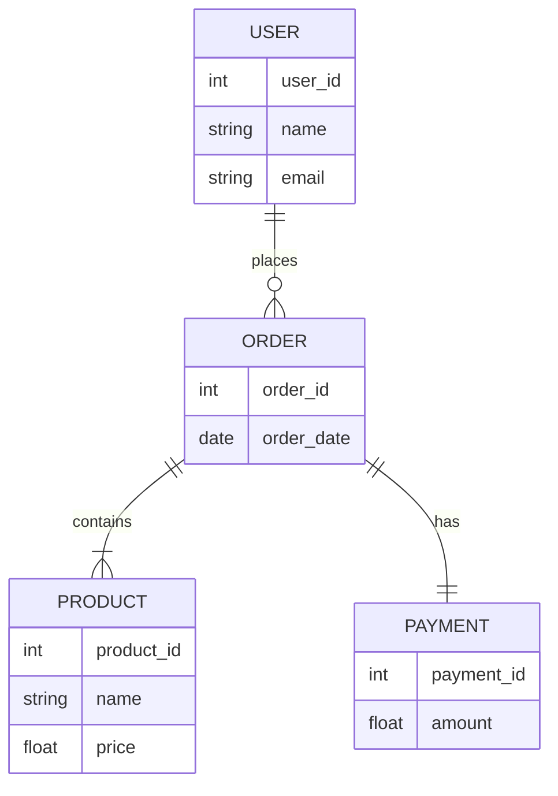
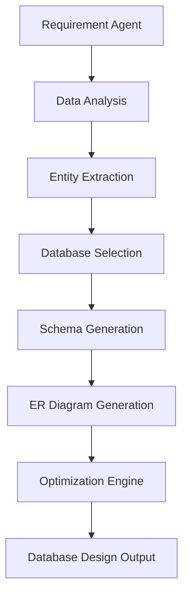

# Database Agent Documentation

# AI Software Architect Agent


## 1. Introduction

The Database Agent is a specialized AI agent responsible for designing efficient, scalable, and optimized database architectures for software applications.

It analyzes software requirements provided by the Requirement Agent and system architecture created by the Architecture Agent to generate:

- Database architecture
- Entity identification
- Database schema
- Relationships between entities
- SQL/NoSQL recommendations
- Data optimization strategies
- ER diagrams


The Database Agent works like a professional database architect who understands application requirements and converts them into a well-structured data management solution.


Example:


User Requirement:

```
Build an online shopping platform with customers, products, orders, and payments.
```


Database Agent Output:


```
Database Type:

PostgreSQL


Entities:

- User
- Product
- Order
- Payment


Relationships:

User places Order

Order contains Products

Order has Payment


Optimization:

Indexing

Caching

Normalization

```


---

# 2. Purpose of Database Agent


The main purpose of the Database Agent is to design a database system that efficiently stores, manages, and retrieves application data.


It performs:


- Database selection
- Entity extraction
- Schema generation
- Relationship mapping
- Data normalization
- Performance optimization
- Database documentation


---

# 3. Role of Database Agent


The Database Agent works as:


```
Database Architect

+

Data Modeling Expert

+

Database Optimization Specialist

+

Data Security Advisor

```


It answers questions like:


```
Which database should be used?


What entities are required?


How should tables be connected?


How can database performance be improved?

```


---

# 4. Input and Output


# Input


The Database Agent receives:


```
Software Requirements

System Architecture

Application Features

Expected Data Flow

Scalability Requirements

Security Requirements

```


Example:


```json
{
"application":

"E-Commerce System",

"features":

[
"User Management",
"Product Management",
"Order Processing"
],

"scale":

"Large"
}
```


---

# Output


The agent generates:


```
Complete Database Design

```


Including:


- Database type recommendation
- Entity list
- Attributes
- Relationships
- Schema design
- ER diagram
- Optimization strategy


---

# 5. Database Agent Workflow


The complete workflow:


```
Architecture Input


        |

        v


Requirement Analysis


        |

        v


Entity Identification


        |

        v


Relationship Mapping


        |

        v


Database Selection


        |

        v


Schema Generation


        |

        v


Database Optimization


        |

        v


Final Database Design

```


---

# 6. Internal Architecture


The Database Agent contains:


```
                  Database Agent


                         |

        --------------------------------


        |              |               |


        v              v               v


Data Analysis    Schema Engine   Optimization Engine


        |              |               |


        --------------------------------


                         |

                         v


              Database Knowledge Base

```


---

# 7. Data Requirement Analysis Module


This module understands application data needs.


It identifies:


## Data Objects


Example:


Application:

```
Library Management System
```


Objects:


```
Student

Book

Issue Record

Return Record

```


---

## Data Attributes


Example:


User Entity:


```
User_ID

Name

Email

Password

Phone

```


---

## Data Relationships


Example:


```
Student

     |

     |

borrows

     |

     v

Book

```


---

# 8. Entity Identification Process


The Database Agent extracts entities from requirements.


Example:


Requirement:


```
Users can upload and share photos.
```


Extracted entities:


```
User

Photo

Album

Comment

```


---

# 9. Database Selection Engine


The agent decides between SQL and NoSQL databases.


---

# 9.1 Relational Database Selection


Recommended when:


```
Strong relationships required

Structured data

Complex transactions

High consistency

```


Examples:


```
Banking System

ERP System

E-Commerce System

```


Recommended databases:


```
PostgreSQL

MySQL

Oracle

```


---

# 9.2 NoSQL Database Selection


Recommended when:


```
Flexible schema

Large unstructured data

High scalability

Fast data access

```


Examples:


```
Social Media

Content Platforms

Real-time Applications

```


Recommended databases:


```
MongoDB

Cassandra

Firebase

```


---

# 9.3 Database Decision Logic


Example:


```
IF application requires financial transactions

THEN select SQL database


IF application handles large document data

THEN select NoSQL database


IF AI application requires similarity search

THEN add Vector Database

```


---

# 10. Schema Generation Engine


The Schema Generation Engine creates database structures.


Example:


Application:


```
Food Delivery System
```


Generated Schema:


```
USER

----------------

user_id PK

name

email

password


RESTAURANT

----------------

restaurant_id PK

name

location


ORDER

----------------

order_id PK

user_id FK

restaurant_id FK

amount

```


---

# 11. Database Normalization


The Database Agent applies normalization rules.


## First Normal Form (1NF)


Ensures:

- Atomic values
- No repeating groups


Example:


Incorrect:


```
Phone:

12345,67890

```


Correct:


```
Phone Table

```


---

## Second Normal Form (2NF)


Removes partial dependency.


---

## Third Normal Form (3NF)


Removes unnecessary dependencies.


Benefits:


- Reduced duplication
- Better consistency
- Improved maintenance


---

# 12. Relationship Generation


The agent identifies:


## One-to-One Relationship


Example:


```
User

 |

Profile

```


---

## One-to-Many Relationship


Example:


```
Customer

 |

Orders

```


---

## Many-to-Many Relationship


Example:


```
Students

 |

Courses

```


---

# 13. ER Diagram Generation


The Database Agent automatically generates ER diagrams.


Example:





---

# 14. Database Optimization Strategy


The agent recommends optimization techniques.


## Indexing


Improves search performance.


Example:


```
Create index on user_email

```


---

## Query Optimization


Improves database queries.


---

## Caching


Stores frequently accessed data.


Example:


```
Redis Cache

```


---

## Partitioning


Divides large tables.


Example:


```
Orders_2026

Orders_2027

```


---

# 15. Database Security Recommendations


The agent considers database security.


Security practices:


## Encryption


Protect sensitive information.


Example:


```
Passwords

Personal Data

Financial Information

```


---

## Access Control


Restrict database permissions.


---

## Backup Strategy


Maintain secure backups.


---

# 16. Database Agent Prompt Design


System Prompt:


```
You are a database architect.

Analyze application requirements and design efficient databases.

Identify entities, relationships, and schema structures.

Select suitable database technologies.

Consider performance, scalability, and security.
```


---

# 17. Communication With Other Agents


## Requirement Agent


Provides:


```
Data Requirements

Business Rules

User Information

```


---

## Architecture Agent


Provides:


```
Application Architecture

Technology Decisions

Scalability Requirements

```


---

## Security Agent


Receives:


```
Database Structure

Sensitive Data Information

```


---

# 18. Database Agent Data Flow





---

# 19. Error Handling


## Missing Data Information


Example:


```
Requirement:

Create application
```


Response:


```
Need information about data entities and users.
```


---

## Database Conflict


Example:


```
Highly scalable system

+

Single local database

```


Solution:


```
Recommend distributed database approach.
```


---

# 20. Advantages of Database Agent


- Automates database design
- Generates ER diagrams
- Reduces manual modeling effort
- Improves database decisions
- Supports SQL and NoSQL systems
- Provides optimization recommendations


---

# 21. Future Enhancements


## Automatic Migration Generation


Generate database migration scripts.


## AI Query Optimization


Suggest improved SQL queries.


## Database Performance Prediction


Predict database bottlenecks.


## Automated Data Governance


Manage data policies automatically.


---

# 22. Conclusion


The Database Agent provides intelligent database architecture generation for the AI Software Architect Agent.

By analyzing requirements, identifying entities, selecting suitable database technologies, generating schemas, and optimizing performance, it helps developers build reliable and scalable data management systems.

This agent represents the role of an AI-powered database architect within the multi-agent software engineering workflow.
