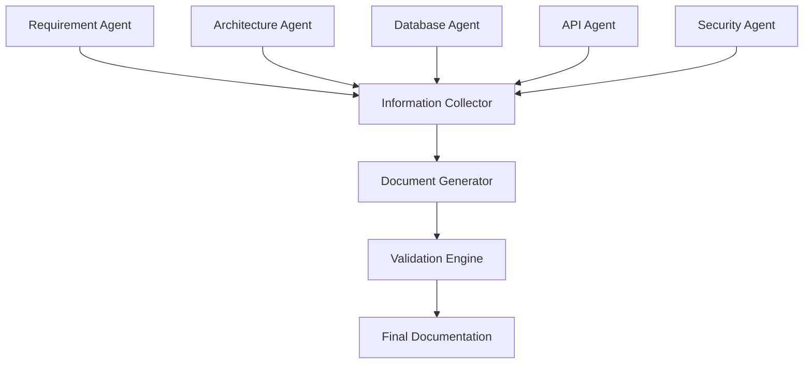

# Documentation Agent Documentation

# AI Software Architect Agent


## 1. Introduction

The Documentation Agent is the final-stage AI agent in the AI Software Architect Agent workflow.

Its primary responsibility is to collect, organize, and transform the outputs generated by different AI agents into professional software documentation.

The Documentation Agent works as an automated technical writer that converts architecture decisions, database designs, API specifications, security recommendations, and workflows into structured documentation formats.

It ensures that the final output is understandable for:

- Software developers
- System architects
- Project managers
- Stakeholders
- Documentation teams


The agent generates professional documents such as:

- Software Architecture Document
- System Design Document
- API Documentation
- Database Documentation
- Security Report
- Deployment Guide
- Project Report


---

# 2. Purpose of Documentation Agent


The main purpose of the Documentation Agent is to automate the documentation process of software architecture design.


It performs:


- Information collection
- Content organization
- Technical writing
- Diagram generation
- Document formatting
- Quality validation


---

# 3. Role of Documentation Agent


The Documentation Agent works as:


```
Technical Writer

+

Documentation Engineer

+

Knowledge Organizer

+

Report Generator

```


It answers questions like:


```
How should architecture decisions be documented?


How can technical information be presented clearly?


How can multiple AI outputs be combined into one report?

```


---

# 4. Input and Output


# Input


The Documentation Agent receives outputs from all other agents.


Input sources:


```
Requirement Agent

Architecture Agent

Database Agent

API Agent

Security Agent

```


Example:


```
Architecture Design

Database Schema

API Specification

Security Recommendations

```


---

# Output


The agent generates:


```
Complete Technical Documentation Package

```


Including:


- Architecture document
- Design specifications
- API documentation
- Database documentation
- Security documentation
- Deployment instructions


---

# 5. Documentation Agent Workflow


The workflow follows multiple stages.


```
Agent Outputs Collection


          |

          v


Information Processing


          |

          v


Document Structure Creation


          |

          v


Content Generation


          |

          v


Diagram Integration


          |

          v


Quality Validation


          |

          v


Final Documentation Package

```


---

# 6. Internal Architecture


The Documentation Agent consists of:


```
                Documentation Agent


                         |

       -----------------------------------


       |                |                |


       v                v                v


Content Analyzer  Template Engine  Validation Engine


       |                |                |


       -----------------------------------


                         |

                         v


              Document Generation Module

```


---

# 7. Information Collection Module


This module gathers information from all AI agents.


Collected information:


## Requirement Information


From Requirement Agent:


```
Project Overview

Users

Functional Requirements

Non Functional Requirements

```


---

## Architecture Information


From Architecture Agent:


```
Architecture Pattern

Components

Technology Stack

Communication Flow

```


---

## Database Information


From Database Agent:


```
Database Type

Entities

Schema

ER Diagram

Optimization

```


---

## API Information


From API Agent:


```
Endpoints

Request Format

Response Format

Authentication

```


---

## Security Information


From Security Agent:


```
Threat Analysis

Security Controls

Recommendations

```


---

# 8. Document Structure Generation


The Documentation Agent creates a standard structure.


Example:


```
1. Introduction

2. Problem Statement

3. Requirements Analysis

4. System Architecture

5. Database Design

6. API Design

7. Security Architecture

8. Deployment Strategy

9. Testing

10. Conclusion

```


---

# 9. Technical Writing Engine


The AI writing engine converts raw technical information into readable documentation.


Example:


Input:


```
Database:

PostgreSQL

```


Generated:


```
The system uses PostgreSQL as the primary relational database because it provides strong consistency, transaction support, and scalability for structured application data.
```


---

# 10. Diagram Generation


The Documentation Agent integrates diagrams automatically.


Supported diagrams:


## System Architecture Diagram


Shows:


```
Frontend

Backend

Database

AI Services

External Services

```


---

## UML Diagrams


Generates:


```
Use Case Diagram

Class Diagram

Sequence Diagram

Activity Diagram

```


---

## Database Diagrams


Generates:


```
ER Diagram

Database Schema Diagram

```


---

# 11. Document Formatting


The agent maintains professional formatting.


Supported formats:


## Markdown


Used for:


```
GitHub Documentation

Project Repository

```


---

## PDF


Used for:


```
Academic Reports

Project Submission

Technical Documents

```


---

## DOCX


Used for:


```
Formal Documentation

Business Reports

```


---

# 12. Documentation Template Engine


The agent uses reusable templates.


Example:


```
Architecture Document Template


Title


Introduction


Architecture Overview


Components


Technology Stack


Security


Conclusion

```


Benefits:


- Consistent documentation
- Faster generation
- Professional appearance


---

# 13. Documentation Validation Engine


Before final output, validation is performed.


Checks:


## Completeness Validation


Ensures:


```
All required sections are present.

```


---

## Technical Accuracy


Checks:


```
Architecture matches requirements.

Database matches system design.

API matches backend components.

```


---

## Formatting Validation


Checks:


```
Proper headings

Correct diagrams

Readable structure

```


---

# 14. Version Management


The Documentation Agent maintains document versions.


Example:


```
Architecture_Report_v1.0


Architecture_Report_v1.1


Architecture_Report_v2.0

```


Benefits:


- Track modifications
- Maintain history
- Support collaboration


---

# 15. Documentation Agent Prompt Design


System Prompt:


```
You are a professional technical documentation engineer.

Collect information from multiple software architecture agents.

Generate clear, structured, and professional documentation.

Include diagrams, explanations, and implementation details.
Follow software documentation standards.
```


---

# 16. Communication With Other Agents


## Requirement Agent


Receives:


```
Requirement Analysis Report

```


---

## Architecture Agent


Receives:


```
System Architecture Design

```


---

## Database Agent


Receives:


```
Database Documentation

```


---

## API Agent


Receives:


```
API Specification

```


---

## Security Agent


Receives:


```
Security Architecture Report

```


---

# 17. Documentation Agent Data Flow





---

# 18. Automated Report Generation Workflow


The complete process:


```
Collect Agent Responses


          |

          v


Analyze Technical Information


          |

          v


Create Document Sections


          |

          v


Generate Diagrams


          |

          v


Apply Formatting


          |

          v


Validate Content


          |

          v


Export Final Report

```


---

# 19. Error Handling


## Missing Agent Output


Example:


```
Database Agent response unavailable.

```


Solution:


```
Mark section as pending
and request regeneration.

```


---

## Inconsistent Information


Example:


```
Architecture Agent:

MongoDB


Database Agent:

PostgreSQL

```


Solution:


```
Trigger validation and request decision.

```


---

# 20. Advantages of Documentation Agent


- Automates technical documentation
- Saves developer time
- Maintains professional standards
- Combines multiple AI outputs
- Generates project reports automatically
- Improves project maintainability


---

# 21. Future Enhancements


## Automatic Documentation Updates


Update documents whenever architecture changes.


---

## AI Documentation Reviewer


Automatically review documentation quality.


---

## Multi-language Documentation


Generate documentation in multiple languages.


---

## Interactive Documentation


Create web-based documentation portals.


---

# 22. Conclusion


The Documentation Agent completes the AI Software Architect Agent workflow by converting AI-generated architecture information into professional software documentation.

By combining outputs from requirement analysis, architecture design, database modeling, API design, and security analysis, it creates complete technical documentation automatically.

This agent demonstrates how Agentic AI can automate not only software design but also the complete software engineering documentation lifecycle.
