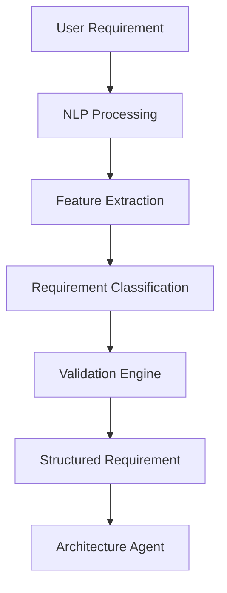

# Requirement Agent Documentation

# AI Software Architect Agent


## 1. Introduction

The Requirement Agent is the first and most important agent in the AI Software Architect Agent system.

Its primary responsibility is to understand user-provided software ideas and transform unstructured natural language requirements into structured software requirements.

The Requirement Agent acts as a professional business analyst who analyzes user needs, identifies system features, detects constraints, and prepares a clear requirement specification for other AI agents.


The agent converts simple user descriptions like:

```
"I want to build an online shopping application"
```

into structured information like:

```
Project Type:
E-Commerce Platform

Users:
Customer, Admin

Functional Requirements:
- Product Search
- Cart Management
- Payment Processing

Non Functional Requirements:
- Security
- Scalability
- Performance
```


---

# 2. Purpose of Requirement Agent


The main purpose of the Requirement Agent is to bridge the communication gap between users and software architecture systems.


It performs:


- Requirement understanding
- Requirement extraction
- Requirement classification
- Requirement validation
- Requirement documentation


---

# 3. Role of Requirement Agent


The Requirement Agent works as a:

```
Business Analyst

+

Requirement Engineer

+

AI Understanding Layer

```


It understands:

- Business goals
- User expectations
- System features
- Technical constraints


---

# 4. Input and Output


## Input


The agent receives:


```
User Software Idea

Project Description

Business Requirements

Technical Constraints

Expected Features

```


Example:


```json
{
"project":

"AI Healthcare Assistant",

"description":

"System to help doctors analyze patient information"
}
```


---

## Output


The agent generates:


```
Structured Requirements Document

```


Containing:


- Project overview
- Actors
- Functional requirements
- Non-functional requirements
- Constraints
- Assumptions


---

# 5. Requirement Agent Workflow


The workflow follows multiple processing stages.


```
User Input


    |

    v


Natural Language Understanding


    |

    v


Requirement Extraction


    |

    v


Requirement Classification


    |

    v


Requirement Validation


    |

    v


Structured Requirement Output

```


---

# 6. Internal Architecture


The Requirement Agent consists of:


```
                 Requirement Agent


                        |

        --------------------------------


        |              |              |


        v              v              v


 NLP Module     Analysis Module   Validation Module


        |              |              |


        --------------------------------


                        |

                        v


              Requirement Database

```


---

# 7. NLP Processing Module


The Natural Language Processing module understands user input.


Responsibilities:


## Text Understanding


Identifies the meaning behind user descriptions.


Example:


Input:

```
Build a food delivery app
```


Extracts:


```
Domain:

Food Delivery


Main Features:

Ordering

Payment

Delivery Tracking

```


---

## Keyword Extraction


Identifies important terms.


Example:


Input:


```
Secure banking application with multiple users
```


Extracts:


```
Domain:

Banking


Keywords:

Security

Authentication

Users

```


---

# 8. Requirement Extraction Process


The agent extracts:


## Actors


Identifies system users.


Example:


```
Customer

Admin

Doctor

Student

```


---

## Features


Identifies system capabilities.


Example:


```
Login

Registration

Payment

Reports

Notifications

```


---

## Data Requirements


Identifies required data.


Example:


```
User Data

Transaction Data

Product Data

```


---

## System Constraints


Identifies limitations.


Example:


```
Must use Java

Cloud deployment required

High security needed

```


---

# 9. Requirement Classification


Requirements are divided into two categories.


# 9.1 Functional Requirements


Describe what the system should do.


Examples:


```
User Registration

Login Authentication

Generate Reports

Process Payments

```


---

# 9.2 Non Functional Requirements


Describe quality attributes.


Examples:


```
Performance

Security

Scalability

Availability

Reliability

```


---

# 10. Requirement Validation


Before sending requirements to other agents, validation is performed.


Validation checks:


## Completeness


Checks whether important information is missing.


Example:


Missing:


```
User roles not defined
```


Action:


```
Ask clarification question
```


---

## Consistency


Checks conflicts between requirements.


Example:


Conflict:


```
No authentication

+

High security requirement

```


---

## Feasibility


Checks whether requirements are technically achievable.


---

# 11. Requirement Agent Decision Logic


The agent follows decision rules.


Example:


```
IF application requires millions of users

THEN recommend scalable architecture


IF application handles sensitive data

THEN recommend security requirements


IF application requires real-time processing

THEN recommend event-driven architecture

```


---

# 12. Requirement Agent Prompt Design


System Prompt:


```
You are a professional software requirement analyst.

Analyze user software ideas.

Extract functional and non-functional requirements.

Identify users, features, constraints, and assumptions.

Provide structured software requirements.
```


---

# 13. Communication With Other Agents


The Requirement Agent communicates with:


## Architecture Agent


Provides:


```
Validated Requirements

User Roles

System Features

Constraints

```


---

## Database Agent


Provides:


```
Data Requirements

Entities

Relationships

```


---

## Security Agent


Provides:


```
Security Requirements

Sensitive Data Information

Access Requirements

```


---

# 14. Requirement Agent Data Flow





---

# 15. Error Handling


The agent handles:


## Incomplete Requirements


Example:


```
User:

Create application


```


Response:


```
Please provide application domain and required features.
```


---

## Ambiguous Requirements


Example:


```
Create a fast system
```


Agent asks:


```
What type of performance improvement is required?
```


---

# 16. Advantages of Requirement Agent


- Converts natural language into structured requirements
- Reduces manual requirement analysis
- Improves communication
- Identifies missing information
- Provides input for architecture generation


---

# 17. Future Enhancements


## Voice-Based Requirement Collection


Users can provide requirements through voice.


## Automatic Requirement Prioritization


AI ranks requirements based on importance.


## Domain-Specific Analysis


Specialized requirement understanding for:

- Healthcare
- Finance
- Education
- E-commerce


---

# 18. Conclusion


The Requirement Agent is the foundation of the AI Software Architect Agent system.

By understanding user ideas, extracting requirements, validating information, and communicating structured data to other agents, it enables the complete automated software architecture generation workflow.

The quality of the final architecture depends heavily on the accuracy of requirement analysis performed by this agent.
