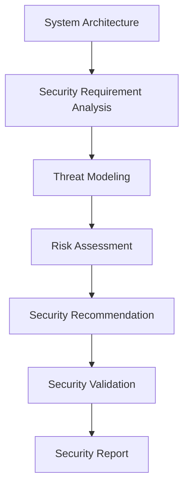

# Security Agent Documentation

# AI Software Architect Agent


## 1. Introduction

The Security Agent is a specialized AI agent responsible for analyzing software architecture and identifying security requirements, risks, and protection mechanisms.

In modern software systems, security is a critical design factor. The Security Agent ensures that generated architectures follow secure software engineering principles.

The agent works like a cybersecurity architect by evaluating:

- Application vulnerabilities
- Authentication requirements
- Authorization mechanisms
- Data protection strategies
- Network security
- Secure coding practices
- Compliance requirements


The Security Agent receives outputs from Requirement Agent, Architecture Agent, Database Agent, and API Agent and performs security analysis before final architecture approval.


Example:


Input:

```
Application:

Online Banking System

Requirements:

- User accounts
- Money transfer
- Transaction history
```


Security Agent Output:


```
Security Recommendations:

Authentication:
JWT + Multi Factor Authentication


Data Protection:
AES Encryption


Database Security:
Encrypted sensitive fields


API Security:
Rate limiting + Input validation


Threats:
SQL Injection
Unauthorized Access

```


---

# 2. Purpose of Security Agent


The main purpose of the Security Agent is to design secure software architectures and prevent possible security threats.


It performs:


- Security requirement analysis
- Threat identification
- Risk assessment
- Security recommendation
- Authentication design
- Authorization design
- Vulnerability analysis


---

# 3. Role of Security Agent


The Security Agent works as:


```
Cybersecurity Architect

+

Security Analyst

+

Threat Modeling Expert

+

Application Security Consultant

```


It answers questions like:


```
How should user data be protected?


Which authentication method should be used?


What security threats exist?


How can APIs and databases be secured?

```


---

# 4. Input and Output


# Input


The Security Agent receives:


```
Application Requirements

System Architecture

Database Design

API Architecture

Deployment Information

```


Example:


```json
{
"application":

"Healthcare Management System",

"sensitive_data":

[
"Patient Records",
"Medical History"
]
}
```


---

# Output


The agent generates:


```
Security Architecture Document

```


Including:


- Security risks
- Threat analysis
- Authentication mechanism
- Authorization strategy
- Data encryption approach
- Security recommendations


---

# 5. Security Agent Workflow


The complete workflow:


```
System Architecture Input


        |

        v


Security Requirement Analysis


        |

        v


Threat Identification


        |

        v


Risk Assessment


        |

        v


Security Solution Selection


        |

        v


Security Validation


        |

        v


Security Report Generation

```


---

# 6. Internal Architecture


The Security Agent contains:


```
                    Security Agent


                          |

        --------------------------------------


        |                 |                 |


        v                 v                 v


Threat Analyzer   Security Engine   Validation Engine


        |                 |                 |


        --------------------------------------


                          |

                          v


                 Security Knowledge Base

```


---

# 7. Security Requirement Analysis


The agent first identifies security needs.


It analyzes:


## Data Sensitivity


Example:


```
Public Data

User Data

Financial Data

Medical Data

```


---

## User Access Level


Example:


```
Admin

Employee

Customer

Guest

```


---

## Application Risk Level


Example:


```
Low Risk

Medium Risk

High Risk

Critical

```


---

# 8. Threat Analysis Engine


The Security Agent identifies possible threats using security models.


It follows:


## OWASP Top 10 Analysis


Common threats:


```
SQL Injection

Broken Authentication

Cross Site Scripting

Security Misconfiguration

Data Exposure

```


---

# 9. Threat Modeling


The agent uses threat modeling techniques.


## STRIDE Model


STRIDE categories:


```
S - Spoofing

T - Tampering

R - Repudiation

I - Information Disclosure

D - Denial of Service

E - Elevation of Privilege

```


Example:


Threat:


```
Unauthorized user accessing admin panel

```


Risk:


```
Elevation of Privilege

```


Solution:


```
Role Based Access Control

```


---

# 10. Authentication Design


The Security Agent recommends authentication methods.


## JWT Authentication


Used for:


```
Web Applications

REST APIs

Mobile Applications

```


Workflow:


```
User Login


      |

      v


Credential Verification


      |

      v


JWT Token Generation


      |

      v


Secure API Access

```


---

## OAuth 2.0


Used for:


```
Third-party authentication

Social login

Enterprise systems

```


---

## Multi Factor Authentication


Used for:


```
Banking

Healthcare

Sensitive applications

```


---

# 11. Authorization Design


The agent designs access control mechanisms.


## Role Based Access Control (RBAC)


Example:


```
Admin:

Manage Users


Customer:

View Profile


Employee:

Process Requests

```


---

## Attribute Based Access Control (ABAC)


Access depends on:


```
User Attributes

Location

Time

Permission Level

```


---

# 12. Data Security Strategy


The Security Agent recommends:


## Encryption


### Data At Rest


Example:


```
Database Encryption

AES-256

```


---

### Data In Transit


Example:


```
HTTPS

TLS Encryption

```


---

## Password Protection


Recommended:


```
Hashing Algorithms:

bcrypt

Argon2

```


---

# 13. API Security Design


The Security Agent evaluates API security.


Recommendations:


## Input Validation


Prevents:


```
SQL Injection

XSS Attacks

```


---

## Rate Limiting


Prevents:


```
API Abuse

DDoS Attacks

```


---

## Secure Headers


Example:


```
HTTPS Headers

Content Security Policy

```


---

# 14. Database Security


The agent protects databases using:


## Access Control


Restrict database users.


---

## Encryption


Protect sensitive information.


---

## Backup Security


Secure backup storage.


---

# 15. Cloud Security Recommendations


For cloud deployment:


Recommended practices:


```
Identity Management

Network Security Groups

Firewall Rules

Secret Management

Monitoring

```


---

# 16. Security Decision Logic


The Security Agent follows rules.


Example:


```
IF application handles financial data

THEN recommend MFA and encryption


IF application exposes public APIs

THEN recommend rate limiting


IF application stores passwords

THEN recommend password hashing


IF application has multiple user roles

THEN recommend RBAC

```


---

# 17. Security Validation Engine


Before final output, the agent checks:


## Authentication Check


```
Does the system have user verification?

```


---

## Authorization Check


```
Are permissions properly defined?

```


---

## Data Protection Check


```
Is sensitive data encrypted?

```


---

## API Security Check


```
Are APIs protected?

```


---

# 18. Security Agent Prompt Design


System Prompt:


```
You are a cybersecurity architect.

Analyze software systems and identify security risks.

Design authentication, authorization,
encryption, and security controls.

Follow secure software development practices.
```


---

# 19. Communication With Other Agents


## Requirement Agent


Receives:


```
Security Requirements

Sensitive Information

User Roles

```


---

## Architecture Agent


Receives:


```
System Components

Deployment Design

Technology Stack

```


---

## Database Agent


Receives:


```
Database Structure

Sensitive Data Fields

```


---

## API Agent


Receives:


```
API Endpoints

Authentication Requirements

```


---

# 20. Security Agent Data Flow





---

# 21. Error Handling


## Missing Security Information


Example:


```
Application stores user data
but data sensitivity is unknown.

```


Solution:


```
Request data classification details.

```


---

## Security Conflict


Example:


```
No authentication

+

Sensitive user information

```


Solution:


```
Recommend authentication mechanism.

```


---

# 22. Advantages of Security Agent


- Detects security risks early
- Improves software protection
- Provides security recommendations
- Automates threat analysis
- Supports secure architecture design
- Reduces vulnerabilities


---

# 23. Future Enhancements


## AI-Based Vulnerability Prediction


Predict possible vulnerabilities before deployment.


---

## Automated Security Testing


Generate:


```
Penetration Tests

Security Test Cases

```


---

## Compliance Checking


Support standards:


```
GDPR

HIPAA

PCI-DSS

ISO 27001

```


---

# 24. Conclusion


The Security Agent strengthens the AI Software Architect Agent by ensuring that generated software architectures follow secure design principles.

Through threat analysis, risk assessment, authentication design, encryption recommendations, and security validation, this agent acts as an AI-powered cybersecurity architect.

It ensures that security is considered from the initial architecture stage rather than being added later during development.
