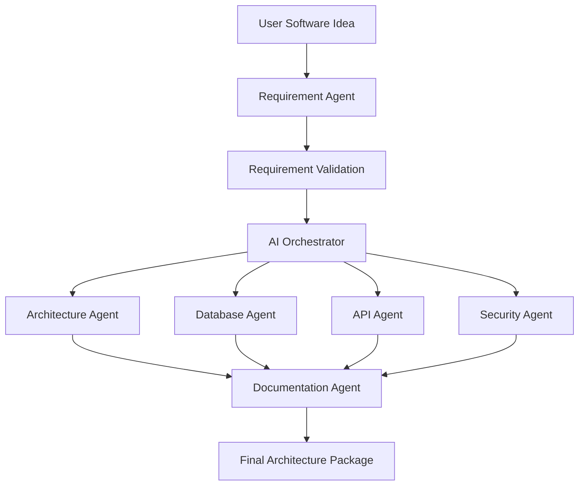

# AI Workflow Documentation

# AI Software Architect Agent


## 1. Introduction

The AI Workflow defines the complete internal working process of the AI Software Architect Agent.

The workflow explains how the system receives user requirements, processes information, coordinates multiple AI agents, performs reasoning, validates decisions, and generates a complete software architecture solution.

The AI Software Architect Agent follows an **Agentic AI Workflow**, where autonomous AI agents collaborate to complete complex software engineering tasks.

Unlike traditional AI systems that only generate responses, this system performs multiple reasoning steps, uses specialized agents, maintains context, validates outputs, and continuously improves architecture decisions.


---

# 2. AI Workflow Objectives


The major objectives of the AI workflow are:


## 2.1 Understand User Requirements

The system should understand software ideas written in natural language.


Example:

User Input:

```
Build an online education platform with video lectures and payment support.
```


The AI system identifies:

- Users
- Features
- Functional requirements
- Non-functional requirements
- Constraints


---

## 2.2 Autonomous Task Execution

The AI system automatically decides which agents should perform specific tasks.


Example:


```
Requirement Agent

        |

        v

Architecture Agent

        |

        v

Database Agent

        |

        v

Security Agent

```


---

## 2.3 Intelligent Decision Making

The system evaluates multiple design possibilities and selects the most suitable solution.


Example:


Requirement:

```
Large scale banking application
```


AI Decision:


```
Architecture:

Microservices


Reason:

High scalability,
security,
and independent deployment.

```


---

## 2.4 Generate Professional Documentation

The system converts AI outputs into structured technical documents.


Generated outputs:


- Architecture document
- Database design
- API specification
- Security report
- Deployment strategy


---

# 3. AI Agent Architecture


The system uses a multi-agent architecture.


Each agent has:


```
Agent Role

+

System Prompt

+

Knowledge Base

+

Reasoning Capability

+

Output Format

```


---

# 4. AI Workflow Overview


```
                     User


                      |

                      v


             Requirement Input


                      |

                      v


              AI Orchestrator


                      |

     --------------------------------------


     |          |          |              |


     v          v          v              v


Requirement Architecture Database    Security

Agent        Agent        Agent       Agent


     |          |          |              |


     --------------------------------------


                      |

                      v


            Documentation Agent


                      |

                      v


             Final Architecture


```


---

# 5. Complete AI Processing Pipeline


The AI workflow consists of several stages.


---

# Stage 1: User Requirement Collection


The workflow begins when a user provides a software idea.


Example:


```
Create an AI-based healthcare management system.
```


The system collects:

- Project description
- Business requirements
- Expected features
- User roles
- Constraints


Input format:


```json
{
"project":

"Healthcare Management System",

"description":

"AI platform for patient management"

}
```


---

# Stage 2: Requirement Understanding


The Requirement Agent processes the user input.


Responsibilities:


- Natural language understanding
- Requirement extraction
- Feature identification
- Actor identification


Processing:


```
User Text

    |

    v

Natural Language Processing

    |

    v

Requirement Extraction

    |

    v

Structured Requirement Object

```


Output:


```json
{
"users":[
"Doctor",
"Patient"
],

"features":[
"Appointment Booking",
"Medical Records"
]
}
```


---

# Stage 3: Requirement Validation


Before architecture generation, requirements are validated.


Validation checks:


## Completeness Check

Does the requirement contain enough information?


Example:


Missing:

```
User roles not defined
```


System Response:


```
Ask clarification question
```


---

## Consistency Check


Checks whether requirements conflict.


Example:


Conflict:

```
High security + No authentication
```


---

## Feasibility Check


Determines whether the requested system is technically possible.


---

# Stage 4: AI Orchestration


The AI Orchestrator controls the workflow execution.


Responsibilities:


- Agent selection
- Task scheduling
- Context sharing
- Result collection


Workflow:


```
Requirement Agent Result


          |

          v


AI Orchestrator


          |

          v


Assign Tasks


          |

          v


Execute Specialized Agents

```


---

# Stage 5: Architecture Generation


The Architecture Agent creates system design.


Input:


```
Validated Requirements
```


Processing:


```
Requirement Analysis

        |

        v

Architecture Pattern Selection

        |

        v

Component Design

        |

        v

Technology Recommendation

```


Output:


```
Architecture Style:

Microservices


Components:

Frontend

Backend

Database

Authentication Service

Payment Service

```


---

# Stage 6: Database Design Generation


The Database Agent designs the data layer.


Processing:


```
Requirement Information

        |

        v

Entity Identification

        |

        v

Relationship Analysis

        |

        v

Schema Generation

```


Output:


```
Tables:

User

Order

Payment

Product

```


---

# Stage 7: API Design Generation


The API Agent creates communication interfaces.


Responsibilities:


- Endpoint creation
- HTTP method selection
- Request/response design
- Authentication flow


Example:


```
POST /api/login

GET /api/products

POST /api/order

```


---

# Stage 8: Security Analysis


The Security Agent evaluates system risks.


Processing:


```
Architecture

      |

      v

Threat Identification

      |

      v

Security Recommendation

```


Output:


```
Authentication:

JWT


Encryption:

AES


Authorization:

RBAC

```


---

# Stage 9: Documentation Generation


The Documentation Agent combines all outputs.


Generated documents:


```
Software Requirement Specification

System Architecture

Database Design

API Documentation

Security Documentation

Deployment Plan

```


---

# 6. Agent Communication Workflow


Agents communicate using structured messages.


Example:


Requirement Agent Output:


```json
{

"projectType":

"E-Commerce",


"users":

[
"Customer",
"Admin"
],


"features":

[
"Product Search",
"Payment"
]

}
```


Architecture Agent receives this information and generates design.


---

# 7. AI Decision Making Process


The system follows a reasoning-based decision process.


```
Problem Understanding

        |

        v

Analyze Requirements

        |

        v

Generate Possible Solutions

        |

        v

Evaluate Solutions

        |

        v

Select Best Architecture

        |

        v

Generate Final Recommendation

```


---

# 8. Architecture Decision Logic


The AI evaluates:


## Scalability Requirement


Question:


```
Will the application support millions of users?
```


Decision:


```
Yes:

Microservices


No:

Monolithic Architecture

```


---

## Performance Requirement


Decision:


```
High Performance:

Caching + Load Balancing

```


---

## Security Requirement


Decision:


```
Sensitive Data:

Encryption + Authentication

```


---

# 9. AI Memory Management


The system uses memory to improve future recommendations.


Memory Types:


## Short-Term Memory


Stores current conversation.


Example:


```
Current project discussion
```


---

## Long-Term Memory


Stores:


- Previous projects
- Architecture decisions
- Technology choices


---

## Vector Memory


Used for semantic search.


Workflow:


```
Previous Document

        |

        v

Embedding Generation

        |

        v

Vector Storage

        |

        v

Similarity Search

        |

        v

Relevant Knowledge Retrieval

```


---

# 10. AI Validation Workflow


AI outputs are validated before final delivery.


```
Generated Output

        |

        v

Validation Agent

        |

        |

---------------------

|                   |

Technical Check   Security Check


        |

        v


Quality Approval


        |

        v


Final Response

```


Validation checks:


- Requirement matching
- Technical feasibility
- Security compliance
- Architecture consistency


---

# 11. Complete AI Workflow Diagram





---

# 12. Error Handling Workflow


If an agent fails:


```
Agent Failure

      |

      v

Error Detection

      |

      v

Retry Mechanism

      |

      v

Alternative Strategy

      |

      v

Continue Workflow

```


---

# 13. Human Feedback Integration


The system supports human feedback.


Workflow:


```
Generated Architecture

        |

        v

User Review

        |

        v

Feedback Collection

        |

        v

Architecture Improvement

```


Benefits:


- Better accuracy
- Continuous improvement
- User customization


---

# 14. Advantages of AI Workflow


- Autonomous software design
- Faster architecture creation
- Reduced manual effort
- Consistent documentation
- Intelligent decision making
- Multi-agent collaboration


---

# 15. Future AI Workflow Enhancements


## Self Learning Agent


Agents improve using previous project experiences.


## Autonomous Coding Agent


Generate complete application code.


## Automated Testing Agent


Create and execute test cases.


## Continuous Architecture Optimization


Improve deployed systems automatically.


---

# 16. Conclusion


The AI Workflow is the core intelligence layer of the AI Software Architect Agent.

Through multi-agent collaboration, structured reasoning, memory management, validation mechanisms, and automated documentation generation, the system can transform simple software ideas into complete professional architecture solutions.

This workflow demonstrates the practical implementation of Agentic AI in modern software engineering.
