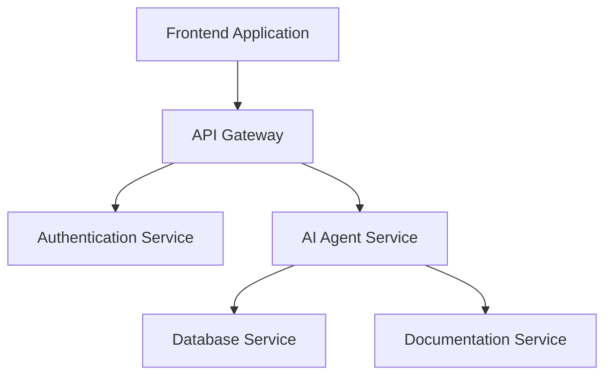

# API Architecture Documentation

# AI Software Architect Agent


## 1. Introduction

The API Architecture defines the communication structure between different components of the AI Software Architect Agent system.

The API layer acts as a communication bridge between:

- Frontend application
- Backend services
- AI agent modules
- Database systems
- External AI services


The API architecture is designed using RESTful principles to provide:

- Secure communication
- Scalability
- Maintainability
- Easy integration
- Standardized data exchange


The API system allows users to submit software requirements and receive AI-generated architecture outputs through structured API communication.


---

# 2. API Architecture Objectives


The main objectives of API architecture are:


## 2.1 Provide Communication Interface

Enable communication between frontend, backend, and AI agents.


## 2.2 Support AI Agent Execution

Allow the backend system to trigger different AI agents through APIs.


## 2.3 Ensure Security

Protect user data and prevent unauthorized access.


## 2.4 Enable Scalability

Support increasing users and project requests.


## 2.5 Maintain Standardization

Follow REST API standards for consistency.


---

# 3. API Architecture Overview


The system follows a layered API architecture.


```
                     Client Application


                            |

                            v


                     API Gateway


                            |

                            v


                 Backend API Layer


                            |

        -----------------------------------

        |          |          |            |

        v          v          v            v


 Requirement Architecture Database   Security

 API          API          API        API


        |          |          |            |


        -----------------------------------


                            |

                            v


                   Data Access Layer


                            |

                            v


                  Database Systems

```


---

# 4. API Communication Flow


The API workflow follows this process:


```
User Request

      |

      v

Frontend Application

      |

      v

REST API Request

      |

      v

Backend Controller

      |

      v

Service Layer

      |

      v

AI Agent Execution

      |

      v

Database Storage

      |

      v

API Response

      |

      v

User Interface

```


---

# 5. API Technology Stack


## Backend Framework

```
Spring Boot
```


Purpose:

- API development
- Request handling
- Business logic


---

## Communication Protocol


```
HTTP / HTTPS
```


Used for:

- Secure communication
- Data exchange


---

## Data Format


```
JSON
```


Example:


```json
{
 "projectName":"Healthcare AI System",
 "description":"AI assistant for doctors"
}
```


---

# 6. API Endpoint Design


## 6.1 Authentication APIs


Authentication APIs manage user login and security.


---

## User Registration


### Endpoint

```
POST /api/auth/register
```


### Purpose

Creates a new user account.


### Request


```json
{
"name":"Snehal",

"email":"user@example.com",

"password":"password123"
}
```


### Response


```json
{
"message":"User registered successfully",

"userId":101
}
```


---

## User Login


### Endpoint

```
POST /api/auth/login
```


### Purpose

Authenticates users.


Request:


```json
{
"email":"user@example.com",

"password":"password123"
}
```


Response:


```json
{
"token":"jwt-token",

"message":"Login successful"
}
```


---

# 7. Project Management APIs


## Create Project


Endpoint:


```
POST /api/projects
```


Purpose:

Creates a new software architecture project.


Request:


```json
{
"projectName":"Food Delivery Application",

"description":"Online food ordering system"
}
```


Response:


```json
{
"projectId":1001,

"status":"Created"
}
```


---

## Get Project Details


Endpoint:


```
GET /api/projects/{projectId}
```


Purpose:

Retrieves project information.


Response:


```json
{
"name":"Healthcare System",

"status":"Architecture Generated"
}
```


---

# 8. Requirement Agent APIs


## Submit Requirement


Endpoint:


```
POST /api/requirements/analyze
```


Purpose:

Sends user requirements to Requirement Agent.


Request:


```json
{
"projectId":1001,

"description":
"Create an AI healthcare assistant"
}
```


Response:


```json
{
"functionalRequirements":[
"User Login",
"Medical Analysis"
],

"nonFunctionalRequirements":[
"Security",
"Performance"
]
}
```


---

# 9. Architecture Agent APIs


## Generate Architecture


Endpoint:


```
POST /api/architecture/generate
```


Purpose:

Generates software architecture.


Request:


```json
{
"projectId":1001
}
```


Response:


```json
{
"architecture":

"Microservices",

"components":[

"Frontend",

"Backend",

"Database"

]
}
```


---

# 10. Database Design APIs


## Generate Database Design


Endpoint:


```
POST /api/database/generate
```


Purpose:

Creates database schema and ER design.


Response:


```json
{
"entities":[

"User",

"Product",

"Order"

],

"database":"PostgreSQL"
}
```


---

# 11. API Design Agent APIs


## Generate API Documentation


Endpoint:


```
POST /api/api-design/generate
```


Purpose:

Creates API specifications.


Response:


```json
{
"endpoints":[

"/api/login",

"/api/users",

"/api/orders"

]
}
```


---

# 12. Security Agent APIs


## Generate Security Analysis


Endpoint:


```
POST /api/security/analyze
```


Purpose:

Analyzes security requirements.


Response:


```json
{
"threats":[

"SQL Injection",

"Unauthorized Access"

],

"solutions":[

"JWT",

"Encryption"

]
}
```


---

# 13. Documentation APIs


## Generate Documentation


Endpoint:


```
POST /api/documentation/generate
```


Purpose:

Creates final project documentation.


Response:


```json
{
"documents":[

"SRS",

"Architecture",

"API Documentation"

]
}
```


---

# 14. API Authentication Architecture


The system uses JWT-based authentication.


Workflow:


```
User Login

    |

    v

Authentication Server

    |

    v

Validate Credentials

    |

    v

Generate JWT Token

    |

    v

Access Protected APIs

```


---

# 15. API Security Measures


## HTTPS Communication

All API communication uses encrypted channels.


## JWT Authentication

Tokens are used for secure access.


## Role Based Access Control


Example:


```
Admin

Developer

User

```


Each role has specific permissions.


---

## Input Validation


All API requests are validated before processing.


Protection against:

- SQL Injection
- XSS attacks
- Invalid data


---

# 16. Error Handling Strategy


The API follows standard HTTP response codes.


| Code | Meaning |
|-|-|
|200|Successful Request|
|201|Resource Created|
|400|Bad Request|
|401|Unauthorized|
|403|Forbidden|
|404|Not Found|
|500|Server Error|


Example Error Response:


```json
{
"status":400,

"message":
"Invalid project requirement"
}
```


---

# 17. API Documentation Workflow


```
Requirement Input

        |

        v

Backend API

        |

        v

AI Agent Processing

        |

        v

Database Storage

        |

        v

Response Generation

```


---

# 18. API Architecture Diagram





---

# 19. API Design Principles


## RESTful Design

Uses standard HTTP methods.


## Stateless Communication

Each request contains required information.


## Version Control

API versions are maintained.


Example:


```
/api/v1/projects
```


## Documentation First

All APIs are documented before implementation.


---

# 20. Future API Enhancements


## GraphQL Support

For flexible data querying.


## WebSocket Integration

For real-time AI responses.


## API Gateway Scaling

For enterprise deployment.


## Third Party Integrations

Integration with:

- GitHub
- Jira
- Cloud platforms


---

# 21. Conclusion


The API Architecture provides a secure and scalable communication framework for the AI Software Architect Agent.

Through RESTful services, structured API design, authentication mechanisms, and AI agent integration, the system enables efficient communication between users, AI agents, databases, and external services.

This architecture supports future expansion and enterprise-level deployment.
