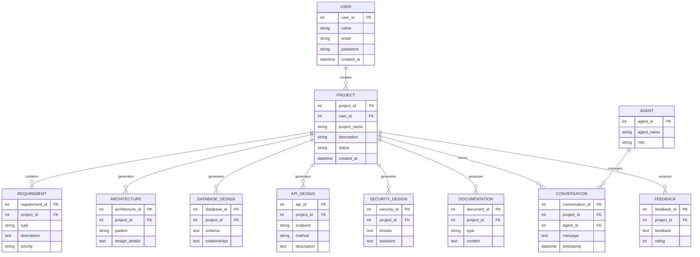

# Database Design Documentation

# AI Software Architect Agent


## 1. Introduction

The Database Design defines the data storage architecture of the **AI Software Architect Agent** system.

The system requires efficient data management for storing:

- User information
- Software projects
- Requirements
- AI agent conversations
- Generated architectures
- Database designs
- API documentation
- Security recommendations
- Generated reports
- AI knowledge and memory


The database architecture follows a hybrid approach by combining:

- Relational Database
- Document Database
- Vector Database


This approach provides both structured data management and AI knowledge retrieval capabilities.


---

# 2. Database Design Objectives


The main objectives of database design are:


## 2.1 Data Organization

Store project-related information in a structured format.


## 2.2 Data Consistency

Maintain accuracy and integrity of stored information.


## 2.3 AI Memory Management

Store previous interactions and knowledge for improving future recommendations.


## 2.4 Scalability

Support increasing users, projects, and AI-generated documents.


## 2.5 Security

Protect sensitive user and project information.


---

# 3. Database Architecture Overview


The system follows a hybrid database architecture.


```
                  AI Software Architect Agent


                            |

                            v


                 Database Management Layer


                            |

        ------------------------------------------------


        |                     |                        |


        v                     v                        v


 Relational Database   Document Database      Vector Database


 PostgreSQL/MySQL      MongoDB                ChromaDB/FAISS


        |                     |                        |


        v                     v                        v


 Structured Data       AI Documents          AI Knowledge Memory


```


---

# 4. Database Components


# 4.1 Relational Database


Technology:

```
PostgreSQL / MySQL
```


Purpose:

Stores structured application data.


Used for:

- Users
- Projects
- Requirements
- Agent details
- System metadata


Advantages:

- ACID transactions
- Data consistency
- SQL support
- Strong relationships


---

# 4.2 Document Database


Technology:

```
MongoDB
```


Purpose:

Stores flexible AI-generated documents.


Used for:


- Architecture reports
- Generated documentation
- Agent responses
- Conversation history


Advantages:

- Flexible schema
- JSON-based storage
- Easy document management


---

# 4.3 Vector Database


Technology:

```
ChromaDB / FAISS / Pinecone
```


Purpose:

Stores AI embeddings for semantic search.


Used for:


- Previous architecture knowledge
- Similar project retrieval
- AI memory
- Context generation


Workflow:


```
Document

    |

    v

Embedding Model

    |

    v

Vector Representation

    |

    v

Vector Database

    |

    v

Similarity Search

```


---

# 5. Database Entity Overview


Main entities:


```
User

Project

Requirement

Agent

Conversation

Architecture

Technology

DatabaseDesign

APIDesign

SecurityDesign

Documentation

Feedback

```


---

# 6. Entity Relationship Diagram





---

# 7. Table Design


# 7.1 User Table


Stores user account information.


| Column | Data Type | Description |
|-|-|-|
| user_id | Integer | Primary Key |
| name | VARCHAR | User name |
| email | VARCHAR | User email |
| password | VARCHAR | Encrypted password |
| created_at | Timestamp | Account creation date |


---

# 7.2 Project Table


Stores software projects created by users.


| Column | Data Type | Description |
|-|-|-|
| project_id | Integer | Primary Key |
| user_id | Integer | Foreign Key |
| project_name | VARCHAR | Project title |
| description | TEXT | Project details |
| status | VARCHAR | Current status |
| created_at | Timestamp | Creation date |


Example:


```
Project Name:

AI Healthcare Assistant


Status:

Architecture Generated

```


---

# 7.3 Requirement Table


Stores analyzed requirements.


| Column | Data Type | Description |
|-|-|-|
| requirement_id | Integer | Primary Key |
| project_id | Integer | Project reference |
| type | VARCHAR | Functional/NFR |
| description | TEXT | Requirement details |
| priority | VARCHAR | Importance level |


Example:


```
Type:

Functional Requirement


Description:

User authentication system

```


---

# 7.4 Architecture Table


Stores generated system architecture.


| Column | Data Type | Description |
|-|-|-|
| architecture_id | Integer | Primary Key |
| project_id | Integer | Project reference |
| pattern | VARCHAR | Architecture type |
| design_details | TEXT | Architecture information |


Example:


```
Pattern:

Microservices Architecture

```


---

# 7.5 Database Design Table


Stores generated database models.


| Column | Data Type | Description |
|-|-|-|
| database_id | Integer | Primary Key |
| project_id | Integer | Project reference |
| schema | TEXT | Database schema |
| relationships | TEXT | Entity relationships |


---

# 7.6 API Design Table


Stores generated API information.


| Column | Data Type | Description |
|-|-|-|
| api_id | Integer | Primary Key |
| project_id | Integer | Project reference |
| endpoint | VARCHAR | API URL |
| method | VARCHAR | HTTP method |
| description | TEXT | API purpose |


Example:


```
POST /api/login

Purpose:

User Authentication

```


---

# 7.7 Security Design Table


Stores security analysis.


| Column | Data Type | Description |
|-|-|-|
| security_id | Integer | Primary Key |
| project_id | Integer | Project reference |
| threats | TEXT | Identified threats |
| solutions | TEXT | Security solutions |


---

# 7.8 Documentation Table


Stores generated documents.


| Column | Data Type | Description |
|-|-|-|
| document_id | Integer | Primary Key |
| project_id | Integer | Project reference |
| type | VARCHAR | Document type |
| content | TEXT | Document data |


---

# 8. AI Memory Database Design


The AI system requires memory storage to improve responses.


Stored information:


```
Previous Projects

Architecture Decisions

Technology Choices

User Preferences

Successful Designs

```


Workflow:


```
Previous Project

        |

        v

Embedding Generation

        |

        v

Vector Storage

        |

        v

Future Retrieval

```


---

# 9. Data Security Strategy


Database security measures:


## Encryption


Sensitive data is encrypted before storage.


## Access Control


Users can access only their own projects.


## Backup Strategy


Regular database backups are maintained.


## Audit Logging


Important activities are recorded.


---

# 10. Database Optimization Strategy


## Indexing


Frequently searched fields are indexed.


Example:

```
project_id

user_id

created_at

```


## Query Optimization


Efficient SQL queries are used.


## Data Partitioning


Large datasets are divided into smaller sections.


---

# 11. Database Workflow


```
User Creates Project


        |

        v


Requirement Data Storage


        |

        v


AI Agent Processing


        |

        v


Architecture Data Storage


        |

        v


Documentation Storage


        |

        v


Final Project Repository

```


---

# 12. Future Database Improvements


## Distributed Database

Support global deployment.


## Advanced Vector Search

Improve AI knowledge retrieval.


## Automated Data Cleaning

Remove unnecessary information.


## Real-Time Analytics

Monitor system usage.


---

# 13. Conclusion


The database architecture of the AI Software Architect Agent provides a scalable and intelligent data management solution.

By combining relational databases, document storage, and vector databases, the system can efficiently manage structured information while supporting AI memory and knowledge retrieval.

This design ensures reliability, performance, security, and future scalability.
