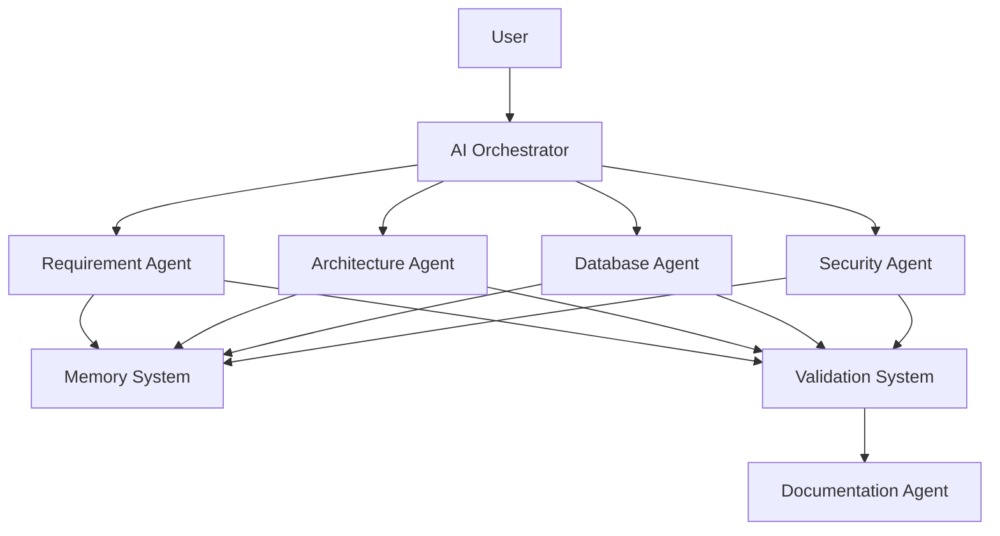

# Design Patterns Documentation

# AI Software Architect Agent


## 1. Introduction

Design patterns define reusable solutions to common software architecture and development problems.

The AI Software Architect Agent uses multiple software design patterns, architecture patterns, and Agentic AI patterns to create a modular, scalable, and maintainable system.

The selection of design patterns helps the system achieve:

- Better code organization
- Separation of responsibilities
- Easier maintenance
- Agent scalability
- Improved communication
- Reliable AI workflow execution


The project combines traditional software engineering patterns with modern AI agent design patterns.


---

# 2. Design Pattern Categories


The system uses three major categories of patterns:


```
Design Patterns


      |

      |----------------------------|

      |                            |

Software Patterns          AI Agent Patterns


      |                            |

      v                            v


Backend Design          Autonomous AI Workflow


```


---

# 3. Architecture Patterns Used


# 3.1 Multi-Agent Architecture Pattern


## Overview


The AI Software Architect Agent follows a multi-agent architecture where multiple specialized agents collaborate to complete complex tasks.


Instead of one AI model performing all operations, different agents handle different responsibilities.


Agents:


```
Requirement Agent

Architecture Agent

Database Agent

API Agent

Security Agent

Documentation Agent

```


---

## Implementation


```
                 AI Orchestrator


                       |

     ------------------------------------


     |          |          |            |


     v          v          v            v


Requirement Architecture Database Security

Agent        Agent        Agent       Agent


```


---

## Advantages


- Separation of responsibilities
- Better accuracy
- Easier debugging
- Independent agent improvement
- Parallel execution capability


---

# 3.2 Layered Architecture Pattern


## Overview


The system follows a layered architecture where responsibilities are separated into different layers.


Layers:


```
Presentation Layer

        |

Business Logic Layer

        |

AI Processing Layer

        |

Data Access Layer

        |

Database Layer

```


---

## Usage in Project


### Presentation Layer

Responsible for:

- User interaction
- Requirement input
- Result visualization


### Business Layer

Responsible for:

- Workflow management
- API processing


### AI Layer

Responsible for:

- Agent execution
- Reasoning


### Data Layer

Responsible for:

- Storage
- Retrieval


---

## Benefits


- Easy maintenance
- Clear responsibility separation
- Better testing


---

# 3.3 Microservices Architecture Pattern


## Overview


The system can be deployed using microservices architecture.


Each major service operates independently.


Example:


```
User Service

Requirement Service

Architecture Service

Database Service

Security Service

Documentation Service

```


---

## Advantages


- Independent deployment
- Horizontal scalability
- Fault isolation
- Technology flexibility


---

# 4. AI Agent Design Patterns


# 4.1 Agent Orchestrator Pattern


## Overview


The Orchestrator pattern uses a central controller that manages multiple AI agents.


The AI Orchestrator decides:

- Which agent executes
- Execution order
- Data sharing
- Result combination


---

## Workflow


```
User Request


     |

     v


AI Orchestrator


     |

---------------------


|       |       |


Agent1 Agent2 Agent3


     |

     v


Final Response

```


---

## Advantages


- Central workflow control
- Easier agent management
- Better coordination


---

# 4.2 Specialized Agent Pattern


## Overview


Each agent focuses on one specific responsibility.


Example:


Requirement Agent:


```
Only handles requirement analysis.

```


Architecture Agent:


```
Only handles system architecture.

```


---

## Benefits


- Expert-level performance
- Reduced complexity
- Easier updates


---

# 4.3 Tool-Using Agent Pattern


## Overview


AI agents can use external tools to complete tasks.


Examples:


Architecture Agent:

Uses:

- Diagram generator
- Technology database


Database Agent:

Uses:

- Schema generator
- ER diagram generator


---

## Workflow


```
AI Agent


   |

   v


Select Required Tool


   |

   v


Execute Tool


   |

   v


Generate Result

```


---

# 4.4 Memory-Augmented Agent Pattern


## Overview


The system provides memory capabilities to AI agents.


Memory types:


## Short-Term Memory


Stores current conversation.


Example:

```
Current user discussion
```


## Long-Term Memory


Stores previous project knowledge.


Example:

```
Previous architecture decisions
```


## Vector Memory


Stores embeddings for semantic retrieval.


---

## Workflow


```
User Request


     |

     v


Memory Retrieval


     |

     v


Relevant Knowledge


     |

     v


AI Response

```


---

# 4.5 Reflection Pattern


## Overview


The Reflection pattern allows AI agents to review and improve their own output.


Process:


```
Generate Solution


        |

        v


Self Evaluation


        |

        v


Identify Problems


        |

        v


Improve Solution


        |

        v


Final Output

```


---

## Usage


Used for:


- Architecture validation
- Security checking
- Documentation improvement


---

# 4.6 Planning Pattern


## Overview


The AI system creates a plan before execution.


Example:


User Request:


```
Create e-commerce system
```


AI Plan:


```
1. Analyze requirements

2. Design architecture

3. Create database

4. Design APIs

5. Generate documentation

```


---

## Benefits


- Structured execution
- Reduced errors
- Better reasoning


---

# 5. Software Design Patterns


# 5.1 Factory Pattern


## Purpose


Creates AI agent objects dynamically.


Example:


```
AgentFactory


        |

        |


Create Requirement Agent


Create Database Agent


Create Security Agent

```


---

## Benefits


- Flexible agent creation
- Reduced dependency


---

# 5.2 Strategy Pattern


## Purpose


Allows changing algorithms dynamically.


Example:


Architecture selection strategy:


```
Small Application

        |

        v

Monolithic Strategy


Large Application

        |

        v

Microservices Strategy

```


---

## Benefits


- Flexible decision making
- Easy addition of new strategies


---

# 5.3 Observer Pattern


## Purpose


Allows components to receive updates automatically.


Example:


When architecture generation completes:


```
Architecture Agent


        |

        v


Notify Documentation Agent


```


---

## Benefits


- Loose coupling
- Event-driven communication


---

# 5.4 Repository Pattern


## Purpose


Separates database operations from business logic.


Architecture:


```
Service Layer


      |

      v


Repository Layer


      |

      v


Database

```


---

## Benefits


- Cleaner code
- Easier database changes


---

# 6. Workflow Design Pattern


The complete AI workflow follows a pipeline pattern.


```
Input Processing


        |

        v


Requirement Analysis


        |

        v


Architecture Generation


        |

        v


Database Design


        |

        v


Security Analysis


        |

        v


Documentation Generation


```


---

# 7. Event Driven Pattern


## Overview


The system can use events for communication.


Example:


Event:


```
RequirementCompleted

```


Triggers:


```
Architecture Agent Execution

```


---

## Benefits


- Asynchronous processing
- Better scalability
- Loose coupling


---

# 8. Pattern Selection Justification


| Pattern | Usage | Reason |
|-|-|-|
|Multi-Agent Pattern|AI collaboration|Specialized intelligence|
|Orchestrator Pattern|Workflow control|Agent coordination|
|Layered Architecture|System structure|Maintainability|
|Factory Pattern|Agent creation|Flexibility|
|Strategy Pattern|Architecture decisions|Dynamic selection|
|Repository Pattern|Database access|Clean architecture|
|Reflection Pattern|AI improvement|Quality enhancement|
|Memory Pattern|Knowledge retrieval|Better recommendations|


---

# 9. Complete Pattern Architecture





---

# 10. Future Design Pattern Enhancements


## Autonomous Agent Collaboration


Agents negotiate decisions automatically.


## Multi-Agent Communication Protocol


Standard communication between agents.


## Self Improving Architecture Pattern


System learns from previous designs.


---

# 11. Conclusion


The AI Software Architect Agent combines traditional software design patterns with modern Agentic AI patterns.

These patterns provide a strong foundation for building a scalable, modular, and intelligent software architecture generation system.

By using orchestrator-based workflows, specialized agents, memory systems, and reflection mechanisms, the project demonstrates advanced AI engineering practices.
