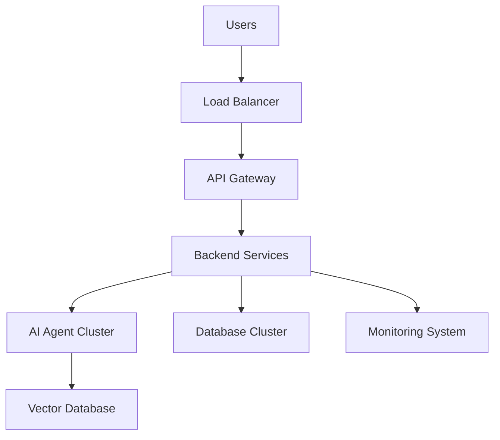

# Scalability Strategy Documentation

# AI Software Architect Agent


## 1. Introduction

Scalability Strategy defines how the AI Software Architect Agent can handle increasing numbers of users, projects, AI requests, and generated architecture documents without reducing system performance.

Since the system is based on Agentic AI architecture, scalability is an important design consideration.

The system must support:

- Multiple users accessing the platform simultaneously
- Large software architecture generation requests
- Multiple AI agents running concurrently
- Increasing project history and knowledge storage
- Growing database size
- Future enterprise-level deployment


The scalability strategy focuses on designing a system that can grow from a prototype application into a production-level AI software engineering platform.


---

# 2. Scalability Objectives


The main objectives of scalability design are:


## 2.1 Handle Increasing Users

The system should support increasing numbers of developers, students, and organizations.


Example:


```
100 users

        |

        v

10,000 users

        |

        v

Enterprise users

```


---

## 2.2 Support Large AI Workloads

The system should efficiently manage multiple AI agent executions.


Example:


```
Requirement Agent

Architecture Agent

Database Agent

Security Agent

Documentation Agent

```


Multiple agents should execute without affecting system performance.


---

## 2.3 Maintain Performance

Response time should remain acceptable even with increasing workload.


---

## 2.4 Enable Future Expansion

New AI agents, tools, and services should be added easily.


---

# 3. Scalability Architecture Overview


The system follows a distributed scalable architecture.


```
                         Users


                           |

                           v


                    Load Balancer


                           |

                           v


                  API Gateway Layer


                           |

        -----------------------------------


        |              |                 |


        v              v                 v


 Backend Service   AI Agent Service   Document Service


        |              |                 |


        -----------------------------------


                           |

                           v


                  Data Management Layer


                           |

        -----------------------------------


        |              |                 |


        v              v                 v


 PostgreSQL      MongoDB          Vector Database


                           |

                           v


                  Cloud Infrastructure

```


---

# 4. Horizontal Scaling


## Overview


Horizontal scaling means increasing system capacity by adding more servers or service instances.


Example:


Before scaling:


```
Backend Server

       |

       v

100 Requests

```


After scaling:


```
Backend Server 1

Backend Server 2

Backend Server 3


       |

       v


1000+ Requests

```


---

## Implementation


The following components can be horizontally scaled:


## Backend Services


Multiple Spring Boot instances can run simultaneously.


Example:


```
Backend Instance 1

Backend Instance 2

Backend Instance 3

```


---

## AI Agent Services


Multiple AI agent workers can execute tasks in parallel.


Example:


```
Architecture Agent Worker

Database Agent Worker

Security Agent Worker

```


---

## Documentation Service


Multiple document generation workers can process reports simultaneously.


---

# 5. Vertical Scaling


## Overview


Vertical scaling increases the power of existing servers.


Resources increased:

- CPU
- RAM
- Storage
- GPU


Example:


Before:


```
4 GB RAM Server

```


After:


```
32 GB RAM Server

```


---

## Usage in AI System


Useful for:


- Large language model processing
- Embedding generation
- Document analysis


---

# 6. AI Agent Scalability Strategy


The AI layer requires special scaling techniques.


---

# 6.1 Agent Worker Architecture


Each agent can run as an independent service.


Example:


```
Requirement Agent Service


Architecture Agent Service


Database Agent Service


Security Agent Service


Documentation Agent Service

```


Advantages:


- Independent scaling
- Better performance
- Fault isolation


---

# 6.2 Parallel Agent Execution


Agents can execute simultaneously when tasks are independent.


Example:


Instead of:


```
Requirement

      |

Architecture

      |

Database

      |

Security

```


Parallel execution:


```
Requirement Complete


       |

       |

 ---------------------

 |         |          |

Architecture Database Security


```


Benefits:


- Reduced execution time
- Better resource utilization


---

# 6.3 AI Request Queue Management


Large AI requests are managed using queues.


Technology examples:


- RabbitMQ
- Apache Kafka
- Redis Queue


Workflow:


```
User Request


      |

      v


Message Queue


      |

      v


AI Worker


      |

      v


Generated Response

```


---

# 7. Database Scalability Strategy


The database layer uses multiple optimization techniques.


---

# 7.1 Database Indexing


Indexes improve query performance.


Example:


Frequently searched fields:


```
user_id

project_id

created_date

```


---

# 7.2 Database Partitioning


Large datasets are divided into smaller parts.


Example:


Projects table:


```
Projects_2026

Projects_2027

Projects_2028

```


Benefits:


- Faster queries
- Better management


---

# 7.3 Database Replication


Multiple database copies improve availability.


Architecture:


```
                Application


                    |

                    v


              Database Master


              /            \


             /              \


            v                v


      Replica 1        Replica 2

```


Benefits:


- High availability
- Backup support
- Faster reads


---

# 7.4 Vector Database Scaling


The AI memory system requires scalable vector storage.


Used for:


- Previous architectures
- Technical documents
- Knowledge retrieval


Scaling methods:


- Distributed vector storage
- Index optimization
- Embedding compression


---

# 8. Caching Strategy


Caching reduces unnecessary processing.


Cache candidates:


## User Data


Frequently accessed user information.


## Project Metadata


Recently opened projects.


## AI Responses


Previously generated results.


---

Caching Architecture:


```
User Request


      |

      v


Cache Layer


      |

 -----------------

 |               |

Found          Not Found


 |               |


Return      Process Request


```


Technologies:


- Redis
- Memcached


---

# 9. Cloud Scalability Strategy


The system can be deployed on cloud infrastructure.


Supported platforms:


## AWS


Services:


- EC2
- RDS
- S3
- Lambda
- ECS


---

## Google Cloud Platform


Services:


- Compute Engine
- Cloud SQL
- Vertex AI


---

## Microsoft Azure


Services:


- Virtual Machines
- Azure AI Services


---

# 10. Containerization Strategy


The system uses container-based deployment.


Technology:


```
Docker
```


Each component runs independently.


Example:


```
Frontend Container


Backend Container


AI Service Container


Database Container


```


Advantages:


- Easy deployment
- Environment consistency
- Faster scaling


---

# 11. Kubernetes Deployment Strategy


For enterprise deployment, Kubernetes can manage services.


Architecture:


```
                 Kubernetes Cluster


                        |

        --------------------------------


        |              |              |


        v              v              v


Frontend Pod    Backend Pod    AI Agent Pods


```


Benefits:


- Automatic scaling
- Self-healing
- Load distribution


---

# 12. Load Balancing Strategy


Load balancers distribute user requests.


Workflow:


```
User Request


       |

       v


Load Balancer


       |

 -----------------

 |       |        |


API  API       API

Server Server Server


```


Benefits:


- Better performance
- Fault tolerance
- High availability


---

# 13. Monitoring and Performance Management


The system requires continuous monitoring.


Metrics:


## Application Metrics

- Response time
- API performance
- Error rate


## AI Metrics

- Token usage
- Processing time
- Agent accuracy


## Infrastructure Metrics

- CPU usage
- Memory usage
- Network traffic


Tools:


- Prometheus
- Grafana
- Cloud Monitoring


---

# 14. Fault Tolerance Strategy


The system should continue working even if one component fails.


Methods:


## Retry Mechanism


Failed AI requests are retried.


## Backup Services


Secondary services handle failures.


## Graceful Degradation


System provides partial functionality during failures.


Example:


If Documentation Agent fails:


```
Architecture output is still available

```


---

# 15. Security Scalability


Security must scale with system growth.


Approaches:


- Distributed authentication service
- Centralized identity management
- API rate limiting
- Automated vulnerability scanning


---

# 16. Future Enterprise Scaling Roadmap


## Phase 1: Prototype Deployment


Infrastructure:


- Single server
- Basic database
- Limited users


---

## Phase 2: Production Deployment


Infrastructure:


- Cloud deployment
- Multiple backend instances
- Database optimization


---

## Phase 3: Enterprise Deployment


Infrastructure:


- Kubernetes cluster
- Distributed AI agents
- Global availability


---

# 17. Scalability Architecture Diagram





---

# 18. Advantages of Scalability Strategy


- Supports growing users
- Handles large AI workloads
- Improves system reliability
- Enables cloud deployment
- Reduces performance issues
- Supports enterprise expansion


---

# 19. Conclusion


The Scalability Strategy ensures that the AI Software Architect Agent can evolve from a small prototype into a large-scale AI-powered software engineering platform.

By implementing horizontal scaling, cloud deployment, AI worker management, database optimization, caching, containerization, and monitoring, the system can support future growth while maintaining performance, reliability, and availability.

This scalable architecture allows the AI Software Architect Agent to become a production-ready Agentic AI solution.
