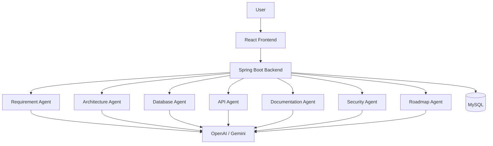
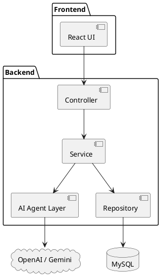
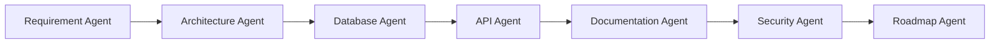
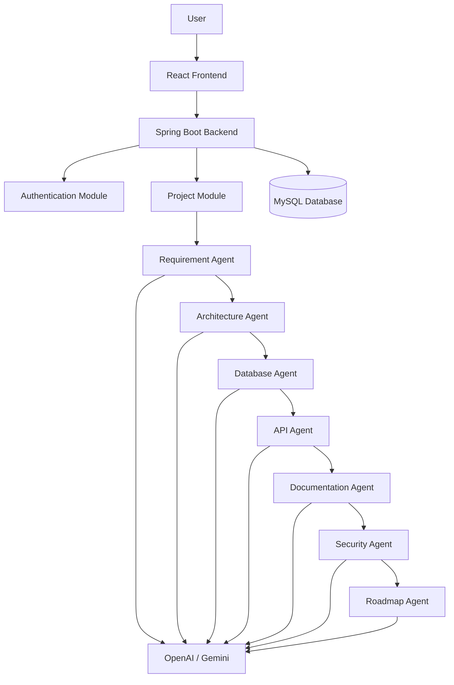

# System Architecture

---

# AI Software Architect Agent

## System Architecture Documentation

Author: Snehal Bhosale

Technology Stack:
- Java 21
- Spring Boot 3
- React.js
- MySQL
- Spring AI
- OpenAI / Gemini
- Docker
- GitHub

---

# 1. Introduction

## Overview

The AI Software Architect Agent is an intelligent software engineering assistant designed to automate the initial phases of software system design. Instead of manually creating software architecture, database schemas, API documentation, UML diagrams, and project documentation, users can provide project requirements, and the system generates these artifacts automatically using Large Language Models (LLMs) combined with rule-based validation.

The system follows a multi-agent architecture where each specialized AI agent performs a dedicated responsibility. This modular design improves maintainability, scalability, and future extensibility.

The project aims to reduce the time spent on repetitive software design tasks while improving documentation quality and architectural consistency.

---

# Purpose

The purpose of the AI Software Architect Agent is to assist software developers, students, startups, and software architects in transforming software requirements into complete architectural documentation.

The platform automates tasks that traditionally require extensive manual effort, allowing developers to focus on implementation rather than repetitive documentation.

---

# Scope

The scope of the project includes:

- Requirement Analysis
- Software Architecture Generation
- Database Design
- REST API Design
- UML Diagram Suggestions
- Software Documentation Generation
- Project Roadmap Creation
- Report Export

The current version focuses on monolithic web application architecture, while future versions may support microservices, mobile applications, and cloud-native systems.

---

# Problem Statement

Software architecture design is one of the most critical phases of software development. Developers often spend significant time creating UML diagrams, selecting technologies, designing databases, documenting APIs, and preparing project documentation.

These activities are repetitive and require substantial expertise. Small teams and students often struggle to produce professional-quality architecture documents due to limited experience or time constraints.

The AI Software Architect Agent addresses this challenge by automating software design tasks using intelligent agents and modern AI models.

---

# Existing System

Most current AI coding assistants primarily focus on source code generation rather than complete software architecture.

Existing solutions typically:

- Generate isolated code snippets.
- Lack coordinated multi-agent collaboration.
- Provide limited documentation.
- Do not generate complete software design artifacts.
- Require significant manual editing.

---

# Proposed System

The proposed AI Software Architect Agent introduces a coordinated multi-agent system where specialized agents work together to generate a complete software architecture.

Each agent has a clearly defined responsibility, enabling modular processing and higher-quality outputs.

The system generates:

- Software Architecture
- Database Schema
- REST APIs
- UML Diagrams
- Technical Documentation
- Development Roadmap

The generated artifacts are stored in the project repository for future reference and further customization.

---

# Objectives

The primary objectives are:

- Automate software architecture design.
- Improve documentation quality.
- Reduce manual effort.
- Generate standardized outputs.
- Support multiple software domains.
- Provide scalable architecture recommendations.
- Enhance developer productivity.
- Simplify academic and industrial software design.

---

# Target Users

The platform is intended for:

- Software Developers
- Software Architects
- College Students
- Startup Teams
- Project Managers
- Researchers
- Freelancers
- Technical Consultants

---

# Expected Benefits

The proposed system provides several benefits:

- Faster project initialization
- Improved software documentation
- Better architectural consistency
- Reduced human error
- Easier maintenance
- Faster onboarding for new developers
- Improved collaboration
- Professional project documentation

---

# Key Features

The AI Software Architect Agent includes the following major features:

## Requirement Analysis

Automatically extracts functional and non-functional requirements from user input.

---

## Architecture Recommendation

Suggests suitable software architectures such as Layered Architecture, MVC, Clean Architecture, or Hexagonal Architecture.

---

## Database Design

Generates normalized database schemas, entity relationships, and SQL scripts.

---

## API Generation

Creates REST API specifications, request/response models, and endpoint documentation.

---

## UML Diagram Assistance

Provides recommendations for:

- Use Case Diagram
- Activity Diagram
- Sequence Diagram
- Class Diagram
- Deployment Diagram
- ER Diagram

---

## Documentation Generator

Automatically creates:

- Software Requirement Specification
- Software Design Document
- API Documentation
- Technical Reports

---

## Roadmap Generator

Creates project milestones, sprint planning, and development timelines.

---

# Assumptions

The following assumptions apply:

- Users provide clear project requirements.
- Internet connectivity is available for AI model access.
- External AI APIs remain operational.
- Database connectivity is maintained.
- Users possess basic software development knowledge.

---

# Constraints

The current system has the following limitations:

- Requires external AI APIs.
- Dependent on internet connectivity.
- AI-generated outputs may require manual review.
- Limited support for non-web application architectures.
- API usage costs depend on the selected AI provider.

---

# Related Documents

This document is closely related to:

- ArchitectureAgent.md
- DatabaseAgent.md
- APIAgent.md
- DeploymentDiagram.md
- ERDiagram.md
- SequenceDiagram.md
- SecurityAgent.md

---
# 2. Overall System Architecture

## Overview

The AI Software Architect Agent follows a modular, layered, and service-oriented architecture. The system is designed so that each module has a single responsibility, making the application easier to develop, maintain, test, and extend.

The architecture consists of four major layers:

1. Presentation Layer
2. Application Layer
3. AI Agent Layer
4. Data Layer

Each layer communicates through well-defined interfaces, reducing coupling and improving scalability.

---

# High-Level Architecture

```
                    User
                      │
                      ▼
              React Frontend
                      │
          HTTPS / REST API Calls
                      │
                      ▼
           Spring Boot Backend
                      │
 ┌──────────┬──────────┬──────────┬──────────┐
 ▼          ▼          ▼          ▼          ▼
Requirement Architecture Database API Documentation
   Agent        Agent      Agent Agent     Agent
                      │
                      ▼
             OpenAI / Gemini API
                      │
                      ▼
               MySQL Database
```

---

# Layered Architecture

The application is divided into multiple logical layers.

## 1. Presentation Layer

### Description

The Presentation Layer provides the graphical user interface (GUI) through which users interact with the system.

### Technologies

- React.js
- HTML5
- CSS3
- JavaScript
- React Router
- Axios

### Responsibilities

- User Registration
- Login
- Dashboard
- Project Creation
- Requirement Submission
- Viewing Generated Artifacts
- Download Reports

### Advantages

- Responsive UI
- Easy navigation
- Component-based architecture
- Better user experience

---

## 2. Application Layer

### Description

The Application Layer contains the core business logic of the system.

### Technologies

- Java 21
- Spring Boot
- Spring Security
- Spring Data JPA
- Spring AI

### Responsibilities

- User Authentication
- Authorization
- Project Management
- AI Agent Coordination
- Validation
- Exception Handling
- Report Generation

---

## 3. AI Agent Layer

### Description

This is the intelligent core of the application. Each AI Agent performs one specialized task.

Instead of relying on a single AI prompt, responsibilities are divided among multiple agents to improve modularity and output quality.

---

# AI Agents

## Requirement Analysis Agent

### Responsibilities

- Analyze project requirements
- Identify functional requirements
- Identify non-functional requirements
- Detect constraints
- Generate user stories
- Prepare structured project specifications

### Output

- Requirement Document
- User Stories
- Requirement Summary

---

## Architecture Agent

### Responsibilities

- Select architecture pattern
- Recommend technology stack
- Suggest design patterns
- Generate component structure
- Create architecture documentation

### Output

- Software Architecture
- Layered Design
- Component Diagram
- Technology Recommendations

---

## Database Design Agent

### Responsibilities

- Identify entities
- Generate attributes
- Define relationships
- Normalize database
- Generate SQL scripts

### Output

- ER Diagram
- SQL Schema
- Database Documentation

---

## API Agent

### Responsibilities

- Generate REST APIs
- Create request models
- Create response models
- Suggest HTTP methods
- Generate endpoint documentation

### Output

- REST API Specification
- Swagger/OpenAPI Draft
- API Documentation

---

## Documentation Agent

### Responsibilities

- Generate Software Requirement Specification (SRS)
- Generate Software Design Document (SDD)
- Generate Developer Guide
- Generate User Manual
- Export documentation

### Output

- PDF Reports
- Markdown Files
- DOCX Files

---

## Security Agent

### Responsibilities

- Recommend authentication mechanisms
- Suggest authorization rules
- Identify security risks
- Generate security checklist

### Output

- Security Report
- Authentication Strategy
- Risk Assessment

---

## Roadmap Agent

### Responsibilities

- Create project milestones
- Define development phases
- Estimate timelines
- Organize sprint planning

### Output

- Project Roadmap
- Sprint Plan
- Timeline

---

# Data Layer

## Description

The Data Layer stores all generated project information.

### Technologies

- MySQL 8
- Hibernate
- Spring Data JPA

### Stored Data

- User Information
- Project Details
- Requirements
- Architecture Documents
- Database Schemas
- API Specifications
- Documentation
- Reports
- Roadmaps

---

# Component Architecture

```
User

↓

React Components

↓

REST Controllers

↓

Service Layer

↓

AI Agent Layer

↓

Repository Layer

↓

MySQL Database
```

Each component communicates only with adjacent layers, promoting loose coupling and clean architecture.

---

# Request Processing Flow

### Step 1

User logs into the application.

↓

### Step 2

Creates a new software project.

↓

### Step 3

Submits project requirements.

↓

### Step 4

Backend validates input.

↓

### Step 5

Requirement Agent analyzes the input.

↓

### Step 6

Architecture Agent selects the appropriate architecture.

↓

### Step 7

Database Agent generates the database schema.

↓

### Step 8

API Agent creates REST API specifications.

↓

### Step 9

Documentation Agent prepares project documents.

↓

### Step 10

Roadmap Agent creates the development plan.

↓

### Step 11

All generated artifacts are stored in MySQL.

↓

### Step 12

Results are displayed to the user.

---

# Mermaid Architecture Diagram



---

# Design Principles

The architecture follows these software engineering principles:

- Separation of Concerns (SoC)
- Single Responsibility Principle (SRP)
- Open/Closed Principle (OCP)
- Dependency Injection
- Layered Architecture
- Loose Coupling
- High Cohesion
- Reusability
- Scalability

---

# Advantages

- Modular architecture
- Easy maintenance
- Clear separation of responsibilities
- Independent AI agents
- Scalable backend
- Reusable components
- Secure communication
- Easy testing and debugging

---
# 3. Internal System Design

## Overview

The AI Software Architect Agent follows a layered architecture combined with the Model-View-Controller (MVC) design pattern. This architectural approach separates the user interface, business logic, and data access into independent layers, making the application easier to maintain, test, and extend.

The backend is developed using Spring Boot, while the frontend is built with React.js. Communication between the frontend and backend occurs through RESTful APIs using JSON over HTTPS.

---

# Model-View-Controller (MVC) Architecture

The backend application follows the MVC architecture.

## Model Layer

### Description

The Model layer represents the application's data and business entities. It maps Java objects to database tables using JPA annotations.

### Responsibilities

- Define database entities
- Store business data
- Represent relationships
- Apply validation rules

### Technologies

- Java
- JPA
- Hibernate
- MySQL

---

## View Layer

### Description

The View layer represents the user interface.

In this project, React.js acts as the View layer.

### Responsibilities

- Display information
- Accept user input
- Show AI-generated outputs
- Render dashboards
- Display reports

---

## Controller Layer

### Description

Controllers receive HTTP requests from the frontend and delegate processing to the appropriate services.

### Responsibilities

- Receive REST requests
- Validate input
- Call business services
- Return JSON responses
- Handle HTTP status codes

Example Controllers:

- AuthenticationController
- ProjectController
- ArchitectureController
- DatabaseController
- APIController
- DocumentationController

---

# Spring Boot Internal Architecture

The backend follows the following architecture:

```
HTTP Request

↓

Controller Layer

↓

Service Layer

↓

AI Agent Layer

↓

Repository Layer

↓

MySQL Database

↓

HTTP Response
```

Each layer performs one dedicated responsibility.

---

# Service Layer

## Description

The Service layer contains the core business logic of the application.

Instead of placing business logic inside controllers, controllers only coordinate requests while services perform processing.

### Responsibilities

- Requirement processing
- AI agent coordination
- Business validation
- Exception handling
- Transaction management
- Report generation

---

## Major Services

- UserService
- AuthenticationService
- ProjectService
- RequirementService
- ArchitectureService
- DatabaseService
- APIService
- DocumentationService
- SecurityService
- RoadmapService

---

# Repository Layer

## Description

Repositories communicate directly with the MySQL database using Spring Data JPA.

Responsibilities include:

- Insert records
- Update records
- Delete records
- Fetch project data
- Search users
- Store AI-generated artifacts

Example repositories:

- UserRepository
- ProjectRepository
- RequirementRepository
- ArchitectureRepository
- DatabaseRepository
- APIRepository
- DocumentationRepository
- RoadmapRepository
- ReportRepository

---

# Frontend Component Architecture

The frontend is organized into reusable React components.

Example structure:

```
src/

├── components/
│      ├── Navbar
│      ├── Sidebar
│      ├── Footer
│      ├── ProjectCard
│      ├── RequirementForm
│      ├── ArchitectureViewer
│      ├── ReportViewer
│      └── LoadingSpinner
│
├── pages/
│      ├── Login
│      ├── Register
│      ├── Dashboard
│      ├── Project
│      ├── Documentation
│      └── Settings
│
├── services/
│
├── hooks/
│
├── context/
│
└── utils/
```

---

# Backend Package Structure

```
com.aiarchitect

├── controller

├── service

├── repository

├── entity

├── dto

├── config

├── security

├── ai

├── prompts

├── utils

├── exception

└── report
```

This package organization improves readability and maintainability.

---

# Data Flow

The system processes information in the following order:

1. User enters project requirements.
2. React validates basic inputs.
3. Backend validates business rules.
4. Requirement Agent analyzes the input.
5. Architecture Agent generates software architecture.
6. Database Agent creates database schema.
7. API Agent generates REST APIs.
8. Documentation Agent creates project documents.
9. Results are stored in MySQL.
10. Frontend displays generated outputs.

---

# AI Prompt Flow

Each AI Agent follows a consistent processing pipeline.

```
User Input

↓

Prompt Builder

↓

AI Model

↓

Generated Response

↓

Response Validator

↓

Formatter

↓

Database Storage

↓

Frontend Display
```

---

# Exception Handling Strategy

The application includes centralized exception handling using Spring Boot.

Common exceptions:

- Invalid request
- Missing fields
- Authentication failure
- Database connection error
- AI API timeout
- AI response validation failure
- File export failure

Each exception returns an appropriate HTTP status code and user-friendly error message.

---

# Caching Strategy

To improve performance, frequently accessed data can be cached.

Possible cache targets:

- Technology recommendations
- Architecture templates
- UML diagram templates
- Prompt templates
- User profile data

Recommended technologies:

- Spring Cache
- Redis (future enhancement)

---

# Logging Strategy

Logging is essential for debugging and monitoring.

The application records:

- User login attempts
- API requests
- AI request timestamps
- AI response status
- Database transactions
- System errors
- Report generation events

Recommended logging framework:

- SLF4J
- Logback

---

# PlantUML Component Diagram



---

# Internal Design Principles

The system follows these architectural principles:

- Single Responsibility Principle (SRP)
- Open/Closed Principle (OCP)
- Dependency Injection
- Separation of Concerns (SoC)
- Layered Architecture
- Reusable Components
- Loose Coupling
- High Cohesion
- Fail-Safe Error Handling

---

# Benefits of the Internal Architecture

- Clean separation of responsibilities
- Easier debugging and maintenance
- Independent development of frontend and backend
- Reusable AI agent components
- Simplified testing
- Improved scalability
- Better code organization
- Enterprise-ready architecture

---
# 4. Enterprise Architecture Design

## Overview

The AI Software Architect Agent is designed using enterprise software engineering principles to ensure scalability, security, maintainability, and reliability. This section describes the internal communication between components, authentication mechanisms, authorization strategies, fault tolerance, and optimization techniques.

The architecture follows a modular approach where every layer has a clearly defined responsibility and communicates through standardized interfaces. This reduces coupling and allows future enhancements without affecting existing modules.

---

# Authentication Architecture

## Purpose

Authentication ensures that only registered users can access the application and its resources.

The application uses **Spring Security** with **JSON Web Tokens (JWT)** to implement stateless authentication.

### Authentication Process

1. The user enters their email and password.
2. The frontend sends a secure HTTPS request to the backend.
3. Spring Security validates the credentials.
4. If authentication succeeds, the backend generates a JWT.
5. The frontend stores the JWT securely.
6. Every subsequent request includes the JWT in the Authorization header.
7. Spring Security validates the token before processing the request.

---

# Authentication Flow

```text
User

↓

Login Page

↓

React Frontend

↓

Spring Security

↓

User Database

↓

JWT Generated

↓

React Stores Token

↓

Authenticated API Requests
```

---

# Authorization Architecture

## Role-Based Access Control (RBAC)

Different users have different permissions.

### Administrator

Responsibilities:

- Manage users
- View all projects
- Delete projects
- Configure system settings
- Access audit logs

---

### Developer

Responsibilities:

- Create projects
- Generate architecture
- Generate APIs
- Generate documentation
- Export reports

---

### Guest

Responsibilities:

- View public documentation
- Explore sample projects

---

# Authorization Matrix

| Feature | Admin | Developer | Guest |
|----------|:-----:|:---------:|:-----:|
| Login | ✓ | ✓ | ✓ |
| Create Project | ✓ | ✓ | ✗ |
| Generate Architecture | ✓ | ✓ | ✗ |
| Generate Database | ✓ | ✓ | ✗ |
| Generate API | ✓ | ✓ | ✗ |
| Export Report | ✓ | ✓ | ✗ |
| Delete Project | ✓ | ✗ | ✗ |
| Manage Users | ✓ | ✗ | ✗ |

---

# API Gateway Design

The API Gateway serves as the single entry point for all client requests.

Responsibilities include:

- Route incoming requests
- Authenticate users
- Validate JWT tokens
- Apply rate limiting
- Log requests
- Forward requests to the backend
- Return standardized responses

Benefits:

- Centralized request handling
- Improved security
- Simplified monitoring
- Easier API versioning

---

# AI Agent Communication

The AI Software Architect Agent uses multiple specialized agents that work together in sequence.

### Communication Workflow

Requirement Agent  
↓

Architecture Agent  
↓

Database Agent  
↓

API Agent  
↓

Documentation Agent  
↓

Security Agent  
↓

Roadmap Agent

Each agent receives structured input from the previous agent and produces structured output for the next one.

---

# Mermaid Agent Communication Diagram



---

# Database Transaction Flow

Each project generation request follows a transaction-based workflow.

1. Create project.
2. Save requirements.
3. Generate architecture.
4. Store architecture.
5. Generate database schema.
6. Store schema.
7. Generate API specification.
8. Store API details.
9. Generate documentation.
10. Commit transaction.

If any step fails, the transaction is rolled back to maintain data consistency.

---

# Fault Tolerance

To improve reliability, the system includes fault-tolerance mechanisms.

### AI API Failure

If the AI provider does not respond:

- Retry the request.
- Display a meaningful error message.
- Log the failure.
- Preserve user input for later retry.

---

### Database Failure

If the database becomes unavailable:

- Stop write operations.
- Log the error.
- Notify the administrator.
- Attempt automatic reconnection.

---

### Network Failure

If the internet connection is interrupted:

- Notify the user.
- Retry API calls.
- Cache unsent requests where appropriate.

---

# Performance Optimization

The system is optimized using several techniques.

### Backend

- Spring Boot caching
- Asynchronous processing
- Connection pooling
- Efficient SQL queries
- Optimized REST APIs

---

### Frontend

- Lazy loading
- Code splitting
- Browser caching
- Image optimization
- Reusable React components

---

### Database

- Primary key indexing
- Foreign key indexing
- Query optimization
- Connection pooling
- Data normalization

---

# Scalability Strategy

The architecture supports future growth through:

- Horizontal scaling
- Vertical scaling
- Containerization with Docker
- Kubernetes orchestration
- Load balancing
- Database replication
- Distributed caching

---

# Reliability

The application maintains high reliability by implementing:

- Health checks
- Automatic restart of failed services
- Database backups
- Continuous monitoring
- Error logging
- Graceful exception handling

---

# Monitoring

Recommended monitoring tools:

- Spring Boot Actuator
- Prometheus
- Grafana
- ELK Stack (Elasticsearch, Logstash, Kibana)

These tools help monitor:

- CPU usage
- Memory usage
- Request latency
- Error rates
- Database performance
- AI API response times

---

# Enterprise Design Principles

The architecture follows these principles:

- Separation of Concerns (SoC)
- Single Responsibility Principle (SRP)
- Open/Closed Principle (OCP)
- Dependency Inversion Principle (DIP)
- Don't Repeat Yourself (DRY)
- Keep It Simple (KISS)
- High Cohesion
- Loose Coupling
- Scalability
- Security by Design

---

# Benefits

The enterprise architecture provides:

- Better maintainability
- Secure authentication
- Flexible authorization
- Modular AI agents
- Reliable transactions
- Improved scalability
- Fault tolerance
- Easy integration with cloud platforms

---
# 5. Quality Attributes and Architectural Decisions

## Overview

A successful software architecture is not only defined by its functionality but also by its quality attributes. These attributes determine how well the system performs under different conditions and how easily it can be maintained, secured, and scaled.

The AI Software Architect Agent has been designed with these quality attributes in mind.

---

# Quality Attributes

## Performance

Performance measures how quickly the application responds to user requests.

### Strategies Used

- RESTful APIs
- Efficient SQL Queries
- Spring Boot Caching
- Lazy Loading (React)
- Connection Pooling
- Asynchronous AI Requests

### Expected Performance

| Operation | Expected Time |
|------------|---------------|
| User Login | < 2 seconds |
| Project Creation | < 3 seconds |
| AI Requirement Analysis | 5–15 seconds |
| Database Schema Generation | 3–8 seconds |
| API Generation | 4–10 seconds |
| Documentation Export | < 5 seconds |

---

# Scalability

The system supports future growth without major architectural changes.

### Horizontal Scaling

- Multiple backend servers
- Load Balancer
- Kubernetes Pods

### Vertical Scaling

- Increase CPU
- Increase RAM
- Increase Storage

### Benefits

- Supports more users
- Better performance
- Reduced downtime

---

# Availability

The application should remain operational even if some components fail.

Techniques include:

- Health checks
- Automatic restart
- Database backup
- Monitoring
- Cloud deployment
- Multiple application instances

---

# Reliability

Reliability ensures that the application performs its intended functions consistently.

Strategies:

- Exception handling
- Database transactions
- Retry mechanisms
- API validation
- Logging

---

# Security

The system follows the principle of "Security by Design."

Security measures include:

- HTTPS
- JWT Authentication
- Spring Security
- Password Encryption (BCrypt)
- Role-Based Access Control (RBAC)
- Input Validation
- SQL Injection Prevention
- Environment Variables
- API Rate Limiting

---

# Maintainability

The architecture is easy to maintain because it uses:

- Layered Architecture
- MVC Pattern
- Dependency Injection
- Modular AI Agents
- Clear Package Structure
- Standard Coding Practices

---

# Testability

The system is designed for effective testing.

### Unit Testing

Tools:

- JUnit 5
- Mockito

### Integration Testing

Tools:

- Spring Boot Test
- TestContainers

### API Testing

Tools:

- Postman
- Swagger UI

---

# Architectural Decision Records (ADR)

## ADR-001

### Decision

Use Spring Boot as the backend framework.

### Reason

- Enterprise standard
- Large community
- Excellent security support
- REST API development
- Easy database integration

---

## ADR-002

### Decision

Use React.js for the frontend.

### Reason

- Component-based development
- Fast rendering
- Rich ecosystem
- Easy integration with REST APIs

---

## ADR-003

### Decision

Use MySQL as the database.

### Reason

- Open source
- Reliable
- ACID compliance
- Excellent support for relational data

---

## ADR-004

### Decision

Use Spring AI with OpenAI/Gemini.

### Reason

- Simplifies AI integration
- Flexible model support
- Easy prompt management

---

## ADR-005

### Decision

Use Docker for deployment.

### Reason

- Consistent environments
- Easy deployment
- Better portability
- Supports cloud hosting

---

# Risk Analysis

| Risk | Impact | Mitigation |
|------|--------|------------|
| AI API unavailable | High | Retry and fallback mechanism |
| Database failure | High | Automated backups and recovery |
| Network interruption | Medium | Retry requests |
| Invalid user input | Medium | Input validation |
| High traffic | Medium | Horizontal scaling |
| Security attacks | High | Spring Security + JWT + HTTPS |

---

# Future Enhancements

The following enhancements are planned for future versions.

## AI Enhancements

- Multi-model AI support
- Local LLM integration
- AI memory
- Better prompt optimization
- AI feedback learning

---

## Collaboration Features

- Team workspaces
- Real-time collaboration
- Project sharing
- Comments
- Version history

---

## Cloud Features

- AWS Deployment
- Azure Deployment
- Kubernetes
- Auto Scaling
- Multi-region deployment

---

## Analytics

- Dashboard
- AI Usage Statistics
- Project Analytics
- Performance Reports

---

# Best Practices

The project follows modern software engineering best practices.

- Clean Code
- SOLID Principles
- DRY Principle
- KISS Principle
- Version Control using Git
- Continuous Integration
- Documentation First
- Modular Design
- Secure Coding
- Code Reviews

---

# Complete System Architecture Diagram



---

# Project Workflow Summary

1. User creates a project.
2. Requirements are submitted.
3. Requirement Agent analyzes input.
4. Architecture Agent designs the solution.
5. Database Agent creates schema.
6. API Agent generates REST APIs.
7. Documentation Agent prepares reports.
8. Security Agent reviews security recommendations.
9. Roadmap Agent generates the project timeline.
10. Results are stored in MySQL.
11. User downloads generated artifacts.

---

# References

1. Spring Boot Official Documentation
2. Spring AI Documentation
3. React Official Documentation
4. MySQL 8 Reference Manual
5. Docker Documentation
6. Kubernetes Documentation
7. OpenAI API Documentation
8. Google Gemini API Documentation
9. UML 2.5 Specification (OMG)
10. Clean Architecture – Robert C. Martin

---

# Glossary

| Term | Meaning |
|------|---------|
| AI Agent | A specialized software component responsible for a specific task |
| REST API | Representational State Transfer Application Programming Interface |
| JWT | JSON Web Token used for authentication |
| MVC | Model-View-Controller design pattern |
| ORM | Object Relational Mapping |
| JPA | Java Persistence API |
| UML | Unified Modeling Language |
| CI/CD | Continuous Integration / Continuous Deployment |
| ADR | Architectural Decision Record |

---

# Conclusion

The System Architecture of the AI Software Architect Agent provides a comprehensive blueprint for developing an intelligent software design platform. The architecture separates the application into distinct layers, promotes modularity through specialized AI agents, and integrates modern technologies such as Spring Boot, React.js, MySQL, and Spring AI.

By incorporating security, scalability, maintainability, and quality attributes into the design, the system is prepared for both academic demonstration and future real-world enhancements. The documented architecture also serves as a reference for developers, reviewers, and future contributors, ensuring consistency throughout the software development lifecycle.

---
