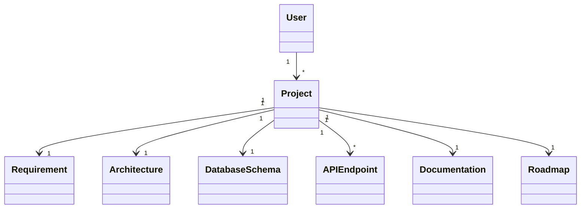

# Class Diagram

---

# Overview

The Class Diagram is one of the core structural diagrams in the Unified Modeling Language (UML). It represents the static structure of the AI Software Architect Agent by illustrating the classes, their attributes, methods, and relationships. Unlike behavioral diagrams that describe workflows, the Class Diagram focuses on how the application's objects are organized and how they collaborate to implement the required functionality.

For the AI Software Architect Agent, the Class Diagram serves as the foundation for software development. It defines the application's architecture using Java and Spring Boot, ensuring that every component has a clear responsibility and interacts with other components in a structured manner.

This diagram follows object-oriented design principles and supports maintainability, scalability, and code reusability.

---

# Purpose

The Class Diagram provides a blueprint of the application's internal structure before implementation begins.

Its primary purposes are:

- Describe the static structure of the system.
- Define all major classes and their responsibilities.
- Represent relationships between classes.
- Improve maintainability.
- Support object-oriented programming.
- Help developers during implementation.
- Simplify debugging and testing.

---

# Objectives

The objectives of the Class Diagram are:

- Model the application's architecture.
- Identify system classes.
- Define attributes and methods.
- Represent relationships among classes.
- Support Java implementation.
- Promote modular design.
- Improve code readability.
- Enable future enhancements.

---

# Why Class Diagrams are Important

A Class Diagram acts as the blueprint of an object-oriented application. Before writing code, developers can visualize how different classes interact and how responsibilities are distributed across the system.

Benefits include:

- Better software planning.
- Improved collaboration.
- Easier maintenance.
- Reduced code duplication.
- Faster development.
- Better understanding of the project.

---

# Overall Application Architecture

The AI Software Architect Agent follows a layered architecture based on Spring Boot.

```
Presentation Layer
        │
        ▼
Controller Layer
        │
        ▼
Service Layer
        │
        ▼
Repository Layer
        │
        ▼
Database Layer
```

Each layer has a specific responsibility and communicates only with adjacent layers.

---

# Package Structure

The application is organized into multiple Java packages.

```
com.aiarchitect

│

├── controller

├── service

├── repository

├── model

├── dto

├── config

├── security

├── exception

├── util

├── agent

├── prompt

└── response
```

This modular package structure improves readability and simplifies future maintenance.

---

# Major Classes

The application contains several important classes.

### Controller Classes

These classes receive HTTP requests from the frontend and forward them to the service layer.

Examples:

- ProjectController
- UserController
- ArchitectureController
- APIController
- DocumentationController

Responsibilities:

- Handle REST requests.
- Validate input.
- Return responses.
- Handle exceptions.

---

### Service Classes

Service classes contain the application's business logic.

Examples:

- ProjectService
- ArchitectureService
- DatabaseService
- APIService
- SecurityService
- DocumentationService
- RoadmapService

Responsibilities:

- Execute business rules.
- Coordinate AI agents.
- Process project data.
- Generate outputs.

---

### Repository Classes

Repository classes communicate with the database.

Examples:

- UserRepository
- ProjectRepository
- ArchitectureRepository
- ReportRepository

Responsibilities:

- Save data.
- Retrieve data.
- Update records.
- Delete records.

Spring Data JPA is used to simplify database operations.

---

### Entity Classes

Entity classes represent database tables.

Examples:

- User
- Project
- Requirement
- Architecture
- DatabaseSchema
- APIEndpoint
- Documentation
- Roadmap

Each entity contains:

- Attributes
- Constructors
- Getters
- Setters
- Relationships

---

### DTO Classes

DTO (Data Transfer Object) classes transfer data between different layers of the application without exposing internal entity structures.

Examples:

- LoginRequest
- LoginResponse
- ProjectRequest
- ProjectResponse
- ArchitectureResponse

Benefits:

- Better security.
- Improved performance.
- Loose coupling.

---

### Utility Classes

Utility classes contain reusable helper methods.

Examples:

- JWTUtil
- ValidationUtil
- FileUtil
- PromptBuilder
- PDFGenerator

Responsibilities:

- Token generation.
- Input validation.
- File creation.
- Prompt formatting.
- PDF export.

---

# Class Responsibilities

Each class has a clearly defined responsibility.

| Class | Responsibility |
|--------|----------------|
| User | Stores user information |
| Project | Stores project details |
| Requirement | Stores analyzed requirements |
| Architecture | Stores generated architecture |
| DatabaseSchema | Stores database design |
| APIEndpoint | Stores generated APIs |
| Documentation | Stores project documentation |
| Roadmap | Stores project planning details |

---

# Object-Oriented Principles

The Class Diagram follows the principles of Object-Oriented Programming.

## Encapsulation

Each class protects its internal data by making fields private and providing public getter and setter methods.

---

## Abstraction

Only essential information is exposed while implementation details remain hidden.

---

## Inheritance

Common functionality can be shared among related classes.

Example:

```
User

↑

Administrator
```

---

## Polymorphism

Different classes may implement common interfaces while providing different behavior.

---

# Naming Conventions

The project follows Java naming standards.

| Component | Convention |
|-----------|------------|
| Class | PascalCase |
| Method | camelCase |
| Variable | camelCase |
| Constant | UPPER_CASE |
| Package | lowercase |

Examples:

- ProjectService
- generateArchitecture()
- projectName
- MAX_FILE_SIZE
- com.aiarchitect.service

---

# Technologies Used

| Technology | Purpose |
|------------|---------|
| Java 21 | Programming Language |
| Spring Boot | Backend Framework |
| Spring AI | AI Integration |
| Spring Data JPA | Database Access |
| MySQL | Database |
| Maven | Dependency Management |
| JWT | Authentication |
| Git | Version Control |

---

# References

1. UML Specification (OMG)
2. Oracle Java Documentation
3. Spring Boot Reference Guide
4. Effective Java – Joshua Bloch
5. Clean Architecture – Robert C. Martin

---
# Class Design

This section describes the major classes used in the AI Software Architect Agent. Each class has a specific responsibility and collaborates with other classes to provide the complete functionality of the application.

The system follows the **Layered Architecture Pattern**, where each layer has a clearly defined role.

---

# Controller Layer

The Controller Layer acts as the entry point of the application. It receives HTTP requests from the frontend, validates user input, invokes the appropriate service classes, and returns the response.

The controllers do not contain business logic. Their responsibility is limited to request handling and response generation.

---

## UserController

### Description

The UserController manages user-related operations such as registration, login, profile management, and authentication.

### Responsibilities

- Register new users
- Authenticate users
- Update user profile
- Retrieve user information
- Handle logout requests

### Methods

```
registerUser()

loginUser()

getProfile()

updateProfile()

logout()
```

### Dependencies

```
UserController

↓

UserService
```

---

## ProjectController

### Description

This controller manages software projects created by users.

### Responsibilities

- Create project
- Update project
- Delete project
- View project details
- Retrieve project history

### Methods

```
createProject()

updateProject()

deleteProject()

getProject()

getAllProjects()
```

---

## ArchitectureController

### Description

Responsible for generating software architecture recommendations.

### Responsibilities

- Receive project requirements
- Generate architecture
- Display recommendations

### Methods

```
generateArchitecture()

viewArchitecture()

downloadArchitecture()
```

---

## DatabaseController

### Description

Handles database design generation.

### Responsibilities

- Generate ER Diagram
- Generate SQL Script
- Display schema

### Methods

```
generateDatabase()

generateERDiagram()

downloadSQL()
```

---

## APIController

### Description

Generates REST API specifications.

### Responsibilities

- Create API endpoints
- Generate request models
- Generate response models

### Methods

```
generateAPI()

viewAPI()

downloadAPI()
```

---

## DocumentationController

### Description

Generates software documentation.

### Responsibilities

- Generate SRS
- Generate Design Document
- Generate User Manual
- Export PDF

### Methods

```
generateDocumentation()

downloadPDF()

exportMarkdown()
```

---

# Service Layer

The Service Layer contains the application's business logic. It coordinates AI agents and processes user requests.

Unlike controllers, service classes implement the actual functionality of the application.

---

## UserService

### Responsibilities

- Validate user data
- Encrypt passwords
- Authenticate users
- Generate JWT tokens

### Methods

```
register()

login()

authenticate()

encryptPassword()
```

---

## ProjectService

### Responsibilities

- Manage projects
- Save project details
- Update project
- Delete project

### Methods

```
createProject()

updateProject()

deleteProject()

findProject()
```

---

## RequirementAnalysisService

### Responsibilities

- Analyze project description
- Extract functional requirements
- Extract non-functional requirements
- Generate user stories

### Methods

```
analyzeRequirements()

extractRequirements()

generateUserStories()
```

---

## ArchitectureService

### Responsibilities

- Generate software architecture
- Recommend design patterns
- Suggest technology stack

### Methods

```
generateArchitecture()

recommendArchitecture()

generateComponents()
```

---

## DatabaseService

### Responsibilities

- Create database schema
- Generate SQL
- Create relationships

### Methods

```
generateDatabase()

generateSQL()

normalizeDatabase()
```

---

## APIService

### Responsibilities

- Generate REST APIs
- Create endpoints
- Produce API documentation

### Methods

```
generateAPI()

createEndpoints()

generateSwagger()
```

---

## SecurityService

### Responsibilities

- Generate JWT
- Encrypt passwords
- Validate requests
- Secure APIs

### Methods

```
generateToken()

validateToken()

encryptPassword()

authorizeUser()
```

---

## DocumentationService

### Responsibilities

- Generate project documentation
- Export reports
- Build PDFs

### Methods

```
generateSRS()

generateSDD()

generatePDF()

generateMarkdown()
```

---

## RoadmapService

### Responsibilities

- Generate project phases
- Sprint planning
- Timeline generation

### Methods

```
generateRoadmap()

generateTimeline()

generateMilestones()
```

---

# Repository Layer

Repository classes interact directly with the database.

Spring Data JPA automatically implements CRUD operations.

---

## UserRepository

### Responsibilities

- Save users
- Retrieve users
- Delete users

### Methods

```
save()

findByEmail()

findById()

delete()
```

---

## ProjectRepository

### Responsibilities

- Store projects
- Retrieve projects
- Update projects

### Methods

```
save()

findProject()

findAll()

delete()
```

---

## ReportRepository

Stores generated reports.

---

## ArchitectureRepository

Stores architecture recommendations.

---

# Layer Communication

The application follows a strict communication hierarchy.

```
Frontend

↓

Controller

↓

Service

↓

Repository

↓

Database
```

Each layer communicates only with the layer directly below it. This improves maintainability and reduces coupling.

---

# Design Principles

The class design follows these principles:

- Single Responsibility Principle (SRP)
- Open/Closed Principle (OCP)
- Liskov Substitution Principle (LSP)
- Interface Segregation Principle (ISP)
- Dependency Inversion Principle (DIP)

Applying these principles makes the application easier to test, maintain, and extend.

---

# Benefits of This Design

- Clear separation of responsibilities
- Improved code readability
- Easier unit testing
- Better scalability
- Simplified maintenance
- Loose coupling between layers
- Reusable business logic

---

# Related Documents

- ActivityDiagram.md
- UseCaseDiagram.md
- SequenceDiagram.md
- ERDiagram.md
- DeploymentDiagram.md
- ArchitectureAgent.md
- DatabaseAgent.md

---
# Entity Classes

Entity classes represent the core business objects of the AI Software Architect Agent. Each entity corresponds to a database table and stores the application's persistent data. These classes are annotated using Spring Data JPA annotations such as `@Entity`, `@Table`, `@Id`, and `@GeneratedValue`.

The entity layer serves as the foundation of the application's data model and defines the relationships between different business objects.

---

# User Entity

## Description

The User entity stores information about every registered user of the application. It manages authentication, authorization, and user profile details.

### Attributes

| Attribute | Data Type | Description |
|------------|----------|-------------|
| userId | Long | Unique identifier |
| fullName | String | User's full name |
| email | String | Email address |
| password | String | Encrypted password |
| role | String | User role |
| createdAt | LocalDateTime | Account creation time |
| lastLogin | LocalDateTime | Last login timestamp |

### Relationships

- One User can create multiple Projects.
- One User can generate multiple Reports.

---

# Project Entity

## Description

Represents a software project submitted by a user.

### Attributes

| Attribute | Data Type | Description |
|------------|----------|-------------|
| projectId | Long | Primary Key |
| projectName | String | Name of project |
| description | Text | Project description |
| domain | String | Project domain |
| technologyStack | String | Selected technologies |
| status | String | Current project status |
| createdDate | LocalDate | Creation date |

### Relationships

- One Project belongs to one User.
- One Project contains many Requirements.
- One Project generates one Architecture Design.
- One Project generates one Database Schema.
- One Project generates many API Endpoints.
- One Project generates one Documentation Report.

---

# Requirement Entity

## Description

Stores the analyzed software requirements extracted by the Requirement Analysis Agent.

### Attributes

- requirementId
- functionalRequirements
- nonFunctionalRequirements
- assumptions
- constraints
- userStories

### Relationships

- One Requirement belongs to one Project.

---

# Architecture Entity

## Description

Stores the software architecture generated by the Architecture Agent.

### Attributes

- architectureId
- architecturePattern
- designPrinciples
- scalabilityRecommendations
- technologyRecommendation

### Relationships

- One Architecture belongs to one Project.

---

# DatabaseSchema Entity

## Description

Represents the database structure generated by the Database Agent.

### Attributes

- schemaId
- databaseType
- normalizationLevel
- sqlScript
- erDiagramLocation

### Relationships

- One Database Schema belongs to one Project.

---

# APIEndpoint Entity

## Description

Stores generated REST API details.

### Attributes

- apiId
- endpoint
- httpMethod
- requestModel
- responseModel
- authenticationRequired

### Relationships

- Multiple API Endpoints belong to one Project.

---

# Documentation Entity

## Description

Stores generated project documentation.

### Attributes

- documentId
- srsDocument
- designDocument
- apiDocumentation
- userManual
- developerGuide

---

# Roadmap Entity

## Description

Stores the software development roadmap.

### Attributes

- roadmapId
- milestones
- sprintPlan
- timeline
- estimatedDuration

---

# DTO Classes

DTO (Data Transfer Object) classes transfer data between the frontend and backend while preventing direct exposure of entity classes.

DTOs improve security, simplify API communication, and reduce unnecessary data transfer.

---

## Request DTOs

Examples include:

- LoginRequest
- RegisterRequest
- ProjectRequest
- ArchitectureRequest
- DocumentationRequest

These DTOs capture input received from the client application.

---

## Response DTOs

Examples include:

- LoginResponse
- UserResponse
- ProjectResponse
- ArchitectureResponse
- DocumentationResponse
- APIResponse

These DTOs return structured information to the frontend.

---

# Utility Classes

Utility classes contain reusable helper methods used throughout the application.

## JWTUtil

Responsibilities:

- Generate JWT tokens.
- Validate JWT tokens.
- Extract user information.

---

## ValidationUtil

Responsibilities:

- Validate email format.
- Validate passwords.
- Validate project input.

---

## FileUtil

Responsibilities:

- Create project folders.
- Read uploaded files.
- Export reports.

---

## PDFGenerator

Responsibilities:

- Generate PDF reports.
- Format documentation.
- Add tables and diagrams.

---

## PromptBuilder

Responsibilities:

- Build prompts for AI models.
- Format user requirements.
- Combine context with templates.

---

# AI Agent Classes

The AI Software Architect Agent is composed of multiple specialized AI agents. Each agent performs a dedicated task and communicates with the service layer.

---

## RequirementAnalysisAgent

Responsibilities:

- Analyze project descriptions.
- Extract requirements.
- Generate user stories.
- Identify constraints.

---

## ArchitectureAgent

Responsibilities:

- Select suitable architecture.
- Recommend design patterns.
- Suggest technologies.
- Generate component structure.

---

## DatabaseAgent

Responsibilities:

- Generate database schema.
- Design ER diagrams.
- Normalize tables.
- Produce SQL scripts.

---

## APIAgent

Responsibilities:

- Design REST APIs.
- Generate endpoints.
- Create request and response models.
- Produce API documentation.

---

## SecurityAgent

Responsibilities:

- Recommend authentication strategy.
- Generate authorization rules.
- Suggest encryption methods.
- Validate API security.

---

## DocumentationAgent

Responsibilities:

- Generate SRS.
- Generate Software Design Document.
- Generate User Manual.
- Produce Developer Guide.

---

## RoadmapAgent

Responsibilities:

- Create development roadmap.
- Generate sprint planning.
- Recommend milestones.
- Estimate timelines.

---

# Class Relationships

The following relationships exist among the classes.

## Association

```
User -------- Project
```

A user owns one or more projects.

---

## Composition

```
Project ◆──── Requirement
```

Requirements cannot exist without a project.

---

## Aggregation

```
Project ◇──── Documentation
```

Documentation is associated with a project but can exist independently as exported files.

---

## Inheritance

```
AIAgent

↑

RequirementAnalysisAgent

ArchitectureAgent

DatabaseAgent

APIAgent

SecurityAgent

DocumentationAgent

RoadmapAgent
```

All specialized AI agents inherit common behavior from the abstract `AIAgent` base class.

---

## Dependency

```
Controller

↓

Service

↓

Repository

↓

Database
```

Each layer depends only on the layer directly below it, promoting loose coupling and maintainability.

---

# Mermaid Class Diagram



---

# Design Principles Applied

- Single Responsibility Principle (SRP)
- Open/Closed Principle (OCP)
- Dependency Inversion Principle (DIP)
- Interface Segregation Principle (ISP)
- High Cohesion
- Low Coupling
- Separation of Concerns
- Reusability

---

# Benefits

This class design offers several advantages:

- Modular architecture
- Clear separation of responsibilities
- Improved maintainability
- Easier testing
- Better scalability
- Enhanced code readability
- Simplified future enhancements

---
