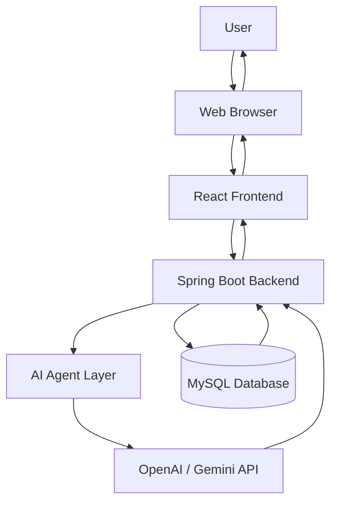
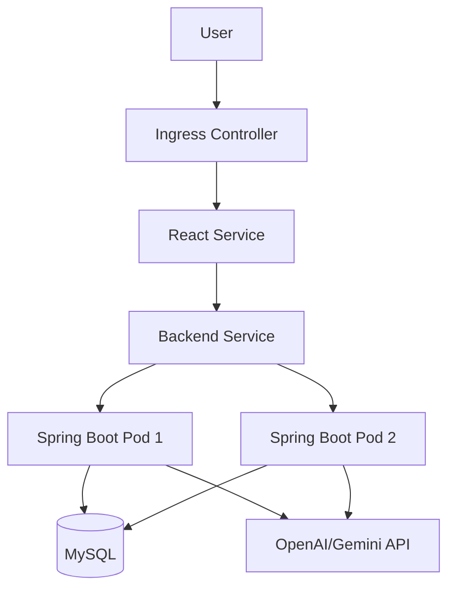
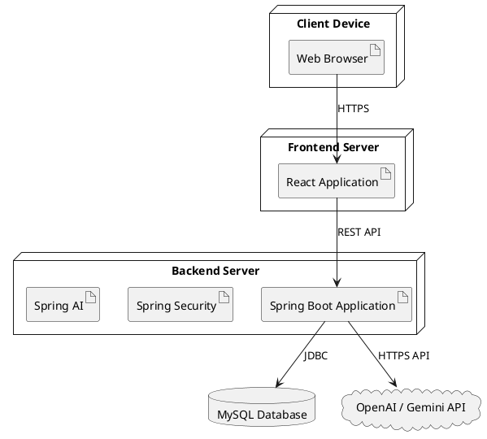

# Deployment Diagram

---

# Overview

The Deployment Diagram is one of the structural diagrams in the Unified Modeling Language (UML). It illustrates the physical architecture of the software system by showing how hardware devices, servers, databases, applications, and external services are connected and deployed.

For the AI Software Architect Agent, the Deployment Diagram demonstrates how the React frontend, Spring Boot backend, MySQL database, AI services, and cloud infrastructure interact to deliver a complete software solution.

Unlike the Class Diagram or Sequence Diagram, which describe the internal structure and behavior of the application, the Deployment Diagram focuses on the runtime environment where the application is executed.

---

# Purpose

The Deployment Diagram provides a physical view of the system architecture.

Its primary purposes are:

- Describe the deployment architecture.
- Show communication between hardware and software components.
- Explain how the application is hosted.
- Illustrate network communication.
- Support DevOps and deployment planning.
- Assist system administrators during deployment.
- Improve understanding of runtime infrastructure.

---

# Objectives

The Deployment Diagram has the following objectives:

- Represent the physical deployment of application components.
- Identify hardware and software nodes.
- Show communication protocols.
- Describe deployment dependencies.
- Support cloud deployment.
- Improve scalability planning.
- Simplify infrastructure management.
- Assist future system upgrades.

---

# Importance of Deployment Diagram

A Deployment Diagram is important because it provides a clear understanding of where each component of the application is installed and how different systems communicate.

Benefits include:

- Better infrastructure planning.
- Easier server configuration.
- Improved scalability.
- Enhanced system reliability.
- Simplified troubleshooting.
- Better communication between developers and DevOps engineers.
- Improved documentation quality.

---

# System Overview

The AI Software Architect Agent follows a modern three-tier architecture.

The system consists of:

- Client Layer
- Application Layer
- Data Layer
- External AI Service Layer

These layers work together to process user requests and generate intelligent software architecture recommendations.

---

# Deployment Architecture

```
User

↓

Web Browser

↓

React Frontend

↓

Spring Boot Backend

↓

AI Agents

↓

OpenAI / Gemini API

↓

MySQL Database
```

Each layer performs a dedicated responsibility, ensuring modularity and maintainability.

---

# Deployment Nodes

The system contains several deployment nodes.

## Client Node

### Description

The Client Node represents the end user's device.

Supported devices include:

- Desktop Computer
- Laptop
- Tablet
- Mobile Device

Responsibilities:

- Access the application
- Submit project requirements
- View generated outputs
- Download reports

---

## Web Browser

The web browser provides the user interface for interacting with the application.

Supported browsers include:

- Google Chrome
- Microsoft Edge
- Mozilla Firefox
- Safari

Responsibilities:

- Render the React application
- Execute JavaScript
- Communicate with the backend using HTTPS
- Display generated diagrams and reports

---

## Frontend Server

### Technology

- React.js
- HTML5
- CSS3
- JavaScript
- Axios
- React Router

Responsibilities:

- User authentication
- Dashboard
- Project creation
- Requirement submission
- Display AI-generated outputs
- Download generated documentation

---

## Backend Server

### Technology

- Java 21
- Spring Boot
- Spring Security
- Spring Data JPA
- Spring AI
- Maven

Responsibilities:

- Business logic
- REST API development
- Authentication
- AI agent coordination
- Database communication
- Report generation

---

## Database Server

### Technology

- MySQL 8

Responsibilities:

- Store user information
- Store projects
- Store generated architectures
- Store API specifications
- Store documentation
- Store reports

---

## AI Service Node

The AI Service Node communicates with external AI providers.

Supported providers:

- OpenAI
- Google Gemini

Responsibilities:

- Requirement analysis
- Architecture generation
- Database design
- API generation
- Documentation generation
- Roadmap generation

---

# Communication Protocols

The following communication protocols are used.

| Protocol | Purpose |
|----------|---------|
| HTTPS | Secure communication between client and server |
| REST API | Communication between frontend and backend |
| JSON | Data exchange format |
| JDBC | Backend to database communication |
| HTTPS API | Backend to AI model communication |

---

# Software Components

| Component | Technology |
|-----------|------------|
| Frontend | React.js |
| Backend | Spring Boot |
| Database | MySQL |
| Authentication | JWT |
| Build Tool | Maven |
| Version Control | Git & GitHub |
| AI Integration | Spring AI + OpenAI/Gemini |

---

# Deployment Environment

The application can be deployed in different environments.

## Development Environment

Purpose:

- Local development
- Feature implementation
- Testing

Tools:

- IntelliJ IDEA
- VS Code
- MySQL Workbench
- Postman

---

## Testing Environment

Purpose:

- Functional testing
- Integration testing
- API testing

Tools:

- JUnit
- Mockito
- Postman

---

## Production Environment

Purpose:

- Real user access
- Stable deployment
- High availability

Possible Platforms:

- AWS EC2
- Microsoft Azure
- Google Cloud Platform
- Render
- Railway

---

# High-Level Deployment Flow

```text
User

↓

Browser

↓

React Frontend

↓

REST API

↓

Spring Boot Backend

↓

AI Agents

↓

OpenAI / Gemini

↓

MySQL Database

↓

Response Returned

↓

Browser

↓

User
```

---

# Related UML Diagrams

The Deployment Diagram is closely related to:

- Use Case Diagram
- Activity Diagram
- Sequence Diagram
- Class Diagram
- ER Diagram

Together, these diagrams provide a complete understanding of the AI Software Architect Agent.

---
# Client-Server Deployment Architecture

## Overview

The AI Software Architect Agent follows a client-server architecture where the user interacts with the system through a web browser. The frontend application communicates with the backend using REST APIs over HTTPS. The backend coordinates AI agents, accesses the database, and communicates with external AI services.

This architecture separates presentation, business logic, and data storage into different layers, improving maintainability, scalability, and security.

---

# Three-Tier Architecture

The application follows a standard three-tier architecture.

## Presentation Layer

### Technologies

- React.js
- HTML5
- CSS3
- JavaScript
- React Router
- Axios

### Responsibilities

- Display user interface
- Handle user interactions
- Validate basic input
- Display AI-generated outputs
- Manage user sessions

---

## Business Layer

### Technologies

- Java 21
- Spring Boot
- Spring Security
- Spring Data JPA
- Spring AI

### Responsibilities

- Process business logic
- Authenticate users
- Coordinate AI agents
- Validate requests
- Generate reports
- Handle exceptions

---

## Data Layer

### Technologies

- MySQL 8
- Hibernate
- Spring Data JPA

### Responsibilities

- Store application data
- Execute SQL queries
- Maintain relationships
- Ensure data integrity
- Support backups

---

# Deployment Workflow

The following steps describe the runtime deployment process.

### Step 1

The user opens the application using a web browser.

↓

### Step 2

The browser loads the React frontend from the web server.

↓

### Step 3

The user logs in or creates a new project.

↓

### Step 4

The frontend sends an HTTPS request to the Spring Boot backend.

↓

### Step 5

Spring Security validates the JWT token.

↓

### Step 6

The backend processes the request.

↓

### Step 7

The appropriate AI Agent prepares prompts.

↓

### Step 8

The backend sends the prompt to OpenAI or Gemini.

↓

### Step 9

The AI model returns the generated response.

↓

### Step 10

The backend stores the generated artifacts in MySQL.

↓

### Step 11

The backend returns the response to the frontend.

↓

### Step 12

The frontend displays the generated software architecture, database schema, APIs, or documentation.

---

# Network Architecture

```
Client Device

↓

Internet

↓

HTTPS

↓

React Frontend Server

↓

REST API

↓

Spring Boot Backend

↓

Spring AI

↓

OpenAI / Gemini

↓

MySQL Database
```

---

# Mermaid Deployment Diagram



---

# Docker Deployment

## Overview

Docker allows the application to run in isolated containers, ensuring consistent deployment across development, testing, and production environments.

Each major component is deployed as a separate container.

---

## Docker Containers

### Frontend Container

Contains:

- React Application
- Static Assets
- Nginx Web Server

---

### Backend Container

Contains:

- Java 21 Runtime
- Spring Boot Application
- REST APIs
- AI Agents

---

### Database Container

Contains:

- MySQL Server
- Database Schema
- Persistent Storage

---

# Container Architecture

```
Docker Host

│

├── React Container

├── Spring Boot Container

└── MySQL Container
```

---

# Docker Communication

The containers communicate using Docker's internal networking.

```
React Container

↓

Spring Boot Container

↓

MySQL Container
```

Benefits include:

- Fast communication
- Secure internal network
- Easy scalability
- Simplified deployment

---

# API Gateway

## Purpose

The API Gateway acts as the single entry point for all client requests.

Responsibilities:

- Route incoming requests
- Authenticate requests
- Validate tokens
- Log API calls
- Forward requests to backend services
- Return responses

---

# API Flow

```
User

↓

React Frontend

↓

API Gateway

↓

Spring Boot Backend

↓

AI Agent

↓

OpenAI / Gemini

↓

Database
```

---

# Communication Protocols

| Source | Destination | Protocol |
|---------|-------------|----------|
| Browser | React Frontend | HTTPS |
| Frontend | Backend | REST API (HTTPS) |
| Backend | OpenAI/Gemini | HTTPS API |
| Backend | MySQL | JDBC |
| Backend | Docker Network | TCP/IP |

---

# Ports Used

| Component | Default Port |
|------------|-------------|
| React Development Server | 5173 |
| Spring Boot | 8080 |
| MySQL | 3306 |
| Swagger UI | 8080/swagger-ui |
| Docker Engine | 2375 (optional) |

---

# Deployment Dependencies

The deployment order should follow these steps:

1. Start MySQL Database
2. Start Spring Boot Backend
3. Configure AI API Keys
4. Start React Frontend
5. Verify API Connectivity
6. Run Health Checks
7. Allow User Access

This sequence ensures that each component has its required dependencies available before accepting user requests.

---

# Advantages of This Deployment

- Clear separation of frontend, backend, and database
- Easy maintenance and debugging
- Supports independent scaling of components
- Secure communication using HTTPS and JWT
- Containerized deployment with Docker
- Simplified CI/CD integration
- Ready for cloud hosting

---
# Cloud Deployment Architecture

## Overview

Cloud deployment enables the AI Software Architect Agent to be accessible from anywhere with an internet connection. Instead of running only on a local machine, the application can be deployed to cloud platforms that provide scalability, reliability, and security.

The deployment architecture separates the frontend, backend, and database into independent services, allowing each component to be updated or scaled without affecting the others.

---

# Supported Cloud Platforms

The application can be deployed on different cloud providers based on project requirements and budget.

| Platform | Purpose | Advantages |
|----------|---------|------------|
| AWS EC2 | Production Hosting | High scalability and enterprise support |
| Microsoft Azure | Enterprise Applications | Excellent integration with Microsoft services |
| Google Cloud Platform | Cloud Computing | Strong AI and machine learning services |
| Render | Student Projects | Easy deployment with free tier |
| Railway | Small Applications | Quick setup and automatic deployments |

---

# Recommended Deployment

For a college project, the following deployment setup is recommended:

```
React Frontend → Vercel

↓

Spring Boot Backend → Render

↓

MySQL Database → Railway / PlanetScale

↓

OpenAI or Gemini API
```

This setup is affordable, easy to configure, and suitable for demonstration purposes.

---

# AWS Deployment Architecture

```
User

↓

Internet

↓

Route 53 (DNS)

↓

Application Load Balancer

↓

EC2 Instance

↓

Spring Boot Application

↓

Spring AI

↓

OpenAI / Gemini API

↓

Amazon RDS (MySQL)
```

### AWS Components

#### Route 53

- Domain Name Service (DNS)
- Routes user requests to the application

#### Application Load Balancer

- Distributes traffic across servers
- Improves availability
- Prevents server overload

#### EC2

Hosts the Spring Boot backend application.

#### Amazon RDS

Provides a managed MySQL database with automated backups and high availability.

---

# Kubernetes Deployment

## Overview

Kubernetes is a container orchestration platform used to manage Docker containers efficiently.

It automatically handles deployment, scaling, and recovery of applications.

---

## Kubernetes Components

### Pod

Runs a single container or a group of related containers.

### Deployment

Maintains the desired number of application instances.

### Service

Provides networking between pods.

### ConfigMap

Stores configuration data.

### Secret

Stores sensitive information such as API keys and database passwords.

### Ingress

Routes external traffic to internal services.

---

# Kubernetes Architecture

```
Internet

↓

Ingress Controller

↓

React Service

↓

Backend Service

↓

Spring Boot Pods

↓

MySQL Service

↓

Persistent Volume
```

---

# Mermaid Kubernetes Diagram



---

# CI/CD Pipeline

## Overview

Continuous Integration (CI) and Continuous Deployment (CD) automate the process of building, testing, and deploying the application whenever new code is pushed to GitHub.

---

# CI/CD Workflow

```
Developer

↓

GitHub Repository

↓

GitHub Actions

↓

Build Application

↓

Run Unit Tests

↓

Create Docker Images

↓

Deploy to Render / AWS

↓

Application Available
```

---

# GitHub Actions Workflow

Typical steps include:

1. Trigger workflow on push to the main branch.
2. Checkout the repository.
3. Set up Java and Node.js.
4. Install project dependencies.
5. Run backend unit tests.
6. Build the Spring Boot application.
7. Build the React frontend.
8. Build Docker images.
9. Deploy the application.
10. Verify deployment using health checks.

---

# Continuous Integration Benefits

- Automatic code validation
- Faster builds
- Consistent testing
- Reduced deployment errors
- Improved collaboration

---

# Continuous Deployment Benefits

- Automatic deployment
- Faster software delivery
- Reduced manual effort
- Reliable release process
- Easier rollback if deployment fails

---

# Security Architecture

The deployment includes multiple security layers.

## HTTPS

All communication between the browser and backend uses HTTPS to encrypt data in transit.

---

## SSL/TLS

SSL/TLS certificates ensure secure communication and prevent data interception.

Benefits:

- Data encryption
- Server authentication
- Data integrity

---

## JWT Authentication

The backend uses JSON Web Tokens (JWT) for authentication.

Workflow:

1. User logs in.
2. Backend generates a JWT.
3. Frontend stores the token securely.
4. Token is included in API requests.
5. Backend validates the token before processing the request.

---

## Spring Security

Spring Security protects REST APIs by:

- Authenticating users
- Authorizing access based on roles
- Protecting endpoints
- Preventing unauthorized access

---

## Environment Variables

Sensitive information should never be stored directly in source code.

Examples of environment variables:

- OPENAI_API_KEY
- GEMINI_API_KEY
- DATABASE_URL
- DATABASE_USERNAME
- DATABASE_PASSWORD
- JWT_SECRET

---

# Monitoring

Monitoring helps developers identify issues and maintain system reliability.

### Spring Boot Actuator

Provides:

- Health checks
- Metrics
- Application status
- Performance information

---

### Prometheus

Collects system and application metrics.

---

### Grafana

Displays dashboards for:

- CPU usage
- Memory usage
- Request count
- API response time
- Database performance

---

# Logging

Application logs help diagnose problems.

Recommended logging levels:

| Level | Purpose |
|--------|---------|
| INFO | Normal application events |
| WARN | Potential issues |
| ERROR | Application failures |
| DEBUG | Development troubleshooting |

Logs should include:

- Login attempts
- API requests
- AI model responses
- Database errors
- Authentication failures

---

# Auto Scaling

To handle increasing traffic, the application can scale horizontally.

Scaling options include:

- Additional frontend instances
- Multiple backend servers
- Read replicas for the database
- Kubernetes Horizontal Pod Autoscaler

Benefits:

- Improved availability
- Better performance
- High reliability
- Reduced downtime

---

# High Availability

The deployment architecture should support high availability through:

- Multiple application instances
- Load balancing
- Database backups
- Automatic restart of failed services
- Health monitoring

---
# PlantUML Deployment Diagram

## Overview

PlantUML provides a textual way to create UML deployment diagrams. It is widely used in software engineering because diagrams can be generated automatically from source code and easily maintained under version control.

The following PlantUML diagram represents the deployment architecture of the AI Software Architect Agent.



---

# Deployment Architecture Summary

The deployment architecture consists of five major components:

1. Client Device
2. Frontend Server
3. Backend Server
4. Database Server
5. External AI Service

Each component has a dedicated responsibility and communicates securely with other components using standard protocols.

---

# Disaster Recovery Plan

## Overview

Disaster Recovery (DR) ensures that the application can continue operating or recover quickly after unexpected failures.

Potential failures include:

- Server crash
- Database corruption
- Network outage
- Cloud service failure
- AI API downtime

---

## Recovery Objectives

### Recovery Time Objective (RTO)

Maximum acceptable downtime:

**30 minutes**

---

### Recovery Point Objective (RPO)

Maximum acceptable data loss:

**Less than 15 minutes**

---

# Backup Strategy

Regular backups protect user data and generated software artifacts.

## Backup Schedule

| Backup Type | Frequency | Retention |
|--------------|-----------|-----------|
| Full Backup | Weekly | 3 Months |
| Incremental Backup | Daily | 30 Days |
| Transaction Logs | Every 6 Hours | 14 Days |

---

## Backup Components

The following data should be backed up regularly:

- User Accounts
- Project Information
- Generated Architectures
- Database Schemas
- API Specifications
- Documentation
- Roadmaps
- Reports

---

# Recovery Process

If a failure occurs:

1. Detect the failure.
2. Notify administrators.
3. Restore the latest database backup.
4. Restart backend services.
5. Verify database integrity.
6. Restart frontend services.
7. Validate AI API connectivity.
8. Resume user access.

---

# Performance Optimization

## Backend Optimization

- Enable Spring Boot caching.
- Use asynchronous processing for AI requests.
- Optimize database queries.
- Reduce API response times.
- Implement pagination for large datasets.

---

## Database Optimization

- Create indexes on frequently queried columns.
- Normalize tables.
- Use connection pooling.
- Optimize JOIN operations.
- Archive inactive project data.

---

## Frontend Optimization

- Lazy-load React components.
- Compress images and assets.
- Minify JavaScript and CSS.
- Use browser caching.
- Display loading indicators for AI operations.

---

# Cost Estimation

The following table provides an approximate monthly deployment cost.

| Component | Free Tier | Paid Option |
|-----------|-----------|-------------|
| React Frontend | Vercel | Free / Pro |
| Spring Boot Backend | Render | Free / Starter |
| Database | Railway | Free / Basic |
| AI API | OpenAI / Gemini | Pay-as-you-go |
| Domain | Optional | Annual Purchase |

For a student project, the application can often be deployed entirely using free-tier services.

---

# Future Deployment Enhancements

The deployment architecture can be extended with the following features:

- Kubernetes cluster deployment
- Microservices architecture
- Redis caching
- Elasticsearch for advanced search
- RabbitMQ or Apache Kafka for asynchronous messaging
- CDN integration for static assets
- Multi-region deployment
- AI model fallback mechanisms
- Auto-scaling based on traffic
- Disaster recovery automation

---

# Deployment Best Practices

To maintain a reliable deployment, follow these practices:

- Use HTTPS for all communication.
- Store secrets in environment variables.
- Enable automatic backups.
- Monitor application health continuously.
- Apply database migrations carefully.
- Keep dependencies updated.
- Use GitHub for version control.
- Automate deployments with CI/CD.
- Document infrastructure changes.
- Test deployments before production release.

---

# Deployment Checklist

Before deploying the application, verify the following:

- Frontend builds successfully.
- Backend builds successfully.
- Database schema is initialized.
- AI API keys are configured.
- Environment variables are set.
- HTTPS is enabled.
- JWT authentication is working.
- REST APIs are tested.
- Docker containers start correctly.
- Health checks return successful responses.

---

# Advantages of the Deployment Architecture

The proposed deployment architecture provides several advantages:

- Modular design with separate frontend, backend, and database.
- Easy scalability through independent services.
- Secure communication using HTTPS and JWT.
- Support for Docker and Kubernetes.
- Cloud-ready infrastructure.
- Easy maintenance and updates.
- High availability through backups and monitoring.
- Suitable for both development and production environments.

---

# Limitations

While the architecture is robust, some limitations exist:

- Dependence on external AI APIs may introduce latency.
- Free cloud tiers have usage limits.
- Internet connectivity is required for AI model access.
- Initial cloud configuration may require additional setup.
- Running multiple containers increases resource usage.

---

# References

1. UML 2.5 Specification – Object Management Group (OMG)
2. Spring Boot Reference Documentation
3. Spring Security Documentation
4. Spring AI Documentation
5. Docker Official Documentation
6. Kubernetes Documentation
7. MySQL 8 Reference Manual
8. React Documentation
9. OpenAI API Documentation
10. Google Gemini API Documentation

---

# Conclusion

The Deployment Diagram illustrates the physical deployment of the AI Software Architect Agent, showing how the frontend, backend, database, and AI services interact within a secure and scalable environment.

The architecture follows modern software engineering principles by separating concerns across multiple layers, supporting cloud deployment, enabling containerization with Docker, and preparing the system for future scalability through Kubernetes and CI/CD pipelines.

This deployment model provides a strong foundation for building, testing, deploying, and maintaining the application in both academic and real-world environments.

---
