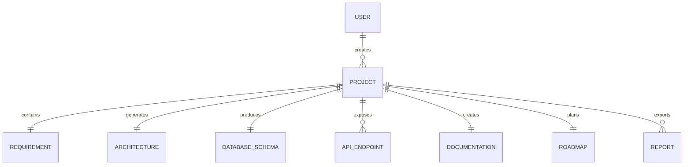
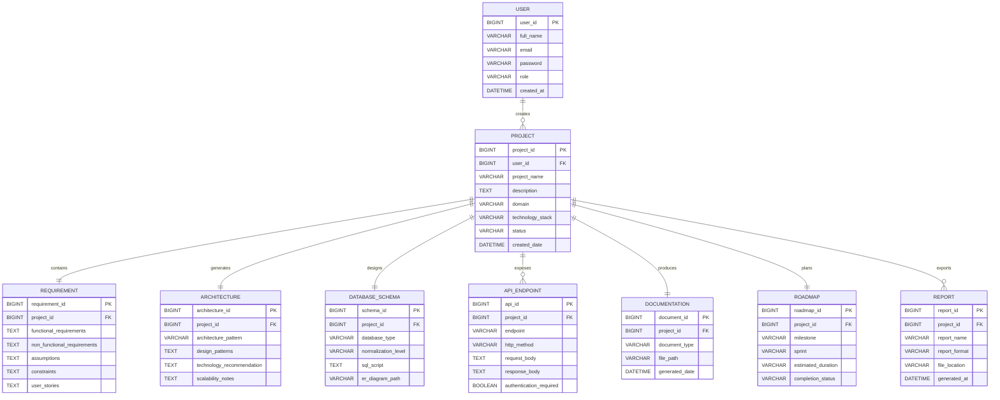
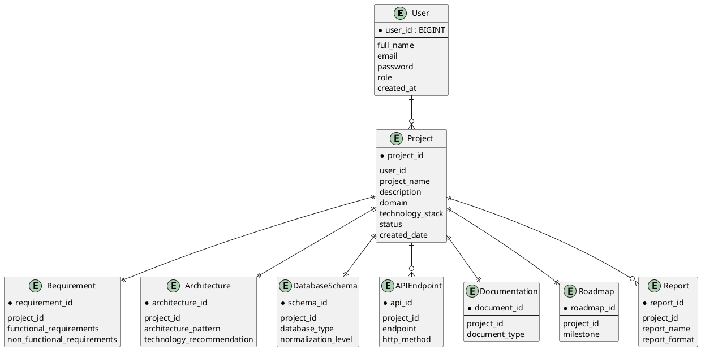

# ER Diagram

---

# Overview

The Entity Relationship (ER) Diagram is one of the most important database design documents in software engineering. It visually represents the structure of the database by identifying entities, attributes, relationships, and constraints.

For the **AI Software Architect Agent**, the ER Diagram provides a blueprint for designing the MySQL database. It ensures that data is organized efficiently, redundancy is minimized, and relationships between entities are clearly defined.

The ER Diagram serves as a bridge between the software architecture and the physical database implementation. It helps developers understand how application data will be stored, retrieved, and managed.

---

# Purpose

The primary purpose of the ER Diagram is to model the database structure before implementation.

It helps developers:

- Identify all database entities.
- Define relationships between entities.
- Design normalized tables.
- Reduce data redundancy.
- Improve database consistency.
- Support efficient data retrieval.
- Simplify database maintenance.

---

# Objectives

The objectives of the ER Diagram are:

- Design a well-structured relational database.
- Identify all entities required by the application.
- Define primary and foreign keys.
- Represent relationships among entities.
- Support database normalization.
- Improve scalability.
- Ensure data integrity.
- Simplify backend development.

---

# Importance of ER Diagram

The ER Diagram is essential because it provides a clear understanding of how data is organized.

Benefits include:

- Easy database planning.
- Improved communication between developers.
- Reduced redundancy.
- Better normalization.
- Faster SQL development.
- Easier debugging.
- Improved scalability.
- Better database documentation.

---

# Database Overview

The AI Software Architect Agent stores information related to:

- Registered Users
- Software Projects
- Project Requirements
- Generated Architectures
- Database Designs
- API Specifications
- Documentation
- Project Roadmaps
- Generated Reports

The application uses **MySQL 8** as the relational database management system.

---

# Database Architecture

The database follows a relational model.

```
User

↓

Project

↓

Requirement

↓

Architecture

↓

Database Schema

↓

API Endpoint

↓

Documentation

↓

Roadmap

↓

Generated Report
```

Each table is connected through foreign keys to maintain referential integrity.

---

# Major Entities

The database consists of the following primary entities.

### User

Stores registered user information.

### Project

Stores software project details.

### Requirement

Stores analyzed functional and non-functional requirements.

### Architecture

Stores generated software architecture.

### DatabaseSchema

Stores generated database schema.

### APIEndpoint

Stores generated REST API specifications.

### Documentation

Stores generated project documentation.

### Roadmap

Stores project roadmap and milestones.

### Report

Stores downloadable project reports.

---

# Entity Descriptions

## User Entity

The User entity represents individuals who access the application.

### Responsibilities

- Authentication
- Authorization
- Profile Management
- Project Ownership

### Attributes

| Attribute | Type | Description |
|-----------|------|-------------|
| user_id | BIGINT | Primary Key |
| full_name | VARCHAR(100) | User Name |
| email | VARCHAR(100) | Unique Email |
| password | VARCHAR(255) | Encrypted Password |
| role | VARCHAR(30) | User Role |
| created_at | DATETIME | Registration Date |

---

## Project Entity

Represents software projects created by users.

### Responsibilities

- Store project information.
- Maintain project status.
- Associate generated artifacts.

### Attributes

| Attribute | Type | Description |
|-----------|------|-------------|
| project_id | BIGINT | Primary Key |
| user_id | BIGINT | Foreign Key |
| project_name | VARCHAR(200) | Project Name |
| description | TEXT | Project Description |
| domain | VARCHAR(100) | Application Domain |
| technology_stack | VARCHAR(200) | Selected Technologies |
| status | VARCHAR(50) | Current Status |
| created_date | DATETIME | Creation Date |

---

## Requirement Entity

Stores analyzed requirements.

### Attributes

| Attribute | Type |
|-----------|------|
| requirement_id | BIGINT |
| project_id | BIGINT |
| functional_requirements | TEXT |
| non_functional_requirements | TEXT |
| assumptions | TEXT |
| constraints | TEXT |
| user_stories | TEXT |

---

## Architecture Entity

Stores software architecture recommendations.

### Attributes

| Attribute | Type |
|-----------|------|
| architecture_id | BIGINT |
| project_id | BIGINT |
| architecture_pattern | VARCHAR(100) |
| technology_recommendation | TEXT |
| scalability_notes | TEXT |
| generated_date | DATETIME |

---

## DatabaseSchema Entity

Stores generated database schemas.

### Attributes

| Attribute | Type |
|-----------|------|
| schema_id | BIGINT |
| project_id | BIGINT |
| database_type | VARCHAR(50) |
| normalization_level | VARCHAR(20) |
| sql_script | LONGTEXT |
| er_diagram_path | VARCHAR(255) |

---

## APIEndpoint Entity

Stores generated REST API information.

### Attributes

| Attribute | Type |
|-----------|------|
| api_id | BIGINT |
| project_id | BIGINT |
| endpoint | VARCHAR(200) |
| http_method | VARCHAR(20) |
| request_body | LONGTEXT |
| response_body | LONGTEXT |
| authentication_required | BOOLEAN |

---

## Documentation Entity

Stores generated documentation.

### Attributes

| Attribute | Type |
|-----------|------|
| document_id | BIGINT |
| project_id | BIGINT |
| document_type | VARCHAR(50) |
| file_path | VARCHAR(255) |
| generated_date | DATETIME |

---

## Roadmap Entity

Stores project planning information.

### Attributes

| Attribute | Type |
|-----------|------|
| roadmap_id | BIGINT |
| project_id | BIGINT |
| milestone | VARCHAR(255) |
| sprint | VARCHAR(50) |
| estimated_duration | VARCHAR(50) |
| completion_status | VARCHAR(30) |

---

## Report Entity

Stores generated downloadable reports.

### Attributes

| Attribute | Type |
|-----------|------|
| report_id | BIGINT |
| project_id | BIGINT |
| report_name | VARCHAR(150) |
| report_format | VARCHAR(20) |
| file_location | VARCHAR(255) |
| generated_at | DATETIME |

---

# Database Technologies

| Technology | Purpose |
|------------|---------|
| MySQL 8 | Relational Database |
| Spring Data JPA | ORM Framework |
| Hibernate | Persistence Layer |
| JDBC | Database Connectivity |
| Maven | Dependency Management |

---

# Related Documents

The ER Diagram is closely connected with:

- Class Diagram
- Sequence Diagram
- Deployment Diagram
- DatabaseAgent.md
- ArchitectureAgent.md
- APIAgent.md

---

# References

1. MySQL 8 Official Documentation
2. Oracle SQL Documentation
3. Spring Data JPA Documentation
4. Hibernate ORM Documentation
5. Database System Concepts – Silberschatz, Korth & Sudarshan

---
# Entity Relationships

## Overview

Entity relationships define how data is connected within the AI Software Architect Agent database. Proper relationship design ensures data consistency, minimizes redundancy, and simplifies database operations.

The system primarily uses **One-to-Many (1:N)** relationships because a single project can generate multiple outputs, while each output belongs to only one project.

---

# Relationship Summary

| Parent Entity | Child Entity | Relationship | Description |
|---------------|-------------|--------------|-------------|
| User | Project | One-to-Many | One user can create multiple software projects |
| Project | Requirement | One-to-One | Each project has one analyzed requirement document |
| Project | Architecture | One-to-One | Each project has one generated architecture |
| Project | DatabaseSchema | One-to-One | Each project has one database design |
| Project | APIEndpoint | One-to-Many | A project contains multiple REST APIs |
| Project | Documentation | One-to-One | Each project has one documentation package |
| Project | Roadmap | One-to-One | Each project has one development roadmap |
| Project | Report | One-to-Many | Multiple reports can be generated for one project |

---

# User → Project Relationship

## Relationship Type

**One-to-Many (1:N)**

### Description

A registered user can create multiple software projects.

Each project belongs to only one registered user.

Example:

```
Snehal

│

├── Hospital Management System

├── AI Software Architect Agent

├── Smart Parking System

└── Online Examination System
```

---

## Business Rule

- One user may own many projects.
- Every project must belong to one user.
- A project cannot exist without its owner.

---

## SQL Foreign Key

```sql
ALTER TABLE Project
ADD CONSTRAINT FK_Project_User
FOREIGN KEY (user_id)
REFERENCES User(user_id);
```

---

# Project → Requirement Relationship

## Relationship Type

**One-to-One (1:1)**

### Description

Every software project has one requirement analysis document generated by the Requirement Analysis Agent.

Example

```
Project

↓

Requirement Analysis
```

---

## Business Rule

- Every project has one requirement analysis.
- Requirement analysis cannot exist independently.

---

## SQL Foreign Key

```sql
ALTER TABLE Requirement
ADD CONSTRAINT FK_Requirement_Project
FOREIGN KEY(project_id)
REFERENCES Project(project_id);
```

---

# Project → Architecture Relationship

## Relationship Type

**One-to-One**

### Description

After analyzing requirements, the Architecture Agent generates one architecture recommendation for the project.

Example

```
Project

↓

Architecture Recommendation
```

---

## Business Rule

- One architecture belongs to one project.
- Architecture cannot exist without a project.

---

# Project → DatabaseSchema Relationship

## Relationship Type

**One-to-One**

### Description

The Database Agent generates one database schema for every project.

Example

```
Project

↓

ER Diagram

↓

SQL Schema
```

---

# Project → APIEndpoint Relationship

## Relationship Type

**One-to-Many**

### Description

One software project generally contains multiple REST API endpoints.

Example

```
Hospital Management System

│

├── Login API

├── Register API

├── Doctor API

├── Patient API

├── Appointment API

└── Report API
```

---

## Business Rule

- One project contains many APIs.
- Every API belongs to one project.

---

# Project → Documentation Relationship

## Relationship Type

**One-to-One**

### Description

Documentation generated by the Documentation Agent belongs to a single project.

Documents include:

- Software Requirement Specification
- Software Design Document
- API Documentation
- User Manual
- Developer Guide

---

# Project → Roadmap Relationship

## Relationship Type

**One-to-One**

### Description

Every project has one development roadmap generated by the Roadmap Agent.

Example

```
Project

↓

Roadmap

↓

Sprint Planning

↓

Timeline
```

---

# Project → Report Relationship

## Relationship Type

**One-to-Many**

### Description

The user may generate multiple downloadable reports during the project lifecycle.

Examples:

- PDF Report
- DOCX Report
- Markdown Report

---

# Relationship Cardinality

| Relationship | Cardinality |
|--------------|-------------|
| User → Project | 1 : N |
| Project → Requirement | 1 : 1 |
| Project → Architecture | 1 : 1 |
| Project → DatabaseSchema | 1 : 1 |
| Project → APIEndpoint | 1 : N |
| Project → Documentation | 1 : 1 |
| Project → Roadmap | 1 : 1 |
| Project → Report | 1 : N |

---

# Participation Constraints

Participation constraints specify whether an entity is mandatory or optional in a relationship.

| Relationship | Participation |
|--------------|---------------|
| User → Project | Partial (a user may have zero or more projects) |
| Project → Requirement | Total |
| Project → Architecture | Total |
| Project → DatabaseSchema | Total |
| Project → Documentation | Total |
| Project → Roadmap | Total |
| Project → APIEndpoint | Partial (a project may not yet have generated APIs) |
| Project → Report | Partial |

---

# Mermaid ER Diagram



---

# Relationship Diagram (Text Representation)

```
USER

│

├────────────── PROJECT

│                   │

│                   ├──── REQUIREMENT

│                   │

│                   ├──── ARCHITECTURE

│                   │

│                   ├──── DATABASE_SCHEMA

│                   │

│                   ├──── API_ENDPOINT

│                   │

│                   ├──── DOCUMENTATION

│                   │

│                   ├──── ROADMAP

│                   │

│                   └──── REPORT
```

---

# Why This Relationship Design?

The relationship model has been designed with the following objectives:

- Eliminate duplicate data.
- Maintain referential integrity.
- Improve query performance.
- Support scalability.
- Simplify maintenance.
- Ensure logical organization of project artifacts.
- Make future extensions easier.

---

# Advantages

- Strong data consistency
- Reduced redundancy
- Easy CRUD operations
- Better scalability
- Cleaner SQL queries
- Simplified backend development
- Supports JPA/Hibernate relationships

---
# Data Dictionary

## Overview

A Data Dictionary is a centralized repository that describes the structure, meaning, and constraints of every database field. It acts as a reference for developers, database administrators, testers, and future contributors.

The AI Software Architect Agent database consists of multiple related tables. Each table stores a specific type of information while maintaining data integrity through primary and foreign keys.

---

# User Table

## Description

Stores details of all registered users.

| Column Name | Data Type | Size | Constraints | Description |
|-------------|----------|------|-------------|-------------|
| user_id | BIGINT | - | Primary Key, Auto Increment | Unique user identifier |
| full_name | VARCHAR | 100 | NOT NULL | Full name of the user |
| email | VARCHAR | 100 | UNIQUE, NOT NULL | Email address |
| password | VARCHAR | 255 | NOT NULL | Encrypted password |
| role | VARCHAR | 30 | DEFAULT 'USER' | User role |
| created_at | DATETIME | - | NOT NULL | Registration date |

---

# Project Table

## Description

Stores software project information.

| Column Name | Data Type | Constraints | Description |
|-------------|-----------|-------------|-------------|
| project_id | BIGINT | Primary Key | Unique project ID |
| user_id | BIGINT | Foreign Key | Owner of project |
| project_name | VARCHAR(200) | NOT NULL | Project title |
| description | TEXT | NOT NULL | Project description |
| domain | VARCHAR(100) | NOT NULL | Application domain |
| technology_stack | VARCHAR(255) | NULL | Technologies selected |
| status | VARCHAR(50) | DEFAULT 'Draft' | Current status |
| created_date | DATETIME | NOT NULL | Creation timestamp |

---

# Requirement Table

## Description

Stores the output generated by the Requirement Analysis Agent.

| Column | Data Type | Description |
|--------|-----------|-------------|
| requirement_id | BIGINT | Primary Key |
| project_id | BIGINT | Foreign Key |
| functional_requirements | LONGTEXT | Functional requirements |
| non_functional_requirements | LONGTEXT | Non-functional requirements |
| assumptions | TEXT | Project assumptions |
| constraints | TEXT | Project constraints |
| user_stories | LONGTEXT | Generated user stories |

---

# Architecture Table

Stores the software architecture generated by the Architecture Agent.

| Column | Type | Description |
|--------|------|-------------|
| architecture_id | BIGINT | Primary Key |
| project_id | BIGINT | Foreign Key |
| architecture_pattern | VARCHAR(100) | Selected architecture |
| design_patterns | TEXT | Recommended design patterns |
| technology_recommendation | LONGTEXT | Technology suggestions |
| scalability_notes | LONGTEXT | Scalability recommendations |

---

# DatabaseSchema Table

Stores the generated database schema.

| Column | Type | Description |
|--------|------|-------------|
| schema_id | BIGINT | Primary Key |
| project_id | BIGINT | Foreign Key |
| database_type | VARCHAR(50) | MySQL, PostgreSQL |
| normalization_level | VARCHAR(20) | 3NF, BCNF |
| sql_script | LONGTEXT | Generated SQL |
| er_diagram_path | VARCHAR(255) | ER Diagram file location |

---

# APIEndpoint Table

Stores generated REST APIs.

| Column | Type | Description |
|--------|------|-------------|
| api_id | BIGINT | Primary Key |
| project_id | BIGINT | Foreign Key |
| endpoint | VARCHAR(200) | REST endpoint |
| http_method | VARCHAR(20) | GET, POST, PUT, DELETE |
| request_body | LONGTEXT | Request JSON |
| response_body | LONGTEXT | Response JSON |
| authentication_required | BOOLEAN | Authentication flag |

---

# Documentation Table

Stores generated project documentation.

| Column | Type | Description |
|--------|------|-------------|
| document_id | BIGINT | Primary Key |
| project_id | BIGINT | Foreign Key |
| document_type | VARCHAR(50) | SRS, API, Design |
| file_path | VARCHAR(255) | Storage location |
| generated_date | DATETIME | Creation time |

---

# Roadmap Table

Stores project development roadmap.

| Column | Type | Description |
|--------|------|-------------|
| roadmap_id | BIGINT | Primary Key |
| project_id | BIGINT | Foreign Key |
| milestone | VARCHAR(255) | Milestone title |
| sprint | VARCHAR(50) | Sprint name |
| estimated_duration | VARCHAR(50) | Expected duration |
| completion_status | VARCHAR(30) | Progress status |

---

# Report Table

Stores downloadable reports.

| Column | Type | Description |
|--------|------|-------------|
| report_id | BIGINT | Primary Key |
| project_id | BIGINT | Foreign Key |
| report_name | VARCHAR(150) | Report name |
| report_format | VARCHAR(20) | PDF, DOCX, MD |
| file_location | VARCHAR(255) | Storage path |
| generated_at | DATETIME | Generation date |

---

# Database Normalization

## First Normal Form (1NF)

The database satisfies First Normal Form because:

- Each table has a primary key.
- Each column stores atomic values.
- Repeating groups are eliminated.

### Example

Instead of storing:

```
Technologies = Java, Spring Boot, React
```

Store:

```
Technology = Java
Technology = Spring Boot
Technology = React
```

---

## Second Normal Form (2NF)

The database satisfies Second Normal Form because:

- All non-key attributes depend on the entire primary key.
- Partial dependencies have been removed.

---

## Third Normal Form (3NF)

The database satisfies Third Normal Form because:

- No transitive dependencies exist.
- Every non-key attribute depends only on the primary key.

Example:

```
Project

ProjectID

↓

ProjectName

↓

Description
```

---

# Constraints Used

The database uses several constraints to ensure data integrity.

## Primary Key

Uniquely identifies every record.

Example:

```
user_id
project_id
architecture_id
```

---

## Foreign Key

Maintains relationships between tables.

Example:

```
project.user_id

↓

user.user_id
```

---

## NOT NULL

Ensures mandatory values are always provided.

Example:

```
project_name

email

password
```

---

## UNIQUE

Prevents duplicate values.

Example:

```
email
```

---

## DEFAULT

Provides a default value if none is specified.

Examples:

```
Role = USER

Status = Draft
```

---

# Indexing Strategy

Indexes improve query performance.

Recommended indexes:

- user_id
- project_id
- email
- architecture_id
- requirement_id
- report_id

Benefits:

- Faster search operations
- Faster JOIN queries
- Improved filtering
- Better scalability

---

# Sample SQL Table

```sql
CREATE TABLE User (
    user_id BIGINT AUTO_INCREMENT PRIMARY KEY,
    full_name VARCHAR(100) NOT NULL,
    email VARCHAR(100) UNIQUE NOT NULL,
    password VARCHAR(255) NOT NULL,
    role VARCHAR(30) DEFAULT 'USER',
    created_at DATETIME NOT NULL
);
```

---

# Database Naming Standards

To maintain consistency, the following naming conventions are recommended:

- Use lowercase names with underscores (e.g., `project_name`).
- Primary keys should end with `_id`.
- Foreign keys should match the referenced primary key name.
- Table names should be singular or consistently plural throughout the project.
- Avoid spaces and special characters in identifiers.

---

# Database Best Practices

The following practices improve maintainability and performance:

- Use normalized tables to reduce redundancy.
- Define foreign keys to enforce relationships.
- Store passwords in encrypted form.
- Use indexes on frequently searched columns.
- Validate data before inserting into the database.
- Perform regular database backups.
- Use transactions for critical operations.
- Document schema changes with version control.

---
# Advanced ER Diagram

## Overview

This section presents a complete Entity Relationship model of the AI Software Architect Agent. The diagram illustrates all entities, their attributes, primary keys, foreign keys, and relationships within the database.

The database has been designed following relational database principles to ensure scalability, maintainability, and data integrity.

---

# Complete Mermaid ER Diagram



---

# PlantUML ER Diagram



---

# Database Security

The AI Software Architect Agent stores sensitive project information and user accounts. Therefore, the database should follow standard security practices.

## Authentication Security

- Passwords should be encrypted using BCrypt.
- JWT tokens should be used for secure API authentication.
- Passwords should never be stored in plain text.

---

## Authorization

The application should implement Role-Based Access Control (RBAC).

### Roles

- Administrator
- Developer
- Standard User

Each role should have different permissions for creating, updating, deleting, and viewing projects.

---

## Data Validation

Before storing data in the database:

- Validate mandatory fields.
- Check email format.
- Prevent duplicate email registration.
- Validate project names.
- Restrict invalid input lengths.

---

## SQL Injection Prevention

The application should prevent SQL Injection by:

- Using Spring Data JPA repositories.
- Using parameterized queries.
- Avoiding dynamic SQL string concatenation.
- Validating user input.

---

# Backup Strategy

Regular backups ensure that project information is not lost.

## Backup Plan

| Backup Type | Frequency |
|-------------|-----------|
| Full Backup | Weekly |
| Incremental Backup | Daily |
| Transaction Log Backup | Every 6 Hours |

---

# Recovery Strategy

If data loss occurs:

1. Restore the latest full backup.
2. Apply incremental backups.
3. Apply transaction logs.
4. Verify database consistency.
5. Restart application services.

---

# Performance Optimization

The following techniques improve database performance.

## Query Optimization

- Retrieve only required columns.
- Avoid unnecessary joins.
- Use pagination for large datasets.
- Optimize WHERE clauses.

---

## Index Optimization

Create indexes on frequently searched columns.

Recommended indexes:

- email
- user_id
- project_id
- architecture_id
- report_id

---

## Connection Pooling

Use **HikariCP** as the database connection pool.

Benefits:

- Faster response time
- Efficient resource utilization
- Reduced database overhead

---

# Scalability Strategy

To support a growing number of users:

- Use database indexing.
- Enable caching.
- Archive completed projects.
- Use read replicas for reporting.
- Optimize long-running queries.

---

# Future Database Enhancements

The database can be enhanced with:

- Project version history
- Team collaboration support
- Audit logging
- AI prompt history
- AI response history
- Notification management
- User preferences
- Activity tracking
- Cloud storage integration

---

# Best Practices

The following best practices were followed during database design.

- Use meaningful table names.
- Maintain referential integrity.
- Normalize tables to Third Normal Form (3NF).
- Keep relationships simple.
- Avoid duplicate information.
- Secure sensitive data.
- Document schema changes.
- Perform regular backups.
- Monitor database performance.
- Use transactions for critical operations.

---

# Conclusion

The Entity Relationship Diagram provides a complete logical representation of the AI Software Architect Agent database. It defines the entities, attributes, relationships, constraints, and rules required to manage application data efficiently.

The proposed design supports scalability, maintainability, and security while ensuring data consistency across all modules. By following relational database principles, normalization techniques, and best practices, the database becomes reliable and suitable for enterprise-level software development.

The ER Diagram serves as the foundation for implementing the persistence layer of the application and provides a clear reference for backend developers, database administrators, and future contributors.

---

# References

1. MySQL 8 Official Documentation
2. Oracle SQL Documentation
3. Spring Data JPA Documentation
4. Hibernate ORM Documentation
5. Database System Concepts – Silberschatz, Korth & Sudarshan
6. Spring Boot Reference Guide
7. IEEE Software Engineering Standards

---

# Glossary

| Term | Description |
|------|-------------|
| Entity | A real-world object represented as a database table |
| Attribute | A property of an entity |
| Primary Key | Unique identifier for a record |
| Foreign Key | A key that references another table |
| Cardinality | Relationship ratio between entities |
| Normalization | Process of reducing redundancy |
| Referential Integrity | Consistency between related tables |
| ORM | Object Relational Mapping |
| JPA | Java Persistence API |
| Hibernate | ORM framework used with Spring Boot |

---

# Document History

| Version | Date | Author | Description |
|---------|------|--------|-------------|
| 1.0 | August 2026 | Snehal Bhosale | Initial ER Diagram |
| 1.1 | August 2026 | Snehal Bhosale | Added entity relationships |
| 1.2 | August 2026 | Snehal Bhosale | Added data dictionary and normalization |
| 1.3 | August 2026 | Snehal Bhosale | Added advanced ER diagrams, security, performance optimization, backup strategy, and future enhancements |
