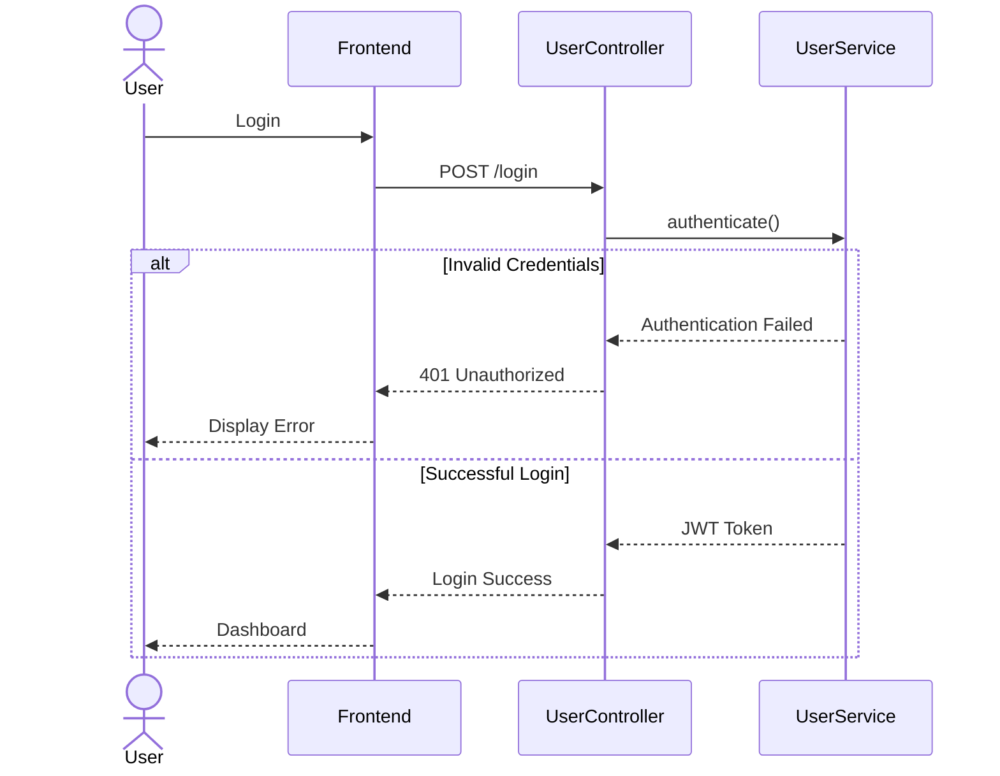

# Sequence Diagram

---

# Overview

The Sequence Diagram is one of the behavioral diagrams in the Unified Modeling Language (UML). It illustrates how different objects in a system interact with one another over time to complete a specific task.

Unlike the Class Diagram, which focuses on the static structure of the application, the Sequence Diagram emphasizes the chronological order of messages exchanged between objects.

For the AI Software Architect Agent, the Sequence Diagram demonstrates how the frontend, backend services, AI agents, and database collaborate to process user requests and generate software architecture, database designs, APIs, documentation, and project roadmaps.

---

# Purpose

The primary purpose of the Sequence Diagram is to represent the flow of communication between different components during system execution.

It helps developers understand:

- The order of operations
- Object interactions
- Method invocations
- Request-response cycles
- Business workflows
- System behavior over time

---

# Objectives

The objectives of the Sequence Diagram are:

- Represent interactions among objects.
- Show the sequence of messages.
- Describe runtime behavior.
- Support software implementation.
- Identify dependencies between components.
- Improve communication among developers.
- Simplify debugging and testing.

---

# Importance of Sequence Diagram

The Sequence Diagram plays a critical role during software design because it describes how system components collaborate to perform a task.

It helps developers answer questions such as:

- Which object receives the request first?
- Which service processes the request?
- How does data move between layers?
- When is the database accessed?
- When are AI agents invoked?
- What happens if an error occurs?

By answering these questions, the Sequence Diagram reduces ambiguity and provides a clear execution flow.

---

# System Components

The AI Software Architect Agent consists of the following interacting components:

## User

The person using the application through the web interface.

Responsibilities:

- Login
- Create projects
- Submit requirements
- View generated artifacts
- Download reports

---

## React Frontend

The frontend is responsible for interacting with the user.

Responsibilities:

- Display forms
- Send HTTP requests
- Receive responses
- Display generated results

---

## Spring Boot Controller

Acts as the entry point for REST API requests.

Responsibilities:

- Receive HTTP requests
- Validate input
- Forward requests to services
- Return HTTP responses

---

## Service Layer

Contains the application's business logic.

Responsibilities:

- Process requests
- Coordinate AI agents
- Validate business rules
- Store generated outputs

---

## AI Agents

Specialized agents perform individual tasks.

Agents include:

- Requirement Analysis Agent
- Architecture Agent
- Database Agent
- API Agent
- Security Agent
- Documentation Agent
- Roadmap Agent

---

## OpenAI / Gemini API

External AI model used to generate intelligent outputs.

Responsibilities:

- Analyze prompts
- Generate recommendations
- Produce technical documents
- Assist AI agents

---

## Repository Layer

Responsible for database communication.

Responsibilities:

- Save entities
- Retrieve data
- Update records
- Delete records

---

## MySQL Database

Stores persistent application data.

Stored information includes:

- Users
- Projects
- Requirements
- Architecture
- Database Schemas
- APIs
- Documentation
- Reports

---

# General Interaction Flow

The interaction begins when the user performs an action through the React frontend.

The frontend sends an HTTP request to the Spring Boot Controller.

The Controller validates the request and forwards it to the appropriate Service.

The Service invokes one or more AI Agents.

The AI Agent prepares a prompt and communicates with the external AI model.

The generated response is processed and stored in the database.

Finally, the response is returned to the frontend and displayed to the user.

---

# High-Level Sequence

```text
User

↓

React Frontend

↓

Spring Boot Controller

↓

Service Layer

↓

AI Agent

↓

OpenAI / Gemini API

↓

Repository

↓

MySQL Database

↓

Repository

↓

Service Layer

↓

Controller

↓

React Frontend

↓

User
```

---

# UML Symbols Used

| Symbol | Meaning |
|---------|---------|
| Actor | External user interacting with the system |
| Lifeline | Represents the lifetime of an object during interaction |
| Activation Bar | Indicates when an object is actively processing a request |
| Message | Communication between objects |
| Return Message | Response returned after processing |
| Self Message | Object calling one of its own methods |
| Combined Fragment | Represents conditions, loops, or alternatives |

---

# Technologies Used

| Technology | Purpose |
|------------|---------|
| React.js | Frontend |
| Java 21 | Programming Language |
| Spring Boot | Backend |
| Spring AI | AI Integration |
| MySQL | Database |
| Maven | Dependency Management |
| JWT | Authentication |
| GitHub | Version Control |

---

# Related UML Diagrams

The Sequence Diagram complements the following UML diagrams:

- Use Case Diagram
- Activity Diagram
- Class Diagram
- ER Diagram
- Deployment Diagram

Together, these diagrams provide a complete understanding of the AI Software Architect Agent.

---
# User Authentication Sequence

## Overview

User authentication is the first interaction between the user and the AI Software Architect Agent. It ensures that only authorized users can access the application's features.

The authentication process uses Spring Security with JWT (JSON Web Token). Once the user logs in successfully, the server generates a secure JWT token that is included in future API requests.

---

## Objects Involved

- User
- React Frontend
- Login Page
- UserController
- UserService
- UserRepository
- MySQL Database
- JWT Service

---

## Sequence Flow

1. User enters email and password.
2. React frontend sends a POST request to the backend.
3. UserController receives the request.
4. UserService validates the credentials.
5. UserRepository retrieves the user record.
6. Password is verified using BCrypt.
7. JWT Service generates a token.
8. Token is returned to the frontend.
9. Dashboard is displayed.

---

## Mermaid Diagram

```mermaid
sequenceDiagram

actor User

participant Frontend

participant UserController

participant UserService

participant UserRepository

database MySQL

participant JWT

User->>Frontend: Enter Email & Password

Frontend->>UserController: POST /login

UserController->>UserService: authenticate()

UserService->>UserRepository: findByEmail()

UserRepository->>MySQL: SELECT User

MySQL-->>UserRepository: User Details

UserRepository-->>UserService: User

UserService->>JWT: Generate Token

JWT-->>UserService: JWT Token

UserService-->>UserController: Authentication Success

UserController-->>Frontend: Login Response

Frontend-->>User: Dashboard
```

---

# Project Creation Sequence

## Overview

After authentication, users create a new software project by submitting project information.

---

## Objects

- User
- React Frontend
- ProjectController
- ProjectService
- ProjectRepository
- Database

---

## Sequence Flow

1. User clicks "Create Project".
2. Project details are entered.
3. Frontend sends POST request.
4. Controller validates request.
5. Service processes project.
6. Repository stores project.
7. Database returns Project ID.
8. Success response is displayed.

---

## Mermaid Diagram

```mermaid
sequenceDiagram

actor User

participant Frontend

participant ProjectController

participant ProjectService

participant ProjectRepository

database MySQL

User->>Frontend: Create Project

Frontend->>ProjectController: POST /projects

ProjectController->>ProjectService: createProject()

ProjectService->>ProjectRepository: save()

ProjectRepository->>MySQL: INSERT Project

MySQL-->>ProjectRepository: Project ID

ProjectRepository-->>ProjectService: Success

ProjectService-->>ProjectController: Project Created

ProjectController-->>Frontend: Success Response

Frontend-->>User: Project Created
```

---

# Requirement Analysis Sequence

## Overview

The Requirement Analysis Agent extracts functional and non-functional requirements from the user's project description.

---

## Objects

- User
- Frontend
- RequirementController
- RequirementService
- RequirementAnalysisAgent
- OpenAI / Gemini
- Repository

---

## Sequence Flow

1. User submits project description.
2. Controller forwards request.
3. Service prepares AI prompt.
4. Requirement Agent sends prompt.
5. AI model analyzes description.
6. Structured requirements are returned.
7. Requirements are stored in the database.
8. Results are displayed.

---

## Mermaid Diagram

```mermaid
sequenceDiagram

actor User

participant Frontend

participant RequirementController

participant RequirementService

participant RequirementAgent

participant OpenAI

database MySQL

User->>Frontend: Submit Requirements

Frontend->>RequirementController: POST /requirements

RequirementController->>RequirementService: analyze()

RequirementService->>RequirementAgent: Build Prompt

RequirementAgent->>OpenAI: Analyze Requirements

OpenAI-->>RequirementAgent: Requirement List

RequirementAgent-->>RequirementService: Structured Data

RequirementService->>MySQL: Save Requirements

MySQL-->>RequirementService: Success

RequirementService-->>RequirementController: Response

RequirementController-->>Frontend: Display Requirements
```

---

# Architecture Generation Sequence

## Overview

Once the requirements are analyzed, the Architecture Agent generates a suitable software architecture.

---

## Objects

- ArchitectureController
- ArchitectureService
- ArchitectureAgent
- AI Model
- Repository

---

## Sequence Flow

1. User clicks "Generate Architecture".
2. Controller receives request.
3. Service loads project requirements.
4. Architecture Agent prepares prompt.
5. AI Model generates architecture.
6. Architecture is stored.
7. Response is returned.

---

## Mermaid Diagram

```mermaid
sequenceDiagram

actor User

participant Frontend

participant ArchitectureController

participant ArchitectureService

participant ArchitectureAgent

participant OpenAI

database MySQL

User->>Frontend: Generate Architecture

Frontend->>ArchitectureController: POST /architecture

ArchitectureController->>ArchitectureService: generate()

ArchitectureService->>ArchitectureAgent: Build Prompt

ArchitectureAgent->>OpenAI: Generate Architecture

OpenAI-->>ArchitectureAgent: Architecture Design

ArchitectureAgent-->>ArchitectureService: Architecture

ArchitectureService->>MySQL: Save Architecture

MySQL-->>ArchitectureService: Success

ArchitectureService-->>ArchitectureController: Response

ArchitectureController-->>Frontend: Architecture Generated
```

---

# Objects Interaction Summary

| Object | Responsibility |
|---------|---------------|
| User | Initiates requests |
| Frontend | Sends HTTP requests |
| Controller | Receives API requests |
| Service | Executes business logic |
| AI Agent | Creates prompts and processes AI responses |
| OpenAI/Gemini | Generates intelligent outputs |
| Repository | Stores and retrieves data |
| MySQL | Persists application data |

---

# Advantages of These Sequence Diagrams

- Clearly shows message flow between components.
- Helps developers understand runtime behavior.
- Useful for debugging and testing.
- Improves communication among team members.
- Provides a blueprint for implementation.
- Supports API design and integration.

---
# Database Design Sequence

## Overview

After the software architecture has been generated, the Database Agent creates an optimized database design based on the project requirements. It identifies entities, attributes, relationships, primary keys, foreign keys, and normalization levels.

The generated database schema is then stored in the project repository for future reference.

---

## Objects Involved

- User
- React Frontend
- DatabaseController
- DatabaseService
- DatabaseAgent
- OpenAI / Gemini API
- DatabaseRepository
- MySQL Database

---

## Sequence Flow

1. User selects **Generate Database Design**.
2. Frontend sends a request to the backend.
3. DatabaseController receives the request.
4. DatabaseService loads project requirements.
5. DatabaseAgent creates an AI prompt.
6. AI model generates the database schema.
7. Database schema is validated.
8. Repository saves the generated schema.
9. Success response is returned to the frontend.

---

## Mermaid Sequence Diagram

```mermaid
sequenceDiagram

actor User

participant Frontend

participant DatabaseController

participant DatabaseService

participant DatabaseAgent

participant OpenAI

participant DatabaseRepository

database MySQL

User->>Frontend: Generate Database Design

Frontend->>DatabaseController: POST /database/generate

DatabaseController->>DatabaseService: generateDatabase()

DatabaseService->>DatabaseAgent: Prepare Prompt

DatabaseAgent->>OpenAI: Generate Schema

OpenAI-->>DatabaseAgent: Database Design

DatabaseAgent-->>DatabaseService: Schema

DatabaseService->>DatabaseRepository: Save Schema

DatabaseRepository->>MySQL: INSERT Schema

MySQL-->>DatabaseRepository: Success

DatabaseRepository-->>DatabaseService: Saved

DatabaseService-->>DatabaseController: Response

DatabaseController-->>Frontend: Database Generated

Frontend-->>User: Display ER Diagram
```

---

# API Generation Sequence

## Overview

The API Agent automatically generates REST API specifications using the project requirements and database schema.

---

## Objects

- User
- APIController
- APIService
- APIAgent
- AI Model
- Repository

---

## Sequence Flow

1. User selects Generate APIs.
2. Controller receives the request.
3. Service loads project information.
4. APIAgent creates prompt.
5. AI generates REST APIs.
6. APIs are stored.
7. Documentation is generated.
8. APIs are displayed.

---

## Mermaid Diagram

```mermaid
sequenceDiagram

actor User

participant Frontend

participant APIController

participant APIService

participant APIAgent

participant OpenAI

database MySQL

User->>Frontend: Generate REST APIs

Frontend->>APIController: POST /api/generate

APIController->>APIService: generateAPI()

APIService->>APIAgent: Build Prompt

APIAgent->>OpenAI: Generate APIs

OpenAI-->>APIAgent: REST Endpoints

APIAgent-->>APIService: API List

APIService->>MySQL: Save APIs

MySQL-->>APIService: Success

APIService-->>APIController: Response

APIController-->>Frontend: Display APIs
```

---

# Documentation Generation Sequence

## Overview

The Documentation Agent combines outputs from all AI agents to generate professional project documentation such as the SRS, Software Design Document, API Documentation, and Developer Guide.

---

## Sequence Flow

1. User selects Generate Documentation.
2. DocumentationService collects all generated artifacts.
3. DocumentationAgent prepares the AI prompt.
4. AI model creates documentation.
5. Documentation is stored.
6. PDF and Markdown files are generated.
7. User receives downloadable documents.

---

## Mermaid Diagram

```mermaid
sequenceDiagram

actor User

participant Frontend

participant DocumentationController

participant DocumentationService

participant DocumentationAgent

participant OpenAI

database MySQL

User->>Frontend: Generate Documentation

Frontend->>DocumentationController: POST /documentation

DocumentationController->>DocumentationService: generateDocs()

DocumentationService->>DocumentationAgent: Build Prompt

DocumentationAgent->>OpenAI: Generate Documentation

OpenAI-->>DocumentationAgent: Documents

DocumentationAgent-->>DocumentationService: Documentation

DocumentationService->>MySQL: Save Documents

MySQL-->>DocumentationService: Success

DocumentationService-->>DocumentationController: Response

DocumentationController-->>Frontend: Download Ready
```

---

# Roadmap Generation Sequence

## Overview

The Roadmap Agent prepares a structured software development roadmap based on the generated architecture and project complexity.

---

## Sequence Flow

1. User requests project roadmap.
2. Service gathers project details.
3. RoadmapAgent prepares prompt.
4. AI generates milestones.
5. Timeline is stored.
6. Roadmap is displayed.

---

## Mermaid Diagram

```mermaid
sequenceDiagram

actor User

participant Frontend

participant RoadmapController

participant RoadmapService

participant RoadmapAgent

participant OpenAI

database MySQL

User->>Frontend: Generate Roadmap

Frontend->>RoadmapController: POST /roadmap

RoadmapController->>RoadmapService: generateRoadmap()

RoadmapService->>RoadmapAgent: Build Prompt

RoadmapAgent->>OpenAI: Generate Timeline

OpenAI-->>RoadmapAgent: Roadmap

RoadmapAgent-->>RoadmapService: Timeline

RoadmapService->>MySQL: Save Roadmap

MySQL-->>RoadmapService: Success

RoadmapService-->>RoadmapController: Response

RoadmapController-->>Frontend: Display Roadmap
```

---

# Report Download Sequence

## Overview

After all AI agents have completed their tasks, users can download the generated reports in different formats.

---

## Supported Formats

- PDF
- Markdown
- DOCX

---

## Sequence Flow

1. User clicks Download.
2. Frontend requests report.
3. ReportService retrieves the document.
4. PDF Generator prepares the file.
5. File is returned.
6. Browser downloads the report.

---

# Alternative Flow (Authentication Failure)

If authentication fails, the system follows an alternate execution path.



---

# Error Handling Strategy

The application includes robust error handling to ensure a smooth user experience.

## Common Error Scenarios

- Invalid login credentials
- Empty project description
- AI service unavailable
- Database connection failure
- Invalid API response
- File export failure
- Network timeout

Each error is handled gracefully, and meaningful feedback is provided to the user.

---

# Best Practices

The following best practices were followed while designing the sequence diagrams:

- Keep interactions simple and readable.
- Clearly separate frontend, backend, AI agents, and database responsibilities.
- Avoid unnecessary object interactions.
- Use standard UML notation.
- Include alternate and error flows.
- Maintain consistency across all diagrams.

---

# Advantages

- Visualizes runtime behavior.
- Simplifies debugging.
- Supports implementation planning.
- Helps developers understand message flow.
- Improves communication among stakeholders.
- Acts as a reference during testing and maintenance.

---

# References

1. OMG Unified Modeling Language (UML) Specification
2. IEEE Software Engineering Standards
3. Spring Boot Documentation
4. OpenAI API Documentation
5. Oracle Java Documentation
6. MySQL Documentation

---

# Conclusion

The Sequence Diagram provides a detailed view of how objects collaborate to complete key operations within the AI Software Architect Agent. It captures the flow of messages from user interactions through the frontend, backend services, AI agents, and database, ensuring a clear understanding of runtime behavior.

Together with the Activity Diagram, Use Case Diagram, and Class Diagram, the Sequence Diagram forms an essential part of the application's software design documentation and serves as a valuable guide during implementation, testing, and future maintenance.

---
