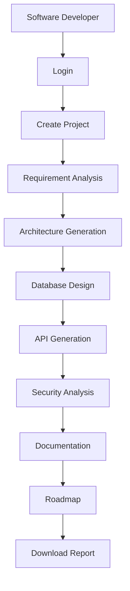

# Use Case Diagram

---

# Overview

The Use Case Diagram is one of the most important diagrams in the Unified Modeling Language (UML). It provides a high-level view of the system by illustrating how different users (called actors) interact with the application to achieve specific goals.

In the **AI Software Architect Agent**, the Use Case Diagram describes the various functionalities offered by the system and identifies the users who can access those functionalities. Rather than focusing on internal implementation details, this diagram focuses on the external behavior of the system.

The Use Case Diagram serves as a communication bridge between stakeholders, developers, project managers, and clients by presenting the application's features in an easy-to-understand visual format.

---

# Purpose

The primary purpose of the Use Case Diagram is to capture the functional requirements of the AI Software Architect Agent.

It provides a clear representation of:

- What the system does.
- Who interacts with the system.
- Which functions are available.
- How users achieve their goals.
- The scope of the application.

This diagram helps developers understand the expected behavior of the software before implementation begins.

---

# Objectives

The objectives of the Use Case Diagram are:

- Identify all actors interacting with the system.
- Define the major functionalities of the application.
- Represent interactions between users and the system.
- Establish the functional scope of the project.
- Improve communication between stakeholders.
- Provide a foundation for software development and testing.
- Support requirement validation.

---

# Why Use Case Diagrams are Important

Use Case Diagrams are widely used during the Requirement Analysis phase because they simplify complex software requirements into understandable interactions.

Benefits include:

- Easy understanding for technical and non-technical users.
- Clear visualization of system functionality.
- Better communication between developers and clients.
- Identification of missing requirements.
- Support for software testing.
- Improved project planning.

Without a Use Case Diagram, developers may misunderstand user expectations, leading to incorrect software implementation.

---

# System Scope

The AI Software Architect Agent is an intelligent web application that automatically analyzes software project requirements and generates technical artifacts required during software planning.

The system provides the following capabilities:

- Requirement Analysis
- Software Architecture Recommendation
- Database Design
- REST API Generation
- Security Recommendations
- Technical Documentation
- Project Roadmap Generation
- Report Export

The Use Case Diagram represents how different users interact with these features.

---

# Primary Actors

Primary actors directly interact with the application to achieve their objectives.

## Software Developer

The Software Developer is the main user of the application.

Responsibilities include:

- Create a new project.
- Submit software requirements.
- Generate software architecture.
- Generate database schema.
- Generate REST APIs.
- Generate documentation.
- Download reports.

---

## Software Architect

The Software Architect reviews the generated architecture and validates technical recommendations.

Responsibilities include:

- Review architecture.
- Evaluate technology stack.
- Modify architecture recommendations.
- Review deployment strategy.
- Validate software design.

---

## Project Manager

The Project Manager uses the generated roadmap and documentation for project planning.

Responsibilities include:

- Review project roadmap.
- Monitor milestones.
- Export project documentation.
- Assign development tasks.
- Estimate project timeline.

---

# Secondary Actors

Secondary actors support the system indirectly.

## Administrator

The Administrator manages the application and its users.

Responsibilities include:

- Manage user accounts.
- Configure AI models.
- Monitor application performance.
- Manage security settings.
- View system logs.

---

## AI Model (OpenAI/Gemini)

The Large Language Model acts as an external service.

Responsibilities include:

- Analyze prompts.
- Generate architecture recommendations.
- Produce documentation.
- Generate APIs.
- Assist AI agents.

---

# Actor Relationships

The relationship between actors and the system is shown below.

```
Software Developer
        │
        ▼
AI Software Architect Agent
        ▲
        │
Software Architect

        ▲
        │
Project Manager

        ▲
        │
Administrator

        ▲
        │
OpenAI / Gemini API
```

---

# Functional Areas

The application is divided into the following functional modules:

### User Management

Functions include:

- User Registration
- User Login
- Authentication
- Authorization
- Profile Management

---

### Project Management

Functions include:

- Create Project
- Edit Project
- Delete Project
- View Project
- Save Project

---

### Requirement Analysis

Functions include:

- Upload Project Description
- Analyze Requirements
- Generate Functional Requirements
- Generate Non-Functional Requirements
- Generate User Stories

---

### Architecture Generation

Functions include:

- Select Architecture Pattern
- Generate Component Diagram
- Generate Deployment Architecture
- Recommend Technology Stack

---

### Database Design

Functions include:

- Generate ER Diagram
- Create Database Schema
- Normalize Tables
- Generate SQL Scripts

---

### API Generation

Functions include:

- Generate REST APIs
- Define Endpoints
- Generate Request and Response Models
- Create API Documentation

---

### Documentation

Functions include:

- Generate SRS
- Generate Software Design Document
- Generate Developer Guide
- Generate User Manual
- Export Documentation

---

### Project Roadmap

Functions include:

- Generate Timeline
- Sprint Planning
- Milestone Generation
- Task Prioritization

---

# Technologies Used

The Use Case Diagram represents interactions involving the following technologies:

| Technology | Purpose |
|------------|---------|
| Java 21 | Backend Development |
| Spring Boot | REST API Development |
| Spring AI | AI Integration |
| React.js | User Interface |
| MySQL | Database |
| OpenAI / Gemini | AI Model |
| Maven | Dependency Management |
| GitHub | Version Control |

---

# Related Diagrams

The Use Case Diagram works together with other UML diagrams.

- Activity Diagram
- Class Diagram
- Sequence Diagram
- ER Diagram
- Deployment Diagram

Together, these diagrams provide a complete understanding of the AI Software Architect Agent system.

---
# Detailed Use Cases

The following section explains every major use case available in the AI Software Architect Agent. Each use case represents a specific functionality that users can perform within the system.

---

# UC-01 : User Registration

## Description

This use case allows a new user to create an account in the system. The user provides personal information such as name, email address, and password. The system validates the information and stores it securely in the database.

## Primary Actor

- Software Developer

## Preconditions

- The user is not already registered.
- The application is available.

## Main Flow

1. User clicks **Register**.
2. User enters registration details.
3. System validates the information.
4. Password is encrypted using BCrypt.
5. User account is created.
6. Confirmation message is displayed.

## Alternative Flow

- Email already exists.
- Invalid email format.
- Weak password.

## Postconditions

- New account is successfully created.
- User can log in.

---

# UC-02 : User Login

## Description

The registered user logs into the application using valid credentials.

## Primary Actor

- Software Developer
- Software Architect
- Project Manager
- Administrator

## Preconditions

- User account exists.

## Main Flow

1. Open Login Page.
2. Enter Email.
3. Enter Password.
4. Click Login.
5. System verifies credentials.
6. JWT Token is generated.
7. Dashboard is displayed.

## Alternative Flow

- Incorrect Password.
- Invalid Email.
- Account Disabled.

## Postconditions

- User is authenticated.
- Secure session begins.

---

# UC-03 : Create New Project

## Description

The user creates a software project by entering project details.

## Primary Actor

Software Developer

## Input

- Project Name
- Description
- Domain
- Preferred Technology
- Functional Requirements

## Output

New project created successfully.

---

# UC-04 : Requirement Analysis

## Description

The Requirement Analysis Agent analyzes the software description and extracts structured requirements.

## Primary Actor

Requirement Analysis Agent

## Processing

The AI extracts:

- Functional Requirements
- Non-Functional Requirements
- User Stories
- Constraints
- Assumptions

## Output

Structured Software Requirements Specification (SRS)

---

# UC-05 : Generate Software Architecture

## Description

The Architecture Agent recommends an appropriate software architecture based on project requirements.

## Primary Actor

Architecture Agent

## Generated Information

- Architecture Pattern
- Components
- Communication Strategy
- Technology Stack
- Scalability Recommendations

## Example

Recommended Architecture:

Layered Architecture

---

# UC-06 : Generate Database Design

## Description

The Database Design Agent creates the database schema.

## Generated Outputs

- ER Diagram
- SQL Script
- Primary Keys
- Foreign Keys
- Relationships
- Normalized Tables

---

# UC-07 : Generate REST APIs

## Description

The API Agent creates RESTful APIs based on the generated software architecture.

## Generated APIs

- Login API
- Project API
- Architecture API
- Database API
- Report API

Each API includes

- Endpoint
- HTTP Method
- Request Body
- Response Body
- Status Codes

---

# UC-08 : Security Analysis

## Description

The Security Agent analyzes the software design and recommends security mechanisms.

## Generated Recommendations

- JWT Authentication
- Role-Based Access Control
- Password Encryption
- HTTPS
- Input Validation
- API Security
- Secure Database Access

---

# UC-09 : Documentation Generation

## Description

The Documentation Agent automatically generates professional software documentation.

Generated Documents

- Software Requirement Specification
- Software Design Document
- API Documentation
- Database Documentation
- User Manual
- Developer Guide

---

# UC-10 : Generate Project Roadmap

## Description

The Roadmap Agent creates a complete software development roadmap.

Generated Information

- Timeline
- Sprint Planning
- Milestones
- Deliverables
- Project Phases

---

# UC-11 : Download Reports

## Description

The user downloads the generated reports.

Supported Formats

- PDF
- DOCX
- Markdown

---

# Include Relationships

The following use cases depend on other use cases.

```
Login
    |
    +----> Create Project
    |
    +----> Generate Architecture
    |
    +----> Generate Database
    |
    +----> Generate APIs
    |
    +----> Download Report
```

Explanation:

A user must log in before accessing these features.

---

# Extend Relationships

Certain use cases extend the functionality of others.

```
Requirement Analysis
        |
        +------> Generate Architecture

Generate Architecture
        |
        +------> Generate Database

Generate Database
        |
        +------> Generate APIs

Generate APIs
        |
        +------> Security Analysis

Security Analysis
        |
        +------> Documentation

Documentation
        |
        +------> Roadmap
```

---

# Complete Workflow

```
User

↓

Login

↓

Create Project

↓

Enter Requirements

↓

Requirement Analysis Agent

↓

Architecture Agent

↓

Database Agent

↓

API Agent

↓

Security Agent

↓

Documentation Agent

↓

Roadmap Agent

↓

Download Report
```

---

# Example Scenario

## Scenario

A software developer wants to build an Online Shopping System.

### Step 1

The developer logs into the application.

### Step 2

A new project named **Online Shopping System** is created.

### Step 3

Project requirements are entered.

### Step 4

The Requirement Analysis Agent extracts functional requirements.

### Step 5

The Architecture Agent recommends Layered Architecture.

### Step 6

The Database Agent generates an ER Diagram.

### Step 7

The API Agent creates REST API specifications.

### Step 8

The Security Agent recommends JWT authentication.

### Step 9

The Documentation Agent generates the SRS and design documents.

### Step 10

The Roadmap Agent prepares a six-phase development roadmap.

### Step 11

The user downloads the final project documentation.

---

# Mermaid Use Case Diagram


# Use Case Relationships

The AI Software Architect Agent is composed of multiple interconnected use cases. Each functionality depends on another to complete the software architecture generation process successfully.

The following relationships exist among the major use cases.

```
User Authentication
        │
        ▼
Create Project
        │
        ▼
Requirement Analysis
        │
        ▼
Architecture Generation
        │
        ▼
Database Design
        │
        ▼
API Generation
        │
        ▼
Security Analysis
        │
        ▼
Documentation Generation
        │
        ▼
Roadmap Generation
        │
        ▼
Download Report
```

Every use case contributes to the successful completion of the software design process.

---

# System Boundary

The System Boundary defines the functionalities that are part of the AI Software Architect Agent. Everything inside the boundary is managed by the application, while external users and services interact with it through defined interfaces.

```
+-------------------------------------------------------------+
|              AI SOFTWARE ARCHITECT AGENT                    |
|-------------------------------------------------------------|
|                                                             |
|  User Login                                                 |
|  Project Management                                         |
|  Requirement Analysis                                       |
|  Software Architecture Generation                           |
|  Database Design                                            |
|  REST API Generation                                        |
|  Security Recommendation                                    |
|  Documentation Generation                                   |
|  Project Roadmap Generation                                 |
|  Report Export                                              |
|                                                             |
+-------------------------------------------------------------+

Developer
Architect
Project Manager
Administrator
OpenAI / Gemini API
```

---

# Actor Permission Matrix

The following table illustrates the permissions assigned to each actor.

| Function | Developer | Architect | Project Manager | Administrator |
|-----------|-----------|-----------|-----------------|---------------|
| Register | ✓ | ✓ | ✓ | ✓ |
| Login | ✓ | ✓ | ✓ | ✓ |
| Create Project | ✓ | ✓ | ✗ | ✗ |
| Edit Project | ✓ | ✓ | ✗ | ✗ |
| Analyze Requirements | ✓ | ✓ | ✗ | ✗ |
| Generate Architecture | ✓ | ✓ | ✗ | ✗ |
| Generate Database | ✓ | ✓ | ✗ | ✗ |
| Generate APIs | ✓ | ✓ | ✗ | ✗ |
| Generate Documentation | ✓ | ✓ | ✓ | ✗ |
| Generate Roadmap | ✓ | ✓ | ✓ | ✗ |
| Download Reports | ✓ | ✓ | ✓ | ✓ |
| Manage Users | ✗ | ✗ | ✗ | ✓ |
| Configure AI Models | ✗ | ✗ | ✗ | ✓ |
| View Logs | ✗ | ✗ | ✗ | ✓ |

---

# Business Rules

The application follows several business rules to ensure consistency and security.

### Rule 1

A user must successfully authenticate before accessing project-related features.

### Rule 2

A project must contain valid software requirements before architecture generation begins.

### Rule 3

The Architecture Agent cannot execute until the Requirement Analysis Agent completes its processing.

### Rule 4

Database generation depends on the generated software architecture.

### Rule 5

REST API generation requires both architecture and database designs.

### Rule 6

Technical documentation is generated only after all AI agents complete their respective tasks.

### Rule 7

Only administrators can configure AI models and manage system users.

---

# Error Scenarios

The system is designed to handle unexpected situations gracefully.

## Invalid Login

If incorrect credentials are entered, access is denied and an error message is displayed.

---

## Empty Project Description

If the project description is empty, the Requirement Analysis Agent will not execute.

---

## AI Service Unavailable

If the external AI service is unavailable, the system notifies the user and allows the request to be retried.

---

## Database Connection Failure

If the database is unavailable, project data is temporarily cached and synchronization is attempted after the connection is restored.

---

## Invalid API Response

If an AI-generated response is incomplete or invalid, the application requests regeneration.

---

# Non-Functional Requirements

The Use Case Diagram also supports several non-functional requirements.

### Performance

The system should process user requests efficiently and provide architecture recommendations within an acceptable response time.

### Scalability

The application should support multiple users and concurrent project generation.

### Security

All sensitive data should be encrypted, and user authentication should follow industry-standard practices.

### Availability

The application should remain accessible with minimal downtime.

### Maintainability

The modular AI-agent architecture allows future enhancements without affecting existing functionality.

---

# Design Principles

The AI Software Architect Agent is designed using the following software engineering principles.

- Separation of Concerns
- Single Responsibility Principle
- Open/Closed Principle
- Modular Architecture
- Layered Design
- Reusability
- Loose Coupling
- High Cohesion

These principles improve maintainability and simplify future development.

---

# Advantages

The Use Case Diagram offers several benefits:

- Clearly defines system functionality.
- Improves communication between stakeholders.
- Helps identify missing requirements.
- Simplifies software planning.
- Supports test case development.
- Provides a high-level view of the system.
- Facilitates requirement validation.
- Improves overall documentation quality.

---

# Limitations

Although the Use Case Diagram is valuable, it has certain limitations.

- It does not describe internal implementation details.
- Complex systems may require multiple diagrams.
- Relationships can become difficult to manage in large applications.
- Frequent requirement changes require diagram updates.

---

# Future Enhancements

Future versions of the AI Software Architect Agent may include additional use cases such as:

- AI-powered code generation
- UML diagram generation
- Cost estimation
- Cloud deployment planning
- DevOps pipeline generation
- Microservices recommendation
- Kubernetes deployment support
- Multi-language architecture generation
- Team collaboration workspace
- Integration with GitHub repositories

---

# Best Practices

The following best practices were followed while preparing this Use Case Diagram.

- Use meaningful actor names.
- Keep use cases concise.
- Avoid implementation details.
- Clearly define system boundaries.
- Use standard UML notation.
- Keep relationships simple and readable.
- Maintain consistency across documentation.
- Update diagrams whenever requirements change.

---

# References

1. OMG Unified Modeling Language (UML) Specification Version 2.5
2. IEEE Software Engineering Standards
3. Ian Sommerville – Software Engineering
4. Robert C. Martin – Clean Architecture
5. Spring Boot Official Documentation
6. OpenAI API Documentation
7. Oracle Java Documentation
8. MySQL Documentation

---

# Glossary

| Term | Description |
|------|-------------|
| Actor | A user or external system interacting with the application |
| Use Case | A functionality provided by the application |
| UML | Unified Modeling Language |
| AI Agent | Specialized module responsible for a specific task |
| API | Application Programming Interface |
| ER Diagram | Entity Relationship Diagram |
| JWT | JSON Web Token |
| REST | Representational State Transfer |

---


# Conclusion

The Use Case Diagram serves as a foundational model for the AI Software Architect Agent by clearly illustrating the interactions between users and the system. It captures the application's functional scope, identifies user responsibilities, and establishes the sequence of operations required to generate software architecture, database designs, APIs, documentation, and project roadmaps.

This document provides a comprehensive understanding of the system's behavior and acts as a valuable reference throughout the software development lifecycle. It supports effective communication among developers, architects, project managers, and stakeholders, ensuring that the project remains aligned with its functional requirements and design objectives.
